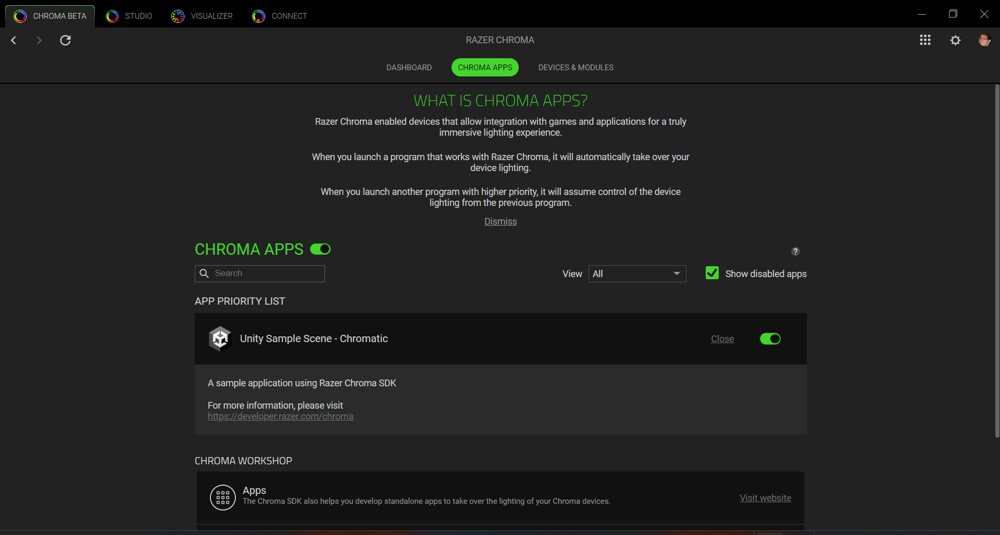
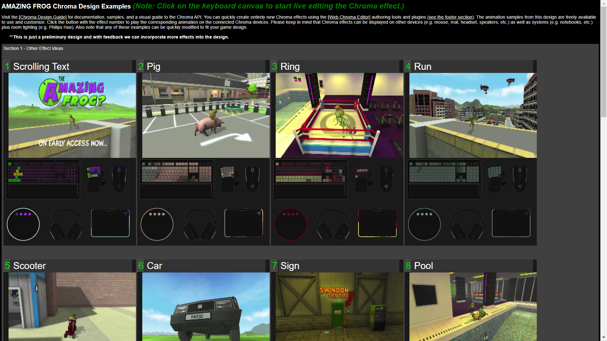

# Latest

* Note: Visit the [Chroma Animation Guide](https://chroma.razer.com/ChromaGuide/) to find the latest supported plugin for Chroma RGB.

# CChromaEditor - C++ Dynamic Library for playing and editing Chroma animations

**Table of Contents**

* [See Also](#see-also)
* [Frameworks supported](#frameworks-supported)
* [Prerequisites](#prerequisites)
* [Security](#security)
* [Assets](#assets)
* [Dialog](#dialog)
* [Streaming](#streaming)
* [Streaming Logic Flow](#streaming-logic-flow)
* [API](#api)
* [File Format](#file-format)

<a name="see-also"></a>

## See Also

**Docs:**

* [Chroma Animation Guide](http://chroma.razer.com/ChromaGuide/) - Visual examples of the Chroma Animation API methods

**Plugins:**

* [CChromaEditor](https://github.com/RazerOfficial/CChromaEditor) - C++ native MFC library for playing and editing Chroma animations

<a name="frameworks-supported"></a>

## Frameworks supported

* Windows ChromaSDK (32-bit)

* Windows ChromaSDK (64-bit)

<a name="prerequisites"></a>

## Prerequisites

* Install [Synapse](https://www.razer.com/synapse-3)

* Make sure the Chroma Connect module is installed.



* If you don't have Chroma hardware, you can see Chroma effects with the [Chroma Emulator](https://github.com/razerofficial/ChromaEmulator)

* This library is full source and can build with VS 2015/2017/2019 so make sure you include the corresponding [Microsoft Visual C++ Redistributable for Visual Studio](https://www.visualstudio.com/downloads/) with your application for the versions that you build with. The core ChromaSDK is built with VS 2015, so you'll want that redistributable at a minimum.

* To compile: Install [Visual Studio](https://www.visualstudio.com/)

* To compile: Install [Windows 10 SDK](https://developer.microsoft.com/en-us/windows/downloads/windows-10-sdk)

* To compile: Install `Templates->Other Languages->Visual C++->Visual C++ 2015 Tools for Windows Desktop` which can be installed through the `Visual Studio New Project Dialog`


* Use retarget solution to select an available Windows SDK.

---

<a name="security"></a>

## Security

The C++ Chroma Editor Library loads the core Razer DLL `RzChromaSDK.dll` and the Razer stream library `RzChromaStreamPlugin.dll`. To avoid a 3rd party injecting malicious code, the C++ Chroma Editor Library checks for a valid signature on the Razer libraries. The DLL issuer is validated to be `Razer USA Ltd.` Init and InitSDK will return `RZRESULT_DLL_INVALID_SIGNATURE` if the signature check fails.

The sample apps use the `CHECK_CHROMA_LIBRARY_SIGNATURE` preprocessor definition to enable signature checking on the Chroma Editor Library. Signature checking can be used on the Razer libraries downloaded from Github releases.

```
#ifdef CHECK_CHROMA_LIBRARY_SIGNATURE
 _sInvalidSignature = !VerifyLibrarySignature::VerifyModule(path);
#endif
```

## Chroma Editor Library

The `Chroma Editor Library` is a helper library for Chroma animation playback and realtime manipulation of Chroma animations.

The latest versions of the `Chroma Editor Library` can be found in [Releases](https://github.com/razerofficial/CChromaEditor/releases) for `Windows-PC` and `Windows-Cloud`.

<a name="windows-pc"></a>

## Windows PC

For `Windows PC` builds the `RzChromaSDK.dll` and `RzChromaStreamPlugin.dll` are not packaged with the build. These libraries are automatically updated and managed by Synapse and the Chroma Connect module. Avoid including these files in your build folder for `Windows PC` builds.

**32-bit libraries**

```
Win32BuildFolder\CChromaEditorLibrary.dll
```

**64-bit libraries**

```
Win64BuildFolder\CChromaEditorLibrary64.dll
```

<a name="windows-cloud"></a>

## Windows Cloud

`Windows Cloud` builds run on cloud platforms using `Windows` such as `Amazon Luna`, `Microsoft Game Pass`, and `NVidia GeForce Now`. Game instances run in the cloud without direct access to Chroma hardware. By running the `Windows Cloud` version of the library `Chroma` effects can reach your local machine and connected hardware. Cloud instances won't have Synapse installed which requires special cloud versions of the libraries. The `Chroma Editor Library` uses the core `RzChromaSDK` low-level library to send Chroma effects to the cloud with the `RzChromaStreamPlugin` streaming library. Viewers can watch the cloud stream via the [Razer Stream Portal](https://stream.razer.com/).

**32-bit libraries**

```
Win32BuildFolder\CChromaEditorLibrary.dll
Win32BuildFolder\RzChromaSDK.dll
Win32BuildFolder\RzChromaStreamPlugin.dll
```

**64-bit libraries**

```
Win64BuildFolder\CChromaEditorLibrary64.dll
Win64BuildFolder\RzChromaSDK64.dll
Win64BuildFolder\RzChromaStreamPlugin64.dll
```

## API Class

The `ChromaAnimationAPI` class provides a wrapper for the Chroma Editor Library. The wrapper for the API can be found at [CConsoleEditor/ChromaAnimationAPI.h](CConsoleEditor/ChromaAnimationAPI.h) and [CConsoleEditor/ChromaAnimationAPI.cpp](CConsoleEditor/ChromaAnimationAPI.cpp).

## Initialization

---

The `ChromaAnimationAPI::InitSDK()` method returns `RZRESULT_SUCCESS` when initialization has succeeded. Avoid making calls to the Chroma API when anything other than success is returned. A unsuccessful result indicates `Chroma` is not present on the machine.

```
 APPINFOTYPE appInfo = {};

 _tcscpy_s(appInfo.Title, 256, _T("Sample Game Title"));
 _tcscpy_s(appInfo.Description, 1024, _T("Sample Game Description"));
 _tcscpy_s(appInfo.Author.Name, 256, _T("Company Name"));
 _tcscpy_s(appInfo.Author.Contact, 256, _T("Company Website or Email"));

 //appInfo.SupportedDevice = 
 //    0x01 | // Keyboards
 //    0x02 | // Mice
 //    0x04 | // Headset
 //    0x08 | // Mousepads
 //    0x10 | // Keypads
 //    0x20   // ChromaLink devices
 appInfo.SupportedDevice = (0x01 | 0x02 | 0x04 | 0x08 | 0x10 | 0x20);
 //    0x01 | // Utility. (To specifiy this is an utility application)
 //    0x02   // Game. (To specifiy this is a game);
 appInfo.Category = 0x02;

 RZRESULT result = ChromaAnimationAPI::InitSDK(&appInfo);
 if (result != RZRESULT_SUCCESS)
 {
  ChromaLogger::printf("Failed to initialize Chroma SDK with error=%ld\r\n", result);
 
 // avoid making Chroma API calls after a non-zero init result
  return;
 }
```

---

<a name="getting-started"></a>

## Getting Started

**Running the editor application**

1 Run the [Chroma Editor Installer](https://github.com/razerofficial/CChromaEditor/releases/) to associate `.chroma` animations with the editor.

2 Double-click a `.chroma` animation file to open in the editor

**Building the editor**

1 Open `CChromaEditor.sln` in Visual Studio

2 The `CChromaEditorLibrary` project builds the native C++ DLL for `x64` and `x86` platforms

3 The `CConsoleEditor` project is a console project that uses the `DLL` and provides a command-line interface. The only parameter is the file path to a `Chroma` animation file. When no parameter is provided, the editor opens `temp.chroma` on the desktop.

<a name="assets"></a>

## Assets

The `chroma` binary file format is supported in multiple engines and can even play on websites. Authoring tools like the [Web Chroma Editor](https://chroma.razer.com/ChromaEditor) can easily record animations for the full device set which can be downloaded in a zip file. The `Web Chroma Editor` is also able to embed `chroma` animation files into code for specific languages.

<a name="dialog"></a>

## Dialog

The standalone Chroma editor has a MFC dialog that can be used to create Chroma animations for the set of devices.


**File Menu**


**New**

Start with a new animationName

**Open**

Open a file dialog and open a `Chroma` animation

**Save**

Save the open animation

**Save As**

Open a file dialog and save the open animation

**Import Menu**


**Import Image**

Import a BMP, JPG, or PNG texture into the grid layout. The images will be stretched to fit the grid.

**Import Image Sequence**

Import a numbered set of images as an animation.

**Import Animation**

Import a GIF animation into the grid layout. Multiple frames will be added if they exist in the GIF. The image will be stretched to fit the grid.
<br/>

<a name="streaming"></a>

## Streaming

The [Razer Streaming Portal](https://stream.razer.com/) supports streaming Chroma RGB on video streaming platforms and can be embedded on any 3rd party site. In order to stream Chroma RGB, you'll need the latest Synapse and Chroma Connect module. No other software is required to control streaming from the browser or the API below.

**Login**

The first step is to login into the [Razer Streaming Portal](https://stream.razer.com/) with Razer ID.


**Profile**

Navigate to the user profile by clicking `MY STREAMS`.


**Stream Source**

Create a `Stream Source` to broadcast `Chroma RGB` events.


**Name Your Stream Source**

Enter the name of your stream source and enter name of the game to generate the stream thumbnail. Make sure `GO LIVE` is turned on. The `Mature` toggle is optional and can be filtered.



**Source**

PC games set the source to `PC`. `Cloud Gaming`, `Console`, and `Mobile` games set the `Source` to `Other`.


**Authorize**

Authorizing a shortcode is used to allow the broadcast to be toggled on sites outside the `Razer Streaming Portal` or by games using the [API](#api) to authorize a `ShortCode`. Once the `Shortcode` is authorized, the `Stream Id` and `Stream Key` can be obtained before releasing the `ShortCode`.


**Link Stream Source**

The `Stream Source` can be linked to several social platforms.  Enable the toggle for social platforms to appear on your `Stream Source` tile. Pick a `default` social platform for yuour `Stream Source` tile.


**Embed**

`Chroma RGB` streaming can be an `Embed` on a 3rd party webpage. Click the `Embed` clipboard icon to add the HTML5 iframe snippet to the clipboard which can be pasted into a 3rd party webpage. The `Embed` URL must match the URL of the 3rd party webpage address.

**Twitch**

Add the [Razer Streaming Panel](https://dashboard.twitch.tv/extensions/5z0l5bgwb0r0xcqritj8leqgo06l9j) Twitch Extension to stream Chroam RGB on Twitch. There's a easily link by clicking the Twitch gear icon.


**Twitch Panel**

In order to broadcast via the Twitch panel, use the `Authenticate` link to authorize the automatic shortcode.


The shortcode will appear in the code activation popup and then click the `AUTHORIZE SHORTCODE` button. After the `Stream Source` has been authorized, the window can be closed.


If the `Stream Source` is associated with the logged in `Razer ID`, authorization will give access to Twitch to allow the broadcast toggle to be used from the Twitch panel.


Viewers of a live Twitch channel will automatically tune into the `Chroma RGB` from the broadcast. The streamer and viewers' hardware will be in sync.


**Save**

Save the `Stream Source` settings when finished. You can rename your `Stream Source` and save the changes. You can reuse the same `Stream Source` for multiple games by changing the game title / thumbnail. You can create multiple `Stream Sources` for mulitple games. You can always delete a `Stream Source` to keep things tidy. If you've accidentally streamed your `Stream Key` to viewers, you can always delete the `Stream Source` and create a new `Stream Source` to generate a new `Stream Id` and `Stream Key`.


**Broadcast**

Once a `Stream Source` has been created, the toggle can be used to `Broadcast` to the social platforms that have been linked. Browse the [Chroma Workshop](https://www.razer.com/chroma-workshop#--games) to find games that have `Chroma RGB` integration. The broadcast toggle for `Chroma RGB` can be used before launching a game or after, either will work.


**Streams**

When the `Chroma RGB` broadcast is active and game `Chroma RGB` events are detected, the `Stream Source` tile will appear on the main page of the portal. The `Stream Source` can appear in the `Favorite Streamers` section if the associated streamer has been favorited. The `Stream Source` can appear in the `Favorite Games` section if the associated game has been favorited. The `Stream Source` appears in the `Available Stream` section sorted by view count and can be found through pagination.


**Favorite Streamers**

Clicking the streamer link on the `Stream Source` navigates to a page where favorites can be toggled via the star icon.


**Favorite Games**

Clicking the game link on the `Stream Source` navigates to a page where favorites can be toggled via the heart icon.


**Watch**

Clicking a `Stream Source` tile opens the watch page. The watch page streams `Chroma RGB` including audio and video with live chat (if available) when linked to the `Stream Source`. `Chroma` is initialized when the page receives focus, and uninitializes `Chroma` when the page loses focus. The watch page also has a drop down to switch between social channels that are linked with the stream.


<a name="streaming-logic-flow"></a>

## Streaming Logic Flow

By default, any game that implements `Chroma RGB` on PC is compatible with streaming that can be controlled from the [Razer Streaming Portal](https://stream.razer.com/). Games are also able to control streaming via the API. Using the streaming API is most useful when the instance of the game is running within `Cloud Gaming`. Streaming can either broadcast or watch a `Chroma RGB` stream. The API supports broadcasting or watching but not both at the same time. It's recommended that games have a `Chroma RGB` toggle in the game settings that is on by default. For streaming `Chroma RGB`, games should be able to display a `shortcode` for stream authorization and a `broadcast toggle`.

Step 1. At any time, the game can use `StreamGetStatus` to get the streaming current status to display to the user.

Step 2. To prepare for broadcasting, the streamer creates a `Stream Source` on the [profile page](https://stream.razer.com/profile).

Step 3. The game invokes `StreamGetAuthShortcode` to display a six digit alpha-numeric `shortcode` to the streamer. The `shortcode` will expire within 5 minutes.

On PC, the only streaming platform is `"PC"`.

Cloud gaming platforms are specified below.

```
"GEFORCE_NOW"
"LUNA"
"STADIA"
"GAME_PASS"
```

Step 4. The game invokes `StreamGetId` and `StreamGetKey` on a 3-second interval while waiting on user authorization.

Step 5. The streamer can edit any `Stream Source` on the [profile page](https://stream.razer.com/profile) and click `AUTHORIZE SHORT CODE`.


Step 6. The streamer enters the shortcode and clicks `AUTHORIZE SHORT CODE`.


Step 7. At this point `StreamGetId` and `StreamGetKey` return valid data to the game. The `Stream Id` and `Stream Key` should be saved in the user settings for feature streaming. To complete the authorization, invoke `StreamReleaseShortcode` which will prevent any other users from obtaining the auth details corresponding to the shortcode.

Step 8. The game can now invoke `StreamBroadcast` to begin broadcasting `Chroma RGB`. Both the `Stream Id` and `Stream Key` are needed to broadcast. `StreamBroadcastEnd` will end the broadcast.

Step 9. The game can invoke `StreamWatch` to watch the `Chroma RGB` stream for a given `Stream Id`. Watching a stream will end by invoking `StreamWatchEnd`.

<a name="api"></a>

## API

* Note: See the [Chroma Animation Guide](http://chroma.razer.com/ChromaGuide/) for visual examples of the API methods.

The API has various methods with the `D` suffix where `double` return-type/parameters were used. This is to support engines like `GameMaker` which have a limited number of data-types.

*(Start of automation)*

Methods:

* [PluginAddColor](#PluginAddColor)
* [PluginAddFrame](#PluginAddFrame)
* [PluginAddNonZeroAllKeys](#PluginAddNonZeroAllKeys)
* [PluginAddNonZeroAllKeysAllFrames](#PluginAddNonZeroAllKeysAllFrames)
* [PluginAddNonZeroAllKeysAllFramesName](#PluginAddNonZeroAllKeysAllFramesName)
* [PluginAddNonZeroAllKeysAllFramesNameD](#PluginAddNonZeroAllKeysAllFramesNameD)
* [PluginAddNonZeroAllKeysAllFramesOffset](#PluginAddNonZeroAllKeysAllFramesOffset)
* [PluginAddNonZeroAllKeysAllFramesOffsetName](#PluginAddNonZeroAllKeysAllFramesOffsetName)
* [PluginAddNonZeroAllKeysAllFramesOffsetNameD](#PluginAddNonZeroAllKeysAllFramesOffsetNameD)
* [PluginAddNonZeroAllKeysName](#PluginAddNonZeroAllKeysName)
* [PluginAddNonZeroAllKeysOffset](#PluginAddNonZeroAllKeysOffset)
* [PluginAddNonZeroAllKeysOffsetName](#PluginAddNonZeroAllKeysOffsetName)
* [PluginAddNonZeroAllKeysOffsetNameD](#PluginAddNonZeroAllKeysOffsetNameD)
* [PluginAddNonZeroTargetAllKeysAllFrames](#PluginAddNonZeroTargetAllKeysAllFrames)
* [PluginAddNonZeroTargetAllKeysAllFramesName](#PluginAddNonZeroTargetAllKeysAllFramesName)
* [PluginAddNonZeroTargetAllKeysAllFramesNameD](#PluginAddNonZeroTargetAllKeysAllFramesNameD)
* [PluginAddNonZeroTargetAllKeysAllFramesOffset](#PluginAddNonZeroTargetAllKeysAllFramesOffset)
* [PluginAddNonZeroTargetAllKeysAllFramesOffsetName](#PluginAddNonZeroTargetAllKeysAllFramesOffsetName)
* [PluginAddNonZeroTargetAllKeysAllFramesOffsetNameD](#PluginAddNonZeroTargetAllKeysAllFramesOffsetNameD)
* [PluginAddNonZeroTargetAllKeysOffset](#PluginAddNonZeroTargetAllKeysOffset)
* [PluginAddNonZeroTargetAllKeysOffsetName](#PluginAddNonZeroTargetAllKeysOffsetName)
* [PluginAddNonZeroTargetAllKeysOffsetNameD](#PluginAddNonZeroTargetAllKeysOffsetNameD)
* [PluginAppendAllFrames](#PluginAppendAllFrames)
* [PluginAppendAllFramesName](#PluginAppendAllFramesName)
* [PluginAppendAllFramesNameD](#PluginAppendAllFramesNameD)
* [PluginClearAll](#PluginClearAll)
* [PluginClearAnimationType](#PluginClearAnimationType)
* [PluginCloseAll](#PluginCloseAll)
* [PluginCloseAnimation](#PluginCloseAnimation)
* [PluginCloseAnimationD](#PluginCloseAnimationD)
* [PluginCloseAnimationName](#PluginCloseAnimationName)
* [PluginCloseAnimationNameD](#PluginCloseAnimationNameD)
* [PluginCloseComposite](#PluginCloseComposite)
* [PluginCloseCompositeD](#PluginCloseCompositeD)
* [PluginCopyAllKeys](#PluginCopyAllKeys)
* [PluginCopyAllKeysName](#PluginCopyAllKeysName)
* [PluginCopyAnimation](#PluginCopyAnimation)
* [PluginCopyAnimationName](#PluginCopyAnimationName)
* [PluginCopyAnimationNameD](#PluginCopyAnimationNameD)
* [PluginCopyBlueChannelAllFrames](#PluginCopyBlueChannelAllFrames)
* [PluginCopyBlueChannelAllFramesName](#PluginCopyBlueChannelAllFramesName)
* [PluginCopyBlueChannelAllFramesNameD](#PluginCopyBlueChannelAllFramesNameD)
* [PluginCopyGreenChannelAllFrames](#PluginCopyGreenChannelAllFrames)
* [PluginCopyGreenChannelAllFramesName](#PluginCopyGreenChannelAllFramesName)
* [PluginCopyGreenChannelAllFramesNameD](#PluginCopyGreenChannelAllFramesNameD)
* [PluginCopyKeyColor](#PluginCopyKeyColor)
* [PluginCopyKeyColorAllFrames](#PluginCopyKeyColorAllFrames)
* [PluginCopyKeyColorAllFramesName](#PluginCopyKeyColorAllFramesName)
* [PluginCopyKeyColorAllFramesNameD](#PluginCopyKeyColorAllFramesNameD)
* [PluginCopyKeyColorAllFramesOffset](#PluginCopyKeyColorAllFramesOffset)
* [PluginCopyKeyColorAllFramesOffsetName](#PluginCopyKeyColorAllFramesOffsetName)
* [PluginCopyKeyColorAllFramesOffsetNameD](#PluginCopyKeyColorAllFramesOffsetNameD)
* [PluginCopyKeyColorName](#PluginCopyKeyColorName)
* [PluginCopyKeyColorNameD](#PluginCopyKeyColorNameD)
* [PluginCopyKeysColor](#PluginCopyKeysColor)
* [PluginCopyKeysColorAllFrames](#PluginCopyKeysColorAllFrames)
* [PluginCopyKeysColorAllFramesName](#PluginCopyKeysColorAllFramesName)
* [PluginCopyKeysColorName](#PluginCopyKeysColorName)
* [PluginCopyKeysColorOffset](#PluginCopyKeysColorOffset)
* [PluginCopyKeysColorOffsetName](#PluginCopyKeysColorOffsetName)
* [PluginCopyNonZeroAllKeys](#PluginCopyNonZeroAllKeys)
* [PluginCopyNonZeroAllKeysAllFrames](#PluginCopyNonZeroAllKeysAllFrames)
* [PluginCopyNonZeroAllKeysAllFramesName](#PluginCopyNonZeroAllKeysAllFramesName)
* [PluginCopyNonZeroAllKeysAllFramesNameD](#PluginCopyNonZeroAllKeysAllFramesNameD)
* [PluginCopyNonZeroAllKeysAllFramesOffset](#PluginCopyNonZeroAllKeysAllFramesOffset)
* [PluginCopyNonZeroAllKeysAllFramesOffsetName](#PluginCopyNonZeroAllKeysAllFramesOffsetName)
* [PluginCopyNonZeroAllKeysAllFramesOffsetNameD](#PluginCopyNonZeroAllKeysAllFramesOffsetNameD)
* [PluginCopyNonZeroAllKeysName](#PluginCopyNonZeroAllKeysName)
* [PluginCopyNonZeroAllKeysNameD](#PluginCopyNonZeroAllKeysNameD)
* [PluginCopyNonZeroAllKeysOffset](#PluginCopyNonZeroAllKeysOffset)
* [PluginCopyNonZeroAllKeysOffsetName](#PluginCopyNonZeroAllKeysOffsetName)
* [PluginCopyNonZeroAllKeysOffsetNameD](#PluginCopyNonZeroAllKeysOffsetNameD)
* [PluginCopyNonZeroKeyColor](#PluginCopyNonZeroKeyColor)
* [PluginCopyNonZeroKeyColorName](#PluginCopyNonZeroKeyColorName)
* [PluginCopyNonZeroKeyColorNameD](#PluginCopyNonZeroKeyColorNameD)
* [PluginCopyNonZeroTargetAllKeys](#PluginCopyNonZeroTargetAllKeys)
* [PluginCopyNonZeroTargetAllKeysAllFrames](#PluginCopyNonZeroTargetAllKeysAllFrames)
* [PluginCopyNonZeroTargetAllKeysAllFramesName](#PluginCopyNonZeroTargetAllKeysAllFramesName)
* [PluginCopyNonZeroTargetAllKeysAllFramesNameD](#PluginCopyNonZeroTargetAllKeysAllFramesNameD)
* [PluginCopyNonZeroTargetAllKeysAllFramesOffset](#PluginCopyNonZeroTargetAllKeysAllFramesOffset)
* [PluginCopyNonZeroTargetAllKeysAllFramesOffsetName](#PluginCopyNonZeroTargetAllKeysAllFramesOffsetName)
* [PluginCopyNonZeroTargetAllKeysAllFramesOffsetNameD](#PluginCopyNonZeroTargetAllKeysAllFramesOffsetNameD)
* [PluginCopyNonZeroTargetAllKeysName](#PluginCopyNonZeroTargetAllKeysName)
* [PluginCopyNonZeroTargetAllKeysNameD](#PluginCopyNonZeroTargetAllKeysNameD)
* [PluginCopyNonZeroTargetAllKeysOffset](#PluginCopyNonZeroTargetAllKeysOffset)
* [PluginCopyNonZeroTargetAllKeysOffsetName](#PluginCopyNonZeroTargetAllKeysOffsetName)
* [PluginCopyNonZeroTargetAllKeysOffsetNameD](#PluginCopyNonZeroTargetAllKeysOffsetNameD)
* [PluginCopyNonZeroTargetZeroAllKeysAllFrames](#PluginCopyNonZeroTargetZeroAllKeysAllFrames)
* [PluginCopyNonZeroTargetZeroAllKeysAllFramesName](#PluginCopyNonZeroTargetZeroAllKeysAllFramesName)
* [PluginCopyNonZeroTargetZeroAllKeysAllFramesNameD](#PluginCopyNonZeroTargetZeroAllKeysAllFramesNameD)
* [PluginCopyRedChannelAllFrames](#PluginCopyRedChannelAllFrames)
* [PluginCopyRedChannelAllFramesName](#PluginCopyRedChannelAllFramesName)
* [PluginCopyRedChannelAllFramesNameD](#PluginCopyRedChannelAllFramesNameD)
* [PluginCopyZeroAllKeys](#PluginCopyZeroAllKeys)
* [PluginCopyZeroAllKeysAllFrames](#PluginCopyZeroAllKeysAllFrames)
* [PluginCopyZeroAllKeysAllFramesName](#PluginCopyZeroAllKeysAllFramesName)
* [PluginCopyZeroAllKeysAllFramesNameD](#PluginCopyZeroAllKeysAllFramesNameD)
* [PluginCopyZeroAllKeysAllFramesOffset](#PluginCopyZeroAllKeysAllFramesOffset)
* [PluginCopyZeroAllKeysAllFramesOffsetName](#PluginCopyZeroAllKeysAllFramesOffsetName)
* [PluginCopyZeroAllKeysAllFramesOffsetNameD](#PluginCopyZeroAllKeysAllFramesOffsetNameD)
* [PluginCopyZeroAllKeysName](#PluginCopyZeroAllKeysName)
* [PluginCopyZeroAllKeysOffset](#PluginCopyZeroAllKeysOffset)
* [PluginCopyZeroAllKeysOffsetName](#PluginCopyZeroAllKeysOffsetName)
* [PluginCopyZeroKeyColor](#PluginCopyZeroKeyColor)
* [PluginCopyZeroKeyColorName](#PluginCopyZeroKeyColorName)
* [PluginCopyZeroKeyColorNameD](#PluginCopyZeroKeyColorNameD)
* [PluginCopyZeroTargetAllKeys](#PluginCopyZeroTargetAllKeys)
* [PluginCopyZeroTargetAllKeysAllFrames](#PluginCopyZeroTargetAllKeysAllFrames)
* [PluginCopyZeroTargetAllKeysAllFramesName](#PluginCopyZeroTargetAllKeysAllFramesName)
* [PluginCopyZeroTargetAllKeysAllFramesNameD](#PluginCopyZeroTargetAllKeysAllFramesNameD)
* [PluginCopyZeroTargetAllKeysName](#PluginCopyZeroTargetAllKeysName)
* [PluginCoreCreateChromaLinkEffect](#PluginCoreCreateChromaLinkEffect)
* [PluginCoreCreateEffect](#PluginCoreCreateEffect)
* [PluginCoreCreateHeadsetEffect](#PluginCoreCreateHeadsetEffect)
* [PluginCoreCreateKeyboardEffect](#PluginCoreCreateKeyboardEffect)
* [PluginCoreCreateKeypadEffect](#PluginCoreCreateKeypadEffect)
* [PluginCoreCreateMouseEffect](#PluginCoreCreateMouseEffect)
* [PluginCoreCreateMousepadEffect](#PluginCoreCreateMousepadEffect)
* [PluginCoreDeleteEffect](#PluginCoreDeleteEffect)
* [PluginCoreInit](#PluginCoreInit)
* [PluginCoreInitSDK](#PluginCoreInitSDK)
* [PluginCoreQueryDevice](#PluginCoreQueryDevice)
* [PluginCoreSetEffect](#PluginCoreSetEffect)
* [PluginCoreStreamBroadcast](#PluginCoreStreamBroadcast)
* [PluginCoreStreamBroadcastEnd](#PluginCoreStreamBroadcastEnd)
* [PluginCoreStreamGetAuthShortcode](#PluginCoreStreamGetAuthShortcode)
* [PluginCoreStreamGetFocus](#PluginCoreStreamGetFocus)
* [PluginCoreStreamGetId](#PluginCoreStreamGetId)
* [PluginCoreStreamGetKey](#PluginCoreStreamGetKey)
* [PluginCoreStreamGetStatus](#PluginCoreStreamGetStatus)
* [PluginCoreStreamGetStatusString](#PluginCoreStreamGetStatusString)
* [PluginCoreStreamReleaseShortcode](#PluginCoreStreamReleaseShortcode)
* [PluginCoreStreamSetFocus](#PluginCoreStreamSetFocus)
* [PluginCoreStreamSupportsStreaming](#PluginCoreStreamSupportsStreaming)
* [PluginCoreStreamWatch](#PluginCoreStreamWatch)
* [PluginCoreStreamWatchEnd](#PluginCoreStreamWatchEnd)
* [PluginCoreUnInit](#PluginCoreUnInit)
* [PluginCreateAnimation](#PluginCreateAnimation)
* [PluginCreateAnimationInMemory](#PluginCreateAnimationInMemory)
* [PluginCreateEffect](#PluginCreateEffect)
* [PluginDeleteEffect](#PluginDeleteEffect)
* [PluginDuplicateFirstFrame](#PluginDuplicateFirstFrame)
* [PluginDuplicateFirstFrameName](#PluginDuplicateFirstFrameName)
* [PluginDuplicateFirstFrameNameD](#PluginDuplicateFirstFrameNameD)
* [PluginDuplicateFrames](#PluginDuplicateFrames)
* [PluginDuplicateFramesName](#PluginDuplicateFramesName)
* [PluginDuplicateFramesNameD](#PluginDuplicateFramesNameD)
* [PluginDuplicateMirrorFrames](#PluginDuplicateMirrorFrames)
* [PluginDuplicateMirrorFramesName](#PluginDuplicateMirrorFramesName)
* [PluginDuplicateMirrorFramesNameD](#PluginDuplicateMirrorFramesNameD)
* [PluginFadeEndFrames](#PluginFadeEndFrames)
* [PluginFadeEndFramesName](#PluginFadeEndFramesName)
* [PluginFadeEndFramesNameD](#PluginFadeEndFramesNameD)
* [PluginFadeStartFrames](#PluginFadeStartFrames)
* [PluginFadeStartFramesName](#PluginFadeStartFramesName)
* [PluginFadeStartFramesNameD](#PluginFadeStartFramesNameD)
* [PluginFillColor](#PluginFillColor)
* [PluginFillColorAllFrames](#PluginFillColorAllFrames)
* [PluginFillColorAllFramesName](#PluginFillColorAllFramesName)
* [PluginFillColorAllFramesNameD](#PluginFillColorAllFramesNameD)
* [PluginFillColorAllFramesRGB](#PluginFillColorAllFramesRGB)
* [PluginFillColorAllFramesRGBName](#PluginFillColorAllFramesRGBName)
* [PluginFillColorAllFramesRGBNameD](#PluginFillColorAllFramesRGBNameD)
* [PluginFillColorName](#PluginFillColorName)
* [PluginFillColorNameD](#PluginFillColorNameD)
* [PluginFillColorRGB](#PluginFillColorRGB)
* [PluginFillColorRGBName](#PluginFillColorRGBName)
* [PluginFillColorRGBNameD](#PluginFillColorRGBNameD)
* [PluginFillNonZeroColor](#PluginFillNonZeroColor)
* [PluginFillNonZeroColorAllFrames](#PluginFillNonZeroColorAllFrames)
* [PluginFillNonZeroColorAllFramesName](#PluginFillNonZeroColorAllFramesName)
* [PluginFillNonZeroColorAllFramesNameD](#PluginFillNonZeroColorAllFramesNameD)
* [PluginFillNonZeroColorAllFramesRGB](#PluginFillNonZeroColorAllFramesRGB)
* [PluginFillNonZeroColorAllFramesRGBName](#PluginFillNonZeroColorAllFramesRGBName)
* [PluginFillNonZeroColorAllFramesRGBNameD](#PluginFillNonZeroColorAllFramesRGBNameD)
* [PluginFillNonZeroColorName](#PluginFillNonZeroColorName)
* [PluginFillNonZeroColorNameD](#PluginFillNonZeroColorNameD)
* [PluginFillNonZeroColorRGB](#PluginFillNonZeroColorRGB)
* [PluginFillNonZeroColorRGBName](#PluginFillNonZeroColorRGBName)
* [PluginFillNonZeroColorRGBNameD](#PluginFillNonZeroColorRGBNameD)
* [PluginFillRandomColors](#PluginFillRandomColors)
* [PluginFillRandomColorsAllFrames](#PluginFillRandomColorsAllFrames)
* [PluginFillRandomColorsAllFramesName](#PluginFillRandomColorsAllFramesName)
* [PluginFillRandomColorsAllFramesNameD](#PluginFillRandomColorsAllFramesNameD)
* [PluginFillRandomColorsBlackAndWhite](#PluginFillRandomColorsBlackAndWhite)
* [PluginFillRandomColorsBlackAndWhiteAllFrames](#PluginFillRandomColorsBlackAndWhiteAllFrames)
* [PluginFillRandomColorsBlackAndWhiteAllFramesName](#PluginFillRandomColorsBlackAndWhiteAllFramesName)
* [PluginFillRandomColorsBlackAndWhiteAllFramesNameD](#PluginFillRandomColorsBlackAndWhiteAllFramesNameD)
* [PluginFillRandomColorsBlackAndWhiteName](#PluginFillRandomColorsBlackAndWhiteName)
* [PluginFillRandomColorsBlackAndWhiteNameD](#PluginFillRandomColorsBlackAndWhiteNameD)
* [PluginFillRandomColorsName](#PluginFillRandomColorsName)
* [PluginFillRandomColorsNameD](#PluginFillRandomColorsNameD)
* [PluginFillThresholdColors](#PluginFillThresholdColors)
* [PluginFillThresholdColorsAllFrames](#PluginFillThresholdColorsAllFrames)
* [PluginFillThresholdColorsAllFramesName](#PluginFillThresholdColorsAllFramesName)
* [PluginFillThresholdColorsAllFramesNameD](#PluginFillThresholdColorsAllFramesNameD)
* [PluginFillThresholdColorsAllFramesRGB](#PluginFillThresholdColorsAllFramesRGB)
* [PluginFillThresholdColorsAllFramesRGBName](#PluginFillThresholdColorsAllFramesRGBName)
* [PluginFillThresholdColorsAllFramesRGBNameD](#PluginFillThresholdColorsAllFramesRGBNameD)
* [PluginFillThresholdColorsMinMaxAllFramesRGB](#PluginFillThresholdColorsMinMaxAllFramesRGB)
* [PluginFillThresholdColorsMinMaxAllFramesRGBName](#PluginFillThresholdColorsMinMaxAllFramesRGBName)
* [PluginFillThresholdColorsMinMaxAllFramesRGBNameD](#PluginFillThresholdColorsMinMaxAllFramesRGBNameD)
* [PluginFillThresholdColorsMinMaxRGB](#PluginFillThresholdColorsMinMaxRGB)
* [PluginFillThresholdColorsMinMaxRGBName](#PluginFillThresholdColorsMinMaxRGBName)
* [PluginFillThresholdColorsMinMaxRGBNameD](#PluginFillThresholdColorsMinMaxRGBNameD)
* [PluginFillThresholdColorsName](#PluginFillThresholdColorsName)
* [PluginFillThresholdColorsNameD](#PluginFillThresholdColorsNameD)
* [PluginFillThresholdColorsRGB](#PluginFillThresholdColorsRGB)
* [PluginFillThresholdColorsRGBName](#PluginFillThresholdColorsRGBName)
* [PluginFillThresholdColorsRGBNameD](#PluginFillThresholdColorsRGBNameD)
* [PluginFillThresholdRGBColorsAllFramesRGB](#PluginFillThresholdRGBColorsAllFramesRGB)
* [PluginFillThresholdRGBColorsAllFramesRGBName](#PluginFillThresholdRGBColorsAllFramesRGBName)
* [PluginFillThresholdRGBColorsAllFramesRGBNameD](#PluginFillThresholdRGBColorsAllFramesRGBNameD)
* [PluginFillThresholdRGBColorsRGB](#PluginFillThresholdRGBColorsRGB)
* [PluginFillThresholdRGBColorsRGBName](#PluginFillThresholdRGBColorsRGBName)
* [PluginFillThresholdRGBColorsRGBNameD](#PluginFillThresholdRGBColorsRGBNameD)
* [PluginFillZeroColor](#PluginFillZeroColor)
* [PluginFillZeroColorAllFrames](#PluginFillZeroColorAllFrames)
* [PluginFillZeroColorAllFramesName](#PluginFillZeroColorAllFramesName)
* [PluginFillZeroColorAllFramesNameD](#PluginFillZeroColorAllFramesNameD)
* [PluginFillZeroColorAllFramesRGB](#PluginFillZeroColorAllFramesRGB)
* [PluginFillZeroColorAllFramesRGBName](#PluginFillZeroColorAllFramesRGBName)
* [PluginFillZeroColorAllFramesRGBNameD](#PluginFillZeroColorAllFramesRGBNameD)
* [PluginFillZeroColorName](#PluginFillZeroColorName)
* [PluginFillZeroColorNameD](#PluginFillZeroColorNameD)
* [PluginFillZeroColorRGB](#PluginFillZeroColorRGB)
* [PluginFillZeroColorRGBName](#PluginFillZeroColorRGBName)
* [PluginFillZeroColorRGBNameD](#PluginFillZeroColorRGBNameD)
* [PluginGet1DColor](#PluginGet1DColor)
* [PluginGet1DColorName](#PluginGet1DColorName)
* [PluginGet1DColorNameD](#PluginGet1DColorNameD)
* [PluginGet2DColor](#PluginGet2DColor)
* [PluginGet2DColorName](#PluginGet2DColorName)
* [PluginGet2DColorNameD](#PluginGet2DColorNameD)
* [PluginGetAnimation](#PluginGetAnimation)
* [PluginGetAnimationCount](#PluginGetAnimationCount)
* [PluginGetAnimationD](#PluginGetAnimationD)
* [PluginGetAnimationId](#PluginGetAnimationId)
* [PluginGetAnimationName](#PluginGetAnimationName)
* [PluginGetCurrentFrame](#PluginGetCurrentFrame)
* [PluginGetCurrentFrameName](#PluginGetCurrentFrameName)
* [PluginGetCurrentFrameNameD](#PluginGetCurrentFrameNameD)
* [PluginGetDevice](#PluginGetDevice)
* [PluginGetDeviceName](#PluginGetDeviceName)
* [PluginGetDeviceNameD](#PluginGetDeviceNameD)
* [PluginGetDeviceType](#PluginGetDeviceType)
* [PluginGetDeviceTypeName](#PluginGetDeviceTypeName)
* [PluginGetDeviceTypeNameD](#PluginGetDeviceTypeNameD)
* [PluginGetFrame](#PluginGetFrame)
* [PluginGetFrameCount](#PluginGetFrameCount)
* [PluginGetFrameCountName](#PluginGetFrameCountName)
* [PluginGetFrameCountNameD](#PluginGetFrameCountNameD)
* [PluginGetKeyColor](#PluginGetKeyColor)
* [PluginGetKeyColorD](#PluginGetKeyColorD)
* [PluginGetKeyColorName](#PluginGetKeyColorName)
* [PluginGetLibraryLoadedState](#PluginGetLibraryLoadedState)
* [PluginGetLibraryLoadedStateD](#PluginGetLibraryLoadedStateD)
* [PluginGetMaxColumn](#PluginGetMaxColumn)
* [PluginGetMaxColumnD](#PluginGetMaxColumnD)
* [PluginGetMaxLeds](#PluginGetMaxLeds)
* [PluginGetMaxLedsD](#PluginGetMaxLedsD)
* [PluginGetMaxRow](#PluginGetMaxRow)
* [PluginGetMaxRowD](#PluginGetMaxRowD)
* [PluginGetPlayingAnimationCount](#PluginGetPlayingAnimationCount)
* [PluginGetPlayingAnimationId](#PluginGetPlayingAnimationId)
* [PluginGetRGB](#PluginGetRGB)
* [PluginGetRGBD](#PluginGetRGBD)
* [PluginHasAnimationLoop](#PluginHasAnimationLoop)
* [PluginHasAnimationLoopName](#PluginHasAnimationLoopName)
* [PluginHasAnimationLoopNameD](#PluginHasAnimationLoopNameD)
* [PluginInit](#PluginInit)
* [PluginInitD](#PluginInitD)
* [PluginInitSDK](#PluginInitSDK)
* [PluginInsertDelay](#PluginInsertDelay)
* [PluginInsertDelayName](#PluginInsertDelayName)
* [PluginInsertDelayNameD](#PluginInsertDelayNameD)
* [PluginInsertFrame](#PluginInsertFrame)
* [PluginInsertFrameName](#PluginInsertFrameName)
* [PluginInsertFrameNameD](#PluginInsertFrameNameD)
* [PluginInvertColors](#PluginInvertColors)
* [PluginInvertColorsAllFrames](#PluginInvertColorsAllFrames)
* [PluginInvertColorsAllFramesName](#PluginInvertColorsAllFramesName)
* [PluginInvertColorsAllFramesNameD](#PluginInvertColorsAllFramesNameD)
* [PluginInvertColorsName](#PluginInvertColorsName)
* [PluginInvertColorsNameD](#PluginInvertColorsNameD)
* [PluginIsAnimationPaused](#PluginIsAnimationPaused)
* [PluginIsAnimationPausedName](#PluginIsAnimationPausedName)
* [PluginIsAnimationPausedNameD](#PluginIsAnimationPausedNameD)
* [PluginIsDialogOpen](#PluginIsDialogOpen)
* [PluginIsDialogOpenD](#PluginIsDialogOpenD)
* [PluginIsInitialized](#PluginIsInitialized)
* [PluginIsInitializedD](#PluginIsInitializedD)
* [PluginIsPlatformSupported](#PluginIsPlatformSupported)
* [PluginIsPlatformSupportedD](#PluginIsPlatformSupportedD)
* [PluginIsPlaying](#PluginIsPlaying)
* [PluginIsPlayingD](#PluginIsPlayingD)
* [PluginIsPlayingName](#PluginIsPlayingName)
* [PluginIsPlayingNameD](#PluginIsPlayingNameD)
* [PluginIsPlayingType](#PluginIsPlayingType)
* [PluginIsPlayingTypeD](#PluginIsPlayingTypeD)
* [PluginLerp](#PluginLerp)
* [PluginLerpColor](#PluginLerpColor)
* [PluginLoadAnimation](#PluginLoadAnimation)
* [PluginLoadAnimationD](#PluginLoadAnimationD)
* [PluginLoadAnimationName](#PluginLoadAnimationName)
* [PluginLoadComposite](#PluginLoadComposite)
* [PluginMakeBlankFrames](#PluginMakeBlankFrames)
* [PluginMakeBlankFramesName](#PluginMakeBlankFramesName)
* [PluginMakeBlankFramesNameD](#PluginMakeBlankFramesNameD)
* [PluginMakeBlankFramesRandom](#PluginMakeBlankFramesRandom)
* [PluginMakeBlankFramesRandomBlackAndWhite](#PluginMakeBlankFramesRandomBlackAndWhite)
* [PluginMakeBlankFramesRandomBlackAndWhiteName](#PluginMakeBlankFramesRandomBlackAndWhiteName)
* [PluginMakeBlankFramesRandomBlackAndWhiteNameD](#PluginMakeBlankFramesRandomBlackAndWhiteNameD)
* [PluginMakeBlankFramesRandomName](#PluginMakeBlankFramesRandomName)
* [PluginMakeBlankFramesRandomNameD](#PluginMakeBlankFramesRandomNameD)
* [PluginMakeBlankFramesRGB](#PluginMakeBlankFramesRGB)
* [PluginMakeBlankFramesRGBName](#PluginMakeBlankFramesRGBName)
* [PluginMakeBlankFramesRGBNameD](#PluginMakeBlankFramesRGBNameD)
* [PluginMirrorHorizontally](#PluginMirrorHorizontally)
* [PluginMirrorVertically](#PluginMirrorVertically)
* [PluginMultiplyColorLerpAllFrames](#PluginMultiplyColorLerpAllFrames)
* [PluginMultiplyColorLerpAllFramesName](#PluginMultiplyColorLerpAllFramesName)
* [PluginMultiplyColorLerpAllFramesNameD](#PluginMultiplyColorLerpAllFramesNameD)
* [PluginMultiplyIntensity](#PluginMultiplyIntensity)
* [PluginMultiplyIntensityAllFrames](#PluginMultiplyIntensityAllFrames)
* [PluginMultiplyIntensityAllFramesName](#PluginMultiplyIntensityAllFramesName)
* [PluginMultiplyIntensityAllFramesNameD](#PluginMultiplyIntensityAllFramesNameD)
* [PluginMultiplyIntensityAllFramesRGB](#PluginMultiplyIntensityAllFramesRGB)
* [PluginMultiplyIntensityAllFramesRGBName](#PluginMultiplyIntensityAllFramesRGBName)
* [PluginMultiplyIntensityAllFramesRGBNameD](#PluginMultiplyIntensityAllFramesRGBNameD)
* [PluginMultiplyIntensityColor](#PluginMultiplyIntensityColor)
* [PluginMultiplyIntensityColorAllFrames](#PluginMultiplyIntensityColorAllFrames)
* [PluginMultiplyIntensityColorAllFramesName](#PluginMultiplyIntensityColorAllFramesName)
* [PluginMultiplyIntensityColorAllFramesNameD](#PluginMultiplyIntensityColorAllFramesNameD)
* [PluginMultiplyIntensityColorName](#PluginMultiplyIntensityColorName)
* [PluginMultiplyIntensityColorNameD](#PluginMultiplyIntensityColorNameD)
* [PluginMultiplyIntensityName](#PluginMultiplyIntensityName)
* [PluginMultiplyIntensityNameD](#PluginMultiplyIntensityNameD)
* [PluginMultiplyIntensityRGB](#PluginMultiplyIntensityRGB)
* [PluginMultiplyIntensityRGBName](#PluginMultiplyIntensityRGBName)
* [PluginMultiplyIntensityRGBNameD](#PluginMultiplyIntensityRGBNameD)
* [PluginMultiplyNonZeroTargetColorLerp](#PluginMultiplyNonZeroTargetColorLerp)
* [PluginMultiplyNonZeroTargetColorLerpAllFrames](#PluginMultiplyNonZeroTargetColorLerpAllFrames)
* [PluginMultiplyNonZeroTargetColorLerpAllFramesName](#PluginMultiplyNonZeroTargetColorLerpAllFramesName)
* [PluginMultiplyNonZeroTargetColorLerpAllFramesNameD](#PluginMultiplyNonZeroTargetColorLerpAllFramesNameD)
* [PluginMultiplyNonZeroTargetColorLerpAllFramesRGB](#PluginMultiplyNonZeroTargetColorLerpAllFramesRGB)
* [PluginMultiplyNonZeroTargetColorLerpAllFramesRGBName](#PluginMultiplyNonZeroTargetColorLerpAllFramesRGBName)
* [PluginMultiplyNonZeroTargetColorLerpAllFramesRGBNameD](#PluginMultiplyNonZeroTargetColorLerpAllFramesRGBNameD)
* [PluginMultiplyTargetColorLerp](#PluginMultiplyTargetColorLerp)
* [PluginMultiplyTargetColorLerpAllFrames](#PluginMultiplyTargetColorLerpAllFrames)
* [PluginMultiplyTargetColorLerpAllFramesName](#PluginMultiplyTargetColorLerpAllFramesName)
* [PluginMultiplyTargetColorLerpAllFramesNameD](#PluginMultiplyTargetColorLerpAllFramesNameD)
* [PluginMultiplyTargetColorLerpAllFramesRGB](#PluginMultiplyTargetColorLerpAllFramesRGB)
* [PluginMultiplyTargetColorLerpAllFramesRGBName](#PluginMultiplyTargetColorLerpAllFramesRGBName)
* [PluginMultiplyTargetColorLerpAllFramesRGBNameD](#PluginMultiplyTargetColorLerpAllFramesRGBNameD)
* [PluginMultiplyTargetColorLerpName](#PluginMultiplyTargetColorLerpName)
* [PluginOffsetColors](#PluginOffsetColors)
* [PluginOffsetColorsAllFrames](#PluginOffsetColorsAllFrames)
* [PluginOffsetColorsAllFramesName](#PluginOffsetColorsAllFramesName)
* [PluginOffsetColorsAllFramesNameD](#PluginOffsetColorsAllFramesNameD)
* [PluginOffsetColorsName](#PluginOffsetColorsName)
* [PluginOffsetColorsNameD](#PluginOffsetColorsNameD)
* [PluginOffsetNonZeroColors](#PluginOffsetNonZeroColors)
* [PluginOffsetNonZeroColorsAllFrames](#PluginOffsetNonZeroColorsAllFrames)
* [PluginOffsetNonZeroColorsAllFramesName](#PluginOffsetNonZeroColorsAllFramesName)
* [PluginOffsetNonZeroColorsAllFramesNameD](#PluginOffsetNonZeroColorsAllFramesNameD)
* [PluginOffsetNonZeroColorsName](#PluginOffsetNonZeroColorsName)
* [PluginOffsetNonZeroColorsNameD](#PluginOffsetNonZeroColorsNameD)
* [PluginOpenAnimation](#PluginOpenAnimation)
* [PluginOpenAnimationD](#PluginOpenAnimationD)
* [PluginOpenAnimationFromMemory](#PluginOpenAnimationFromMemory)
* [PluginOpenEditorDialog](#PluginOpenEditorDialog)
* [PluginOpenEditorDialogAndPlay](#PluginOpenEditorDialogAndPlay)
* [PluginOpenEditorDialogAndPlayD](#PluginOpenEditorDialogAndPlayD)
* [PluginOpenEditorDialogD](#PluginOpenEditorDialogD)
* [PluginOverrideFrameDuration](#PluginOverrideFrameDuration)
* [PluginOverrideFrameDurationD](#PluginOverrideFrameDurationD)
* [PluginOverrideFrameDurationName](#PluginOverrideFrameDurationName)
* [PluginPauseAnimation](#PluginPauseAnimation)
* [PluginPauseAnimationName](#PluginPauseAnimationName)
* [PluginPauseAnimationNameD](#PluginPauseAnimationNameD)
* [PluginPlayAnimation](#PluginPlayAnimation)
* [PluginPlayAnimationD](#PluginPlayAnimationD)
* [PluginPlayAnimationFrame](#PluginPlayAnimationFrame)
* [PluginPlayAnimationFrameName](#PluginPlayAnimationFrameName)
* [PluginPlayAnimationFrameNameD](#PluginPlayAnimationFrameNameD)
* [PluginPlayAnimationLoop](#PluginPlayAnimationLoop)
* [PluginPlayAnimationName](#PluginPlayAnimationName)
* [PluginPlayAnimationNameD](#PluginPlayAnimationNameD)
* [PluginPlayComposite](#PluginPlayComposite)
* [PluginPlayCompositeD](#PluginPlayCompositeD)
* [PluginPreviewFrame](#PluginPreviewFrame)
* [PluginPreviewFrameD](#PluginPreviewFrameD)
* [PluginPreviewFrameName](#PluginPreviewFrameName)
* [PluginReduceFrames](#PluginReduceFrames)
* [PluginReduceFramesName](#PluginReduceFramesName)
* [PluginReduceFramesNameD](#PluginReduceFramesNameD)
* [PluginResetAnimation](#PluginResetAnimation)
* [PluginResumeAnimation](#PluginResumeAnimation)
* [PluginResumeAnimationName](#PluginResumeAnimationName)
* [PluginResumeAnimationNameD](#PluginResumeAnimationNameD)
* [PluginReverse](#PluginReverse)
* [PluginReverseAllFrames](#PluginReverseAllFrames)
* [PluginReverseAllFramesName](#PluginReverseAllFramesName)
* [PluginReverseAllFramesNameD](#PluginReverseAllFramesNameD)
* [PluginSaveAnimation](#PluginSaveAnimation)
* [PluginSaveAnimationName](#PluginSaveAnimationName)
* [PluginSet1DColor](#PluginSet1DColor)
* [PluginSet1DColorName](#PluginSet1DColorName)
* [PluginSet1DColorNameD](#PluginSet1DColorNameD)
* [PluginSet2DColor](#PluginSet2DColor)
* [PluginSet2DColorName](#PluginSet2DColorName)
* [PluginSet2DColorNameD](#PluginSet2DColorNameD)
* [PluginSetChromaCustomColorAllFrames](#PluginSetChromaCustomColorAllFrames)
* [PluginSetChromaCustomColorAllFramesName](#PluginSetChromaCustomColorAllFramesName)
* [PluginSetChromaCustomColorAllFramesNameD](#PluginSetChromaCustomColorAllFramesNameD)
* [PluginSetChromaCustomFlag](#PluginSetChromaCustomFlag)
* [PluginSetChromaCustomFlagName](#PluginSetChromaCustomFlagName)
* [PluginSetChromaCustomFlagNameD](#PluginSetChromaCustomFlagNameD)
* [PluginSetCurrentFrame](#PluginSetCurrentFrame)
* [PluginSetCurrentFrameName](#PluginSetCurrentFrameName)
* [PluginSetCurrentFrameNameD](#PluginSetCurrentFrameNameD)
* [PluginSetCustomColorFlag2D](#PluginSetCustomColorFlag2D)
* [PluginSetDevice](#PluginSetDevice)
* [PluginSetEffect](#PluginSetEffect)
* [PluginSetEffectCustom1D](#PluginSetEffectCustom1D)
* [PluginSetEffectCustom2D](#PluginSetEffectCustom2D)
* [PluginSetEffectKeyboardCustom2D](#PluginSetEffectKeyboardCustom2D)
* [PluginSetIdleAnimation](#PluginSetIdleAnimation)
* [PluginSetIdleAnimationName](#PluginSetIdleAnimationName)
* [PluginSetKeyColor](#PluginSetKeyColor)
* [PluginSetKeyColorAllFrames](#PluginSetKeyColorAllFrames)
* [PluginSetKeyColorAllFramesName](#PluginSetKeyColorAllFramesName)
* [PluginSetKeyColorAllFramesNameD](#PluginSetKeyColorAllFramesNameD)
* [PluginSetKeyColorAllFramesRGB](#PluginSetKeyColorAllFramesRGB)
* [PluginSetKeyColorAllFramesRGBName](#PluginSetKeyColorAllFramesRGBName)
* [PluginSetKeyColorAllFramesRGBNameD](#PluginSetKeyColorAllFramesRGBNameD)
* [PluginSetKeyColorName](#PluginSetKeyColorName)
* [PluginSetKeyColorNameD](#PluginSetKeyColorNameD)
* [PluginSetKeyColorRGB](#PluginSetKeyColorRGB)
* [PluginSetKeyColorRGBName](#PluginSetKeyColorRGBName)
* [PluginSetKeyColorRGBNameD](#PluginSetKeyColorRGBNameD)
* [PluginSetKeyNonZeroColor](#PluginSetKeyNonZeroColor)
* [PluginSetKeyNonZeroColorName](#PluginSetKeyNonZeroColorName)
* [PluginSetKeyNonZeroColorNameD](#PluginSetKeyNonZeroColorNameD)
* [PluginSetKeyNonZeroColorRGB](#PluginSetKeyNonZeroColorRGB)
* [PluginSetKeyNonZeroColorRGBName](#PluginSetKeyNonZeroColorRGBName)
* [PluginSetKeyNonZeroColorRGBNameD](#PluginSetKeyNonZeroColorRGBNameD)
* [PluginSetKeyRowColumnColorName](#PluginSetKeyRowColumnColorName)
* [PluginSetKeysColor](#PluginSetKeysColor)
* [PluginSetKeysColorAllFrames](#PluginSetKeysColorAllFrames)
* [PluginSetKeysColorAllFramesName](#PluginSetKeysColorAllFramesName)
* [PluginSetKeysColorAllFramesRGB](#PluginSetKeysColorAllFramesRGB)
* [PluginSetKeysColorAllFramesRGBName](#PluginSetKeysColorAllFramesRGBName)
* [PluginSetKeysColorName](#PluginSetKeysColorName)
* [PluginSetKeysColorRGB](#PluginSetKeysColorRGB)
* [PluginSetKeysColorRGBName](#PluginSetKeysColorRGBName)
* [PluginSetKeysNonZeroColor](#PluginSetKeysNonZeroColor)
* [PluginSetKeysNonZeroColorAllFrames](#PluginSetKeysNonZeroColorAllFrames)
* [PluginSetKeysNonZeroColorAllFramesName](#PluginSetKeysNonZeroColorAllFramesName)
* [PluginSetKeysNonZeroColorName](#PluginSetKeysNonZeroColorName)
* [PluginSetKeysNonZeroColorRGB](#PluginSetKeysNonZeroColorRGB)
* [PluginSetKeysNonZeroColorRGBName](#PluginSetKeysNonZeroColorRGBName)
* [PluginSetKeysZeroColor](#PluginSetKeysZeroColor)
* [PluginSetKeysZeroColorAllFrames](#PluginSetKeysZeroColorAllFrames)
* [PluginSetKeysZeroColorAllFramesName](#PluginSetKeysZeroColorAllFramesName)
* [PluginSetKeysZeroColorAllFramesRGB](#PluginSetKeysZeroColorAllFramesRGB)
* [PluginSetKeysZeroColorAllFramesRGBName](#PluginSetKeysZeroColorAllFramesRGBName)
* [PluginSetKeysZeroColorName](#PluginSetKeysZeroColorName)
* [PluginSetKeysZeroColorRGB](#PluginSetKeysZeroColorRGB)
* [PluginSetKeysZeroColorRGBName](#PluginSetKeysZeroColorRGBName)
* [PluginSetKeyZeroColor](#PluginSetKeyZeroColor)
* [PluginSetKeyZeroColorName](#PluginSetKeyZeroColorName)
* [PluginSetKeyZeroColorNameD](#PluginSetKeyZeroColorNameD)
* [PluginSetKeyZeroColorRGB](#PluginSetKeyZeroColorRGB)
* [PluginSetKeyZeroColorRGBName](#PluginSetKeyZeroColorRGBName)
* [PluginSetKeyZeroColorRGBNameD](#PluginSetKeyZeroColorRGBNameD)
* [PluginSetLogDelegate](#PluginSetLogDelegate)
* [PluginSetStaticColor](#PluginSetStaticColor)
* [PluginSetStaticColorAll](#PluginSetStaticColorAll)
* [PluginStaticColor](#PluginStaticColor)
* [PluginStaticColorAll](#PluginStaticColorAll)
* [PluginStaticColorD](#PluginStaticColorD)
* [PluginStopAll](#PluginStopAll)
* [PluginStopAnimation](#PluginStopAnimation)
* [PluginStopAnimationD](#PluginStopAnimationD)
* [PluginStopAnimationName](#PluginStopAnimationName)
* [PluginStopAnimationNameD](#PluginStopAnimationNameD)
* [PluginStopAnimationType](#PluginStopAnimationType)
* [PluginStopAnimationTypeD](#PluginStopAnimationTypeD)
* [PluginStopComposite](#PluginStopComposite)
* [PluginStopCompositeD](#PluginStopCompositeD)
* [PluginSubtractColor](#PluginSubtractColor)
* [PluginSubtractNonZeroAllKeys](#PluginSubtractNonZeroAllKeys)
* [PluginSubtractNonZeroAllKeysAllFrames](#PluginSubtractNonZeroAllKeysAllFrames)
* [PluginSubtractNonZeroAllKeysAllFramesName](#PluginSubtractNonZeroAllKeysAllFramesName)
* [PluginSubtractNonZeroAllKeysAllFramesNameD](#PluginSubtractNonZeroAllKeysAllFramesNameD)
* [PluginSubtractNonZeroAllKeysAllFramesOffset](#PluginSubtractNonZeroAllKeysAllFramesOffset)
* [PluginSubtractNonZeroAllKeysAllFramesOffsetName](#PluginSubtractNonZeroAllKeysAllFramesOffsetName)
* [PluginSubtractNonZeroAllKeysAllFramesOffsetNameD](#PluginSubtractNonZeroAllKeysAllFramesOffsetNameD)
* [PluginSubtractNonZeroAllKeysName](#PluginSubtractNonZeroAllKeysName)
* [PluginSubtractNonZeroAllKeysOffset](#PluginSubtractNonZeroAllKeysOffset)
* [PluginSubtractNonZeroAllKeysOffsetName](#PluginSubtractNonZeroAllKeysOffsetName)
* [PluginSubtractNonZeroAllKeysOffsetNameD](#PluginSubtractNonZeroAllKeysOffsetNameD)
* [PluginSubtractNonZeroTargetAllKeysAllFrames](#PluginSubtractNonZeroTargetAllKeysAllFrames)
* [PluginSubtractNonZeroTargetAllKeysAllFramesName](#PluginSubtractNonZeroTargetAllKeysAllFramesName)
* [PluginSubtractNonZeroTargetAllKeysAllFramesNameD](#PluginSubtractNonZeroTargetAllKeysAllFramesNameD)
* [PluginSubtractNonZeroTargetAllKeysAllFramesOffset](#PluginSubtractNonZeroTargetAllKeysAllFramesOffset)
* [PluginSubtractNonZeroTargetAllKeysAllFramesOffsetName](#PluginSubtractNonZeroTargetAllKeysAllFramesOffsetName)
* [PluginSubtractNonZeroTargetAllKeysAllFramesOffsetNameD](#PluginSubtractNonZeroTargetAllKeysAllFramesOffsetNameD)
* [PluginSubtractNonZeroTargetAllKeysOffset](#PluginSubtractNonZeroTargetAllKeysOffset)
* [PluginSubtractNonZeroTargetAllKeysOffsetName](#PluginSubtractNonZeroTargetAllKeysOffsetName)
* [PluginSubtractNonZeroTargetAllKeysOffsetNameD](#PluginSubtractNonZeroTargetAllKeysOffsetNameD)
* [PluginSubtractThresholdColorsMinMaxAllFramesRGB](#PluginSubtractThresholdColorsMinMaxAllFramesRGB)
* [PluginSubtractThresholdColorsMinMaxAllFramesRGBName](#PluginSubtractThresholdColorsMinMaxAllFramesRGBName)
* [PluginSubtractThresholdColorsMinMaxAllFramesRGBNameD](#PluginSubtractThresholdColorsMinMaxAllFramesRGBNameD)
* [PluginSubtractThresholdColorsMinMaxRGB](#PluginSubtractThresholdColorsMinMaxRGB)
* [PluginSubtractThresholdColorsMinMaxRGBName](#PluginSubtractThresholdColorsMinMaxRGBName)
* [PluginSubtractThresholdColorsMinMaxRGBNameD](#PluginSubtractThresholdColorsMinMaxRGBNameD)
* [PluginTrimEndFrames](#PluginTrimEndFrames)
* [PluginTrimEndFramesName](#PluginTrimEndFramesName)
* [PluginTrimEndFramesNameD](#PluginTrimEndFramesNameD)
* [PluginTrimFrame](#PluginTrimFrame)
* [PluginTrimFrameName](#PluginTrimFrameName)
* [PluginTrimFrameNameD](#PluginTrimFrameNameD)
* [PluginTrimStartFrames](#PluginTrimStartFrames)
* [PluginTrimStartFramesName](#PluginTrimStartFramesName)
* [PluginTrimStartFramesNameD](#PluginTrimStartFramesNameD)
* [PluginUninit](#PluginUninit)
* [PluginUninitD](#PluginUninitD)
* [PluginUnloadAnimation](#PluginUnloadAnimation)
* [PluginUnloadAnimationD](#PluginUnloadAnimationD)
* [PluginUnloadAnimationName](#PluginUnloadAnimationName)
* [PluginUnloadComposite](#PluginUnloadComposite)
* [PluginUnloadLibrarySDK](#PluginUnloadLibrarySDK)
* [PluginUnloadLibraryStreamingPlugin](#PluginUnloadLibraryStreamingPlugin)
* [PluginUpdateFrame](#PluginUpdateFrame)
* [PluginUpdateFrameName](#PluginUpdateFrameName)
* [PluginUseIdleAnimation](#PluginUseIdleAnimation)
* [PluginUseIdleAnimations](#PluginUseIdleAnimations)
* [PluginUsePreloading](#PluginUsePreloading)
* [PluginUsePreloadingName](#PluginUsePreloadingName)

---
<a name="PluginAddColor"></a>
**PluginAddColor**

Return the sum of colors

```C++
// DLL Interface
EXPORT_API int PluginAddColor(
 const int color1, const int color2);

// Class Plugin
int result = ChromaAnimationAPI::AddColor(
 const int color1, const int color2);
```

---
<a name="PluginAddFrame"></a>
**PluginAddFrame**

Adds a frame to the `Chroma` animation and sets the `duration` (in seconds).
The `color` is expected to be an array of the dimensions for the `deviceType/device`.
The `length` parameter is the size of the `color` array. For `EChromaSDKDevice1DEnum`
the array size should be `MAX LEDS`. For `EChromaSDKDevice2DEnum` the array
size should be `MAX ROW` times `MAX COLUMN`. Returns the animation id upon
success. Returns negative one upon failure.

```C++
// DLL Interface
EXPORT_API int PluginAddFrame(
 int animationId, float duration, int* colors, int length);

// Class Plugin
int result = ChromaAnimationAPI::AddFrame(
 int animationId, float duration, int* colors, int length);
```

---
<a name="PluginAddNonZeroAllKeys"></a>
**PluginAddNonZeroAllKeys**

Add source color to target where color is not black for frame id, reference
source and target by id.

```C++
// DLL Interface
EXPORT_API void PluginAddNonZeroAllKeys(
 int sourceAnimationId, int targetAnimationId, int frameId);

// Class Plugin
ChromaAnimationAPI::AddNonZeroAllKeys(
 int sourceAnimationId, int targetAnimationId, int frameId);
```

---
<a name="PluginAddNonZeroAllKeysAllFrames"></a>
**PluginAddNonZeroAllKeysAllFrames**

Add source color to target where color is not black for all frames, reference
source and target by id.

```C++
// DLL Interface
EXPORT_API void PluginAddNonZeroAllKeysAllFrames(
 int sourceAnimationId, int targetAnimationId);

// Class Plugin
ChromaAnimationAPI::AddNonZeroAllKeysAllFrames(
 int sourceAnimationId, int targetAnimationId);
```

---
<a name="PluginAddNonZeroAllKeysAllFramesName"></a>
**PluginAddNonZeroAllKeysAllFramesName**

Add source color to target where color is not black for all frames, reference
source and target by name.

```C++
// DLL Interface
EXPORT_API void PluginAddNonZeroAllKeysAllFramesName(
 const char* sourceAnimation, const char* targetAnimation);

// Class Plugin
ChromaAnimationAPI::AddNonZeroAllKeysAllFramesName(
 const char* sourceAnimation, const char* targetAnimation);
```

---
<a name="PluginAddNonZeroAllKeysAllFramesNameD"></a>
**PluginAddNonZeroAllKeysAllFramesNameD**

D suffix for limited data types.

```C++
// DLL Interface
EXPORT_API double PluginAddNonZeroAllKeysAllFramesNameD(
 const char* sourceAnimation, const char* targetAnimation);

// Class Plugin
double result = ChromaAnimationAPI::AddNonZeroAllKeysAllFramesNameD(
 const char* sourceAnimation, const char* targetAnimation);
```

---
<a name="PluginAddNonZeroAllKeysAllFramesOffset"></a>
**PluginAddNonZeroAllKeysAllFramesOffset**

Add source color to target where color is not black for all frames starting
at offset for the length of the source, reference source and target by
id.

```C++
// DLL Interface
EXPORT_API void PluginAddNonZeroAllKeysAllFramesOffset(
 int sourceAnimationId, int targetAnimationId, int offset);

// Class Plugin
ChromaAnimationAPI::AddNonZeroAllKeysAllFramesOffset(
 int sourceAnimationId, int targetAnimationId, int offset);
```

---
<a name="PluginAddNonZeroAllKeysAllFramesOffsetName"></a>
**PluginAddNonZeroAllKeysAllFramesOffsetName**

Add source color to target where color is not black for all frames starting
at offset for the length of the source, reference source and target by
name.

```C++
// DLL Interface
EXPORT_API void PluginAddNonZeroAllKeysAllFramesOffsetName(
 const char* sourceAnimation, const char* targetAnimation, int offset);

// Class Plugin
ChromaAnimationAPI::AddNonZeroAllKeysAllFramesOffsetName(
 const char* sourceAnimation, const char* targetAnimation, int offset);
```

---
<a name="PluginAddNonZeroAllKeysAllFramesOffsetNameD"></a>
**PluginAddNonZeroAllKeysAllFramesOffsetNameD**

D suffix for limited data types.

```C++
// DLL Interface
EXPORT_API double PluginAddNonZeroAllKeysAllFramesOffsetNameD(
 const char* sourceAnimation, const char* targetAnimation, double offset);

// Class Plugin
double result = ChromaAnimationAPI::AddNonZeroAllKeysAllFramesOffsetNameD(
 const char* sourceAnimation, const char* targetAnimation, double offset);
```

---
<a name="PluginAddNonZeroAllKeysName"></a>
**PluginAddNonZeroAllKeysName**

Add source color to target where color is not black for frame id, reference
source and target by name.

```C++
// DLL Interface
EXPORT_API void PluginAddNonZeroAllKeysName(
 const char* sourceAnimation, const char* targetAnimation, int frameId);

// Class Plugin
ChromaAnimationAPI::AddNonZeroAllKeysName(
 const char* sourceAnimation, const char* targetAnimation, int frameId);
```

---
<a name="PluginAddNonZeroAllKeysOffset"></a>
**PluginAddNonZeroAllKeysOffset**

Add source color to target where color is not black for the source frame
and target offset frame, reference source and target by id.

```C++
// DLL Interface
EXPORT_API void PluginAddNonZeroAllKeysOffset(
 int sourceAnimationId, int targetAnimationId, int frameId, int offset);

// Class Plugin
ChromaAnimationAPI::AddNonZeroAllKeysOffset(
 int sourceAnimationId, int targetAnimationId, int frameId, int offset);
```

---
<a name="PluginAddNonZeroAllKeysOffsetName"></a>
**PluginAddNonZeroAllKeysOffsetName**

Add source color to target where color is not black for the source frame
and target offset frame, reference source and target by name.

```C++
// DLL Interface
EXPORT_API void PluginAddNonZeroAllKeysOffsetName(
 const char* sourceAnimation, const char* targetAnimation, int frameId, int offset);

// Class Plugin
ChromaAnimationAPI::AddNonZeroAllKeysOffsetName(
 const char* sourceAnimation, const char* targetAnimation, int frameId, int offset);
```

---
<a name="PluginAddNonZeroAllKeysOffsetNameD"></a>
**PluginAddNonZeroAllKeysOffsetNameD**

D suffix for limited data types.

```C++
// DLL Interface
EXPORT_API double PluginAddNonZeroAllKeysOffsetNameD(
 const char* sourceAnimation, const char* targetAnimation, double frameId,
 double offset);

// Class Plugin
double result = ChromaAnimationAPI::AddNonZeroAllKeysOffsetNameD(
 const char* sourceAnimation, const char* targetAnimation, double frameId,
 double offset);
```

---
<a name="PluginAddNonZeroTargetAllKeysAllFrames"></a>
**PluginAddNonZeroTargetAllKeysAllFrames**

Add source color to target where the target color is not black for all frames,
reference source and target by id.

```C++
// DLL Interface
EXPORT_API void PluginAddNonZeroTargetAllKeysAllFrames(
 int sourceAnimationId, int targetAnimationId);

// Class Plugin
ChromaAnimationAPI::AddNonZeroTargetAllKeysAllFrames(
 int sourceAnimationId, int targetAnimationId);
```

---
<a name="PluginAddNonZeroTargetAllKeysAllFramesName"></a>
**PluginAddNonZeroTargetAllKeysAllFramesName**

Add source color to target where the target color is not black for all frames,
reference source and target by name.

```C++
// DLL Interface
EXPORT_API void PluginAddNonZeroTargetAllKeysAllFramesName(
 const char* sourceAnimation, const char* targetAnimation);

// Class Plugin
ChromaAnimationAPI::AddNonZeroTargetAllKeysAllFramesName(
 const char* sourceAnimation, const char* targetAnimation);
```

---
<a name="PluginAddNonZeroTargetAllKeysAllFramesNameD"></a>
**PluginAddNonZeroTargetAllKeysAllFramesNameD**

D suffix for limited data types.

```C++
// DLL Interface
EXPORT_API double PluginAddNonZeroTargetAllKeysAllFramesNameD(
 const char* sourceAnimation, const char* targetAnimation);

// Class Plugin
double result = ChromaAnimationAPI::AddNonZeroTargetAllKeysAllFramesNameD(
 const char* sourceAnimation, const char* targetAnimation);
```

---
<a name="PluginAddNonZeroTargetAllKeysAllFramesOffset"></a>
**PluginAddNonZeroTargetAllKeysAllFramesOffset**

Add source color to target where the target color is not black for all frames
starting at offset for the length of the source, reference source and target
by id.

```C++
// DLL Interface
EXPORT_API void PluginAddNonZeroTargetAllKeysAllFramesOffset(
 int sourceAnimationId, int targetAnimationId, int offset);

// Class Plugin
ChromaAnimationAPI::AddNonZeroTargetAllKeysAllFramesOffset(
 int sourceAnimationId, int targetAnimationId, int offset);
```

---
<a name="PluginAddNonZeroTargetAllKeysAllFramesOffsetName"></a>
**PluginAddNonZeroTargetAllKeysAllFramesOffsetName**

Add source color to target where the target color is not black for all frames
starting at offset for the length of the source, reference source and target
by name.

```C++
// DLL Interface
EXPORT_API void PluginAddNonZeroTargetAllKeysAllFramesOffsetName(
 const char* sourceAnimation, const char* targetAnimation, int offset);

// Class Plugin
ChromaAnimationAPI::AddNonZeroTargetAllKeysAllFramesOffsetName(
 const char* sourceAnimation, const char* targetAnimation, int offset);
```

---
<a name="PluginAddNonZeroTargetAllKeysAllFramesOffsetNameD"></a>
**PluginAddNonZeroTargetAllKeysAllFramesOffsetNameD**

D suffix for limited data types.

```C++
// DLL Interface
EXPORT_API double PluginAddNonZeroTargetAllKeysAllFramesOffsetNameD(
 const char* sourceAnimation, const char* targetAnimation, double offset);

// Class Plugin
double result = ChromaAnimationAPI::AddNonZeroTargetAllKeysAllFramesOffsetNameD(
 const char* sourceAnimation, const char* targetAnimation, double offset);
```

---
<a name="PluginAddNonZeroTargetAllKeysOffset"></a>
**PluginAddNonZeroTargetAllKeysOffset**

Add source color to target where target color is not blank from the source
frame to the target offset frame, reference source and target by id.

```C++
// DLL Interface
EXPORT_API void PluginAddNonZeroTargetAllKeysOffset(
 int sourceAnimationId, int targetAnimationId, int frameId, int offset);

// Class Plugin
ChromaAnimationAPI::AddNonZeroTargetAllKeysOffset(
 int sourceAnimationId, int targetAnimationId, int frameId, int offset);
```

---
<a name="PluginAddNonZeroTargetAllKeysOffsetName"></a>
**PluginAddNonZeroTargetAllKeysOffsetName**

Add source color to target where target color is not blank from the source
frame to the target offset frame, reference source and target by name.

```C++
// DLL Interface
EXPORT_API void PluginAddNonZeroTargetAllKeysOffsetName(
 const char* sourceAnimation, const char* targetAnimation, int frameId, int offset);

// Class Plugin
ChromaAnimationAPI::AddNonZeroTargetAllKeysOffsetName(
 const char* sourceAnimation, const char* targetAnimation, int frameId, int offset);
```

---
<a name="PluginAddNonZeroTargetAllKeysOffsetNameD"></a>
**PluginAddNonZeroTargetAllKeysOffsetNameD**

D suffix for limited data types.

```C++
// DLL Interface
EXPORT_API double PluginAddNonZeroTargetAllKeysOffsetNameD(
 const char* sourceAnimation, const char* targetAnimation, double frameId,
 double offset);

// Class Plugin
double result = ChromaAnimationAPI::AddNonZeroTargetAllKeysOffsetNameD(
 const char* sourceAnimation, const char* targetAnimation, double frameId,
 double offset);
```

---
<a name="PluginAppendAllFrames"></a>
**PluginAppendAllFrames**

Append all source frames to the target animation, reference source and target
by id.

```C++
// DLL Interface
EXPORT_API void PluginAppendAllFrames(
 int sourceAnimationId, int targetAnimationId);

// Class Plugin
ChromaAnimationAPI::AppendAllFrames(
 int sourceAnimationId, int targetAnimationId);
```

---
<a name="PluginAppendAllFramesName"></a>
**PluginAppendAllFramesName**

Append all source frames to the target animation, reference source and target
by name.

```C++
// DLL Interface
EXPORT_API void PluginAppendAllFramesName(
 const char* sourceAnimation, const char* targetAnimation);

// Class Plugin
ChromaAnimationAPI::AppendAllFramesName(
 const char* sourceAnimation, const char* targetAnimation);
```

---
<a name="PluginAppendAllFramesNameD"></a>
**PluginAppendAllFramesNameD**

D suffix for limited data types.

```C++
// DLL Interface
EXPORT_API double PluginAppendAllFramesNameD(
 const char* sourceAnimation, const char* targetAnimation);

// Class Plugin
double result = ChromaAnimationAPI::AppendAllFramesNameD(
 const char* sourceAnimation, const char* targetAnimation);
```

---
<a name="PluginClearAll"></a>
**PluginClearAll**

`PluginClearAll` will issue a `CLEAR` effect for all devices.

```C++
// DLL Interface
EXPORT_API void PluginClearAll();

// Class Plugin
ChromaAnimationAPI::ClearAll();
```

---
<a name="PluginClearAnimationType"></a>
**PluginClearAnimationType**

`PluginClearAnimationType` will issue a `CLEAR` effect for the given device.

```C++
// DLL Interface
EXPORT_API void PluginClearAnimationType(
 int deviceType, int device);

// Class Plugin
ChromaAnimationAPI::ClearAnimationType(
 int deviceType, int device);
```

---
<a name="PluginCloseAll"></a>
**PluginCloseAll**

`PluginCloseAll` closes all open animations so they can be reloaded from
disk. The set of animations will be stopped if playing.

```C++
// DLL Interface
EXPORT_API void PluginCloseAll();

// Class Plugin
ChromaAnimationAPI::CloseAll();
```

---
<a name="PluginCloseAnimation"></a>
**PluginCloseAnimation**

Closes the `Chroma` animation to free up resources referenced by id. Returns
the animation id upon success. Returns negative one upon failure. This
might be used while authoring effects if there was a change necessitating
re-opening the animation. The animation id can no longer be used once closed.

```C++
// DLL Interface
EXPORT_API int PluginCloseAnimation(int animationId);

// Class Plugin
int result = ChromaAnimationAPI::CloseAnimation(int animationId);
```

---
<a name="PluginCloseAnimationD"></a>
**PluginCloseAnimationD**

D suffix for limited data types.

```C++
// DLL Interface
EXPORT_API double PluginCloseAnimationD(double animationId);

// Class Plugin
double result = ChromaAnimationAPI::CloseAnimationD(double animationId);
```

---
<a name="PluginCloseAnimationName"></a>
**PluginCloseAnimationName**

Closes the `Chroma` animation referenced by name so that the animation can
be reloaded from disk.

```C++
// DLL Interface
EXPORT_API void PluginCloseAnimationName(const char* path);

// Class Plugin
ChromaAnimationAPI::CloseAnimationName(const char* path);
```

---
<a name="PluginCloseAnimationNameD"></a>
**PluginCloseAnimationNameD**

D suffix for limited data types.

```C++
// DLL Interface
EXPORT_API double PluginCloseAnimationNameD(const char* path);

// Class Plugin
double result = ChromaAnimationAPI::CloseAnimationNameD(const char* path);
```

---
<a name="PluginCloseComposite"></a>
**PluginCloseComposite**

`PluginCloseComposite` closes a set of animations so they can be reloaded
from disk. The set of animations will be stopped if playing.

```C++
// DLL Interface
EXPORT_API void PluginCloseComposite(const char* name);

// Class Plugin
ChromaAnimationAPI::CloseComposite(const char* name);
```

---
<a name="PluginCloseCompositeD"></a>
**PluginCloseCompositeD**

D suffix for limited data types.

```C++
// DLL Interface
EXPORT_API double PluginCloseCompositeD(const char* name);

// Class Plugin
double result = ChromaAnimationAPI::CloseCompositeD(const char* name);
```

---
<a name="PluginCopyAllKeys"></a>
**PluginCopyAllKeys**

Copy source animation to target animation for the given frame. Source and
target are referenced by id.

```C++
// DLL Interface
EXPORT_API void PluginCopyAllKeys(
 int sourceAnimationId, int targetAnimationId, int frameId);

// Class Plugin
ChromaAnimationAPI::CopyAllKeys(
 int sourceAnimationId, int targetAnimationId, int frameId);
```

---
<a name="PluginCopyAllKeysName"></a>
**PluginCopyAllKeysName**

Copy source animation to target animation for the given frame. Source and
target are referenced by id.

```C++
// DLL Interface
EXPORT_API void PluginCopyAllKeysName(
 const char* sourceAnimation, const char* targetAnimation, int frameId);

// Class Plugin
ChromaAnimationAPI::CopyAllKeysName(
 const char* sourceAnimation, const char* targetAnimation, int frameId);
```

---
<a name="PluginCopyAnimation"></a>
**PluginCopyAnimation**

Copy animation to named target animation in memory. If target animation
exists, close first. Source is referenced by id.

```C++
// DLL Interface
EXPORT_API int PluginCopyAnimation(
 int sourceAnimationId, const char* targetAnimation);

// Class Plugin
int result = ChromaAnimationAPI::CopyAnimation(
 int sourceAnimationId, const char* targetAnimation);
```

---
<a name="PluginCopyAnimationName"></a>
**PluginCopyAnimationName**

Copy animation to named target animation in memory. If target animation
exists, close first. Source is referenced by name.

```C++
// DLL Interface
EXPORT_API void PluginCopyAnimationName(
 const char* sourceAnimation, const char* targetAnimation);

// Class Plugin
ChromaAnimationAPI::CopyAnimationName(
 const char* sourceAnimation, const char* targetAnimation);
```

---
<a name="PluginCopyAnimationNameD"></a>
**PluginCopyAnimationNameD**

D suffix for limited data types.

```C++
// DLL Interface
EXPORT_API double PluginCopyAnimationNameD(
 const char* sourceAnimation, const char* targetAnimation);

// Class Plugin
double result = ChromaAnimationAPI::CopyAnimationNameD(
 const char* sourceAnimation, const char* targetAnimation);
```

---
<a name="PluginCopyBlueChannelAllFrames"></a>
**PluginCopyBlueChannelAllFrames**

Copy blue channel to other channels for all frames. Intensity range is 0.0
to 1.0. Reference the animation by id.

```C++
// DLL Interface
EXPORT_API void PluginCopyBlueChannelAllFrames(
 int animationId, float redIntensity, float greenIntensity);

// Class Plugin
ChromaAnimationAPI::CopyBlueChannelAllFrames(
 int animationId, float redIntensity, float greenIntensity);
```

---
<a name="PluginCopyBlueChannelAllFramesName"></a>
**PluginCopyBlueChannelAllFramesName**

Copy blue channel to other channels for all frames. Intensity range is 0.0
to 1.0. Reference the animation by name.

```C++
// DLL Interface
EXPORT_API void PluginCopyBlueChannelAllFramesName(
 const char* path, float redIntensity, float greenIntensity);

// Class Plugin
ChromaAnimationAPI::CopyBlueChannelAllFramesName(
 const char* path, float redIntensity, float greenIntensity);
```

---
<a name="PluginCopyBlueChannelAllFramesNameD"></a>
**PluginCopyBlueChannelAllFramesNameD**

D suffix for limited data types.

```C++
// DLL Interface
EXPORT_API double PluginCopyBlueChannelAllFramesNameD(
 const char* path, double redIntensity, double greenIntensity);

// Class Plugin
double result = ChromaAnimationAPI::CopyBlueChannelAllFramesNameD(
 const char* path, double redIntensity, double greenIntensity);
```

---
<a name="PluginCopyGreenChannelAllFrames"></a>
**PluginCopyGreenChannelAllFrames**

Copy green channel to other channels for all frames. Intensity range is
0.0 to 1.0. Reference the animation by id.

```C++
// DLL Interface
EXPORT_API void PluginCopyGreenChannelAllFrames(
 int animationId, float redIntensity, float blueIntensity);

// Class Plugin
ChromaAnimationAPI::CopyGreenChannelAllFrames(
 int animationId, float redIntensity, float blueIntensity);
```

---
<a name="PluginCopyGreenChannelAllFramesName"></a>
**PluginCopyGreenChannelAllFramesName**

Copy green channel to other channels for all frames. Intensity range is
0.0 to 1.0. Reference the animation by name.

```C++
// DLL Interface
EXPORT_API void PluginCopyGreenChannelAllFramesName(
 const char* path, float redIntensity, float blueIntensity);

// Class Plugin
ChromaAnimationAPI::CopyGreenChannelAllFramesName(
 const char* path, float redIntensity, float blueIntensity);
```

---
<a name="PluginCopyGreenChannelAllFramesNameD"></a>
**PluginCopyGreenChannelAllFramesNameD**

D suffix for limited data types.

```C++
// DLL Interface
EXPORT_API double PluginCopyGreenChannelAllFramesNameD(
 const char* path, double redIntensity, double blueIntensity);

// Class Plugin
double result = ChromaAnimationAPI::CopyGreenChannelAllFramesNameD(
 const char* path, double redIntensity, double blueIntensity);
```

---
<a name="PluginCopyKeyColor"></a>
**PluginCopyKeyColor**

Copy animation key color from the source animation to the target animation
for the given frame. Reference the source and target by id.

```C++
// DLL Interface
EXPORT_API void PluginCopyKeyColor(
 int sourceAnimationId, int targetAnimationId, int frameId, int rzkey);

// Class Plugin
ChromaAnimationAPI::CopyKeyColor(
 int sourceAnimationId, int targetAnimationId, int frameId, int rzkey);
```

---
<a name="PluginCopyKeyColorAllFrames"></a>
**PluginCopyKeyColorAllFrames**

Copy animation key color from the source animation to the target animation
for all frames. Reference the source and target by id.

```C++
// DLL Interface
EXPORT_API void PluginCopyKeyColorAllFrames(
 int sourceAnimationId, int targetAnimationId, int rzkey);

// Class Plugin
ChromaAnimationAPI::CopyKeyColorAllFrames(
 int sourceAnimationId, int targetAnimationId, int rzkey);
```

---
<a name="PluginCopyKeyColorAllFramesName"></a>
**PluginCopyKeyColorAllFramesName**

Copy animation key color from the source animation to the target animation
for all frames. Reference the source and target by name.

```C++
// DLL Interface
EXPORT_API void PluginCopyKeyColorAllFramesName(
 const char* sourceAnimation, const char* targetAnimation, int rzkey);

// Class Plugin
ChromaAnimationAPI::CopyKeyColorAllFramesName(
 const char* sourceAnimation, const char* targetAnimation, int rzkey);
```

---
<a name="PluginCopyKeyColorAllFramesNameD"></a>
**PluginCopyKeyColorAllFramesNameD**

D suffix for limited data types.

```C++
// DLL Interface
EXPORT_API double PluginCopyKeyColorAllFramesNameD(
 const char* sourceAnimation, const char* targetAnimation, double rzkey);

// Class Plugin
double result = ChromaAnimationAPI::CopyKeyColorAllFramesNameD(
 const char* sourceAnimation, const char* targetAnimation, double rzkey);
```

---
<a name="PluginCopyKeyColorAllFramesOffset"></a>
**PluginCopyKeyColorAllFramesOffset**

Copy animation key color from the source animation to the target animation
for all frames, starting at the offset for the length of the source animation.
Source and target are referenced by id.

```C++
// DLL Interface
EXPORT_API void PluginCopyKeyColorAllFramesOffset(
 int sourceAnimationId, int targetAnimationId, int rzkey, int offset);

// Class Plugin
ChromaAnimationAPI::CopyKeyColorAllFramesOffset(
 int sourceAnimationId, int targetAnimationId, int rzkey, int offset);
```

---
<a name="PluginCopyKeyColorAllFramesOffsetName"></a>
**PluginCopyKeyColorAllFramesOffsetName**

Copy animation key color from the source animation to the target animation
for all frames, starting at the offset for the length of the source animation.
Source and target are referenced by name.

```C++
// DLL Interface
EXPORT_API void PluginCopyKeyColorAllFramesOffsetName(
 const char* sourceAnimation, const char* targetAnimation, int rzkey, int offset);

// Class Plugin
ChromaAnimationAPI::CopyKeyColorAllFramesOffsetName(
 const char* sourceAnimation, const char* targetAnimation, int rzkey, int offset);
```

---
<a name="PluginCopyKeyColorAllFramesOffsetNameD"></a>
**PluginCopyKeyColorAllFramesOffsetNameD**

D suffix for limited data types.

```C++
// DLL Interface
EXPORT_API double PluginCopyKeyColorAllFramesOffsetNameD(
 const char* sourceAnimation, const char* targetAnimation, double rzkey, double offset);

// Class Plugin
double result = ChromaAnimationAPI::CopyKeyColorAllFramesOffsetNameD(
 const char* sourceAnimation, const char* targetAnimation, double rzkey, double offset);
```

---
<a name="PluginCopyKeyColorName"></a>
**PluginCopyKeyColorName**

Copy animation key color from the source animation to the target animation
for the given frame.

```C++
// DLL Interface
EXPORT_API void PluginCopyKeyColorName(
 const char* sourceAnimation, const char* targetAnimation, int frameId, int rzkey);

// Class Plugin
ChromaAnimationAPI::CopyKeyColorName(
 const char* sourceAnimation, const char* targetAnimation, int frameId, int rzkey);
```

---
<a name="PluginCopyKeyColorNameD"></a>
**PluginCopyKeyColorNameD**

D suffix for limited data types.

```C++
// DLL Interface
EXPORT_API double PluginCopyKeyColorNameD(
 const char* sourceAnimation, const char* targetAnimation, double frameId,
 double rzkey);

// Class Plugin
double result = ChromaAnimationAPI::CopyKeyColorNameD(
 const char* sourceAnimation, const char* targetAnimation, double frameId,
 double rzkey);
```

---
<a name="PluginCopyKeysColor"></a>
**PluginCopyKeysColor**

Copy animation color for a set of keys from the source animation to the
target animation for the given frame. Reference the source and target by
id.

```C++
// DLL Interface
EXPORT_API void PluginCopyKeysColor(
 int sourceAnimationId, int targetAnimationId, int frameId, const int* keys,
 int size);

// Class Plugin
ChromaAnimationAPI::CopyKeysColor(
 int sourceAnimationId, int targetAnimationId, int frameId, const int* keys,
 int size);
```

---
<a name="PluginCopyKeysColorAllFrames"></a>
**PluginCopyKeysColorAllFrames**

Copy animation color for a set of keys from the source animation to the
target animation for all frames. Reference the source and target by id.

```C++
// DLL Interface
EXPORT_API void PluginCopyKeysColorAllFrames(
 int sourceAnimationId, int targetAnimationId, const int* keys, int size);

// Class Plugin
ChromaAnimationAPI::CopyKeysColorAllFrames(
 int sourceAnimationId, int targetAnimationId, const int* keys, int size);
```

---
<a name="PluginCopyKeysColorAllFramesName"></a>
**PluginCopyKeysColorAllFramesName**

Copy animation color for a set of keys from the source animation to the
target animation for all frames. Reference the source and target by name.

```C++
// DLL Interface
EXPORT_API void PluginCopyKeysColorAllFramesName(
 const char* sourceAnimation, const char* targetAnimation, const int* keys,
 int size);

// Class Plugin
ChromaAnimationAPI::CopyKeysColorAllFramesName(
 const char* sourceAnimation, const char* targetAnimation, const int* keys,
 int size);
```

---
<a name="PluginCopyKeysColorName"></a>
**PluginCopyKeysColorName**

Copy animation color for a set of keys from the source animation to the
target animation for the given frame. Reference the source and target by
name.

```C++
// DLL Interface
EXPORT_API void PluginCopyKeysColorName(
 const char* sourceAnimation, const char* targetAnimation, int frameId, const int* keys,
 int size);

// Class Plugin
ChromaAnimationAPI::CopyKeysColorName(
 const char* sourceAnimation, const char* targetAnimation, int frameId, const int* keys,
 int size);
```

---
<a name="PluginCopyKeysColorOffset"></a>
**PluginCopyKeysColorOffset**

Copy animation color for a set of keys from the source animation to the
target animation from the source frame to the target frame. Reference the
source and target by id.

```C++
// DLL Interface
EXPORT_API void PluginCopyKeysColorOffset(
 int sourceAnimationId, int targetAnimationId, int sourceFrameId, int targetFrameId,
 const int* keys, int size);

// Class Plugin
ChromaAnimationAPI::CopyKeysColorOffset(
 int sourceAnimationId, int targetAnimationId, int sourceFrameId, int targetFrameId,
 const int* keys, int size);
```

---
<a name="PluginCopyKeysColorOffsetName"></a>
**PluginCopyKeysColorOffsetName**

Copy animation color for a set of keys from the source animation to the
target animation from the source frame to the target frame. Reference the
source and target by name.

```C++
// DLL Interface
EXPORT_API void PluginCopyKeysColorOffsetName(
 const char* sourceAnimation, const char* targetAnimation, int sourceFrameId,
 int targetFrameId, const int* keys, int size);

// Class Plugin
ChromaAnimationAPI::CopyKeysColorOffsetName(
 const char* sourceAnimation, const char* targetAnimation, int sourceFrameId,
 int targetFrameId, const int* keys, int size);
```

---
<a name="PluginCopyNonZeroAllKeys"></a>
**PluginCopyNonZeroAllKeys**

Copy source animation to target animation for the given frame. Source and
target are referenced by id.

```C++
// DLL Interface
EXPORT_API void PluginCopyNonZeroAllKeys(
 int sourceAnimationId, int targetAnimationId, int frameId);

// Class Plugin
ChromaAnimationAPI::CopyNonZeroAllKeys(
 int sourceAnimationId, int targetAnimationId, int frameId);
```

---
<a name="PluginCopyNonZeroAllKeysAllFrames"></a>
**PluginCopyNonZeroAllKeysAllFrames**

Copy nonzero colors from a source animation to a target animation for all
frames. Reference source and target by id.

```C++
// DLL Interface
EXPORT_API void PluginCopyNonZeroAllKeysAllFrames(
 int sourceAnimationId, int targetAnimationId);

// Class Plugin
ChromaAnimationAPI::CopyNonZeroAllKeysAllFrames(
 int sourceAnimationId, int targetAnimationId);
```

---
<a name="PluginCopyNonZeroAllKeysAllFramesName"></a>
**PluginCopyNonZeroAllKeysAllFramesName**

Copy nonzero colors from a source animation to a target animation for all
frames. Reference source and target by name.

```C++
// DLL Interface
EXPORT_API void PluginCopyNonZeroAllKeysAllFramesName(
 const char* sourceAnimation, const char* targetAnimation);

// Class Plugin
ChromaAnimationAPI::CopyNonZeroAllKeysAllFramesName(
 const char* sourceAnimation, const char* targetAnimation);
```

---
<a name="PluginCopyNonZeroAllKeysAllFramesNameD"></a>
**PluginCopyNonZeroAllKeysAllFramesNameD**

D suffix for limited data types.

```C++
// DLL Interface
EXPORT_API double PluginCopyNonZeroAllKeysAllFramesNameD(
 const char* sourceAnimation, const char* targetAnimation);

// Class Plugin
double result = ChromaAnimationAPI::CopyNonZeroAllKeysAllFramesNameD(
 const char* sourceAnimation, const char* targetAnimation);
```

---
<a name="PluginCopyNonZeroAllKeysAllFramesOffset"></a>
**PluginCopyNonZeroAllKeysAllFramesOffset**

Copy nonzero colors from a source animation to a target animation for all
frames starting at the offset for the length of the source animation. The
source and target are referenced by id.

```C++
// DLL Interface
EXPORT_API void PluginCopyNonZeroAllKeysAllFramesOffset(
 int sourceAnimationId, int targetAnimationId, int offset);

// Class Plugin
ChromaAnimationAPI::CopyNonZeroAllKeysAllFramesOffset(
 int sourceAnimationId, int targetAnimationId, int offset);
```

---
<a name="PluginCopyNonZeroAllKeysAllFramesOffsetName"></a>
**PluginCopyNonZeroAllKeysAllFramesOffsetName**

Copy nonzero colors from a source animation to a target animation for all
frames starting at the offset for the length of the source animation. The
source and target are referenced by name.

```C++
// DLL Interface
EXPORT_API void PluginCopyNonZeroAllKeysAllFramesOffsetName(
 const char* sourceAnimation, const char* targetAnimation, int offset);

// Class Plugin
ChromaAnimationAPI::CopyNonZeroAllKeysAllFramesOffsetName(
 const char* sourceAnimation, const char* targetAnimation, int offset);
```

---
<a name="PluginCopyNonZeroAllKeysAllFramesOffsetNameD"></a>
**PluginCopyNonZeroAllKeysAllFramesOffsetNameD**

D suffix for limited data types.

```C++
// DLL Interface
EXPORT_API double PluginCopyNonZeroAllKeysAllFramesOffsetNameD(
 const char* sourceAnimation, const char* targetAnimation, double offset);

// Class Plugin
double result = ChromaAnimationAPI::CopyNonZeroAllKeysAllFramesOffsetNameD(
 const char* sourceAnimation, const char* targetAnimation, double offset);
```

---
<a name="PluginCopyNonZeroAllKeysName"></a>
**PluginCopyNonZeroAllKeysName**

Copy nonzero colors from source animation to target animation for the specified
frame. Source and target are referenced by id.

```C++
// DLL Interface
EXPORT_API void PluginCopyNonZeroAllKeysName(
 const char* sourceAnimation, const char* targetAnimation, int frameId);

// Class Plugin
ChromaAnimationAPI::CopyNonZeroAllKeysName(
 const char* sourceAnimation, const char* targetAnimation, int frameId);
```

---
<a name="PluginCopyNonZeroAllKeysNameD"></a>
**PluginCopyNonZeroAllKeysNameD**

D suffix for limited data types.

```C++
// DLL Interface
EXPORT_API double PluginCopyNonZeroAllKeysNameD(
 const char* sourceAnimation, const char* targetAnimation, double frameId);

// Class Plugin
double result = ChromaAnimationAPI::CopyNonZeroAllKeysNameD(
 const char* sourceAnimation, const char* targetAnimation, double frameId);
```

---
<a name="PluginCopyNonZeroAllKeysOffset"></a>
**PluginCopyNonZeroAllKeysOffset**

Copy nonzero colors from the source animation to the target animation from
the source frame to the target offset frame. Source and target are referenced
by id.

```C++
// DLL Interface
EXPORT_API void PluginCopyNonZeroAllKeysOffset(
 int sourceAnimationId, int targetAnimationId, int frameId, int offset);

// Class Plugin
ChromaAnimationAPI::CopyNonZeroAllKeysOffset(
 int sourceAnimationId, int targetAnimationId, int frameId, int offset);
```

---
<a name="PluginCopyNonZeroAllKeysOffsetName"></a>
**PluginCopyNonZeroAllKeysOffsetName**

Copy nonzero colors from the source animation to the target animation from
the source frame to the target offset frame. Source and target are referenced
by name.

```C++
// DLL Interface
EXPORT_API void PluginCopyNonZeroAllKeysOffsetName(
 const char* sourceAnimation, const char* targetAnimation, int frameId, int offset);

// Class Plugin
ChromaAnimationAPI::CopyNonZeroAllKeysOffsetName(
 const char* sourceAnimation, const char* targetAnimation, int frameId, int offset);
```

---
<a name="PluginCopyNonZeroAllKeysOffsetNameD"></a>
**PluginCopyNonZeroAllKeysOffsetNameD**

D suffix for limited data types.

```C++
// DLL Interface
EXPORT_API double PluginCopyNonZeroAllKeysOffsetNameD(
 const char* sourceAnimation, const char* targetAnimation, double frameId,
 double offset);

// Class Plugin
double result = ChromaAnimationAPI::CopyNonZeroAllKeysOffsetNameD(
 const char* sourceAnimation, const char* targetAnimation, double frameId,
 double offset);
```

---
<a name="PluginCopyNonZeroKeyColor"></a>
**PluginCopyNonZeroKeyColor**

Copy animation key color from the source animation to the target animation
for the given frame where color is not zero.

```C++
// DLL Interface
EXPORT_API void PluginCopyNonZeroKeyColor(
 int sourceAnimationId, int targetAnimationId, int frameId, int rzkey);

// Class Plugin
ChromaAnimationAPI::CopyNonZeroKeyColor(
 int sourceAnimationId, int targetAnimationId, int frameId, int rzkey);
```

---
<a name="PluginCopyNonZeroKeyColorName"></a>
**PluginCopyNonZeroKeyColorName**

Copy animation key color from the source animation to the target animation
for the given frame where color is not zero.

```C++
// DLL Interface
EXPORT_API void PluginCopyNonZeroKeyColorName(
 const char* sourceAnimation, const char* targetAnimation, int frameId, int rzkey);

// Class Plugin
ChromaAnimationAPI::CopyNonZeroKeyColorName(
 const char* sourceAnimation, const char* targetAnimation, int frameId, int rzkey);
```

---
<a name="PluginCopyNonZeroKeyColorNameD"></a>
**PluginCopyNonZeroKeyColorNameD**

D suffix for limited data types.

```C++
// DLL Interface
EXPORT_API double PluginCopyNonZeroKeyColorNameD(
 const char* sourceAnimation, const char* targetAnimation, double frameId,
 double rzkey);

// Class Plugin
double result = ChromaAnimationAPI::CopyNonZeroKeyColorNameD(
 const char* sourceAnimation, const char* targetAnimation, double frameId,
 double rzkey);
```

---
<a name="PluginCopyNonZeroTargetAllKeys"></a>
**PluginCopyNonZeroTargetAllKeys**

Copy nonzero colors from the source animation to the target animation where
the target color is nonzero for the specified frame. Source and target
are referenced by id.

```C++
// DLL Interface
EXPORT_API void PluginCopyNonZeroTargetAllKeys(
 int sourceAnimationId, int targetAnimationId, int frameId);

// Class Plugin
ChromaAnimationAPI::CopyNonZeroTargetAllKeys(
 int sourceAnimationId, int targetAnimationId, int frameId);
```

---
<a name="PluginCopyNonZeroTargetAllKeysAllFrames"></a>
**PluginCopyNonZeroTargetAllKeysAllFrames**

Copy nonzero colors from the source animation to the target animation where
the target color is nonzero for all frames. Source and target are referenced
by id.

```C++
// DLL Interface
EXPORT_API void PluginCopyNonZeroTargetAllKeysAllFrames(
 int sourceAnimationId, int targetAnimationId);

// Class Plugin
ChromaAnimationAPI::CopyNonZeroTargetAllKeysAllFrames(
 int sourceAnimationId, int targetAnimationId);
```

---
<a name="PluginCopyNonZeroTargetAllKeysAllFramesName"></a>
**PluginCopyNonZeroTargetAllKeysAllFramesName**

Copy nonzero colors from the source animation to the target animation where
the target color is nonzero for all frames. Source and target are referenced
by name.

```C++
// DLL Interface
EXPORT_API void PluginCopyNonZeroTargetAllKeysAllFramesName(
 const char* sourceAnimation, const char* targetAnimation);

// Class Plugin
ChromaAnimationAPI::CopyNonZeroTargetAllKeysAllFramesName(
 const char* sourceAnimation, const char* targetAnimation);
```

---
<a name="PluginCopyNonZeroTargetAllKeysAllFramesNameD"></a>
**PluginCopyNonZeroTargetAllKeysAllFramesNameD**

D suffix for limited data types.

```C++
// DLL Interface
EXPORT_API double PluginCopyNonZeroTargetAllKeysAllFramesNameD(
 const char* sourceAnimation, const char* targetAnimation);

// Class Plugin
double result = ChromaAnimationAPI::CopyNonZeroTargetAllKeysAllFramesNameD(
 const char* sourceAnimation, const char* targetAnimation);
```

---
<a name="PluginCopyNonZeroTargetAllKeysAllFramesOffset"></a>
**PluginCopyNonZeroTargetAllKeysAllFramesOffset**

Copy nonzero colors from the source animation to the target animation where
the target color is nonzero for all frames. Source and target are referenced
by name.

```C++
// DLL Interface
EXPORT_API void PluginCopyNonZeroTargetAllKeysAllFramesOffset(
 int sourceAnimationId, int targetAnimationId, int offset);

// Class Plugin
ChromaAnimationAPI::CopyNonZeroTargetAllKeysAllFramesOffset(
 int sourceAnimationId, int targetAnimationId, int offset);
```

---
<a name="PluginCopyNonZeroTargetAllKeysAllFramesOffsetName"></a>
**PluginCopyNonZeroTargetAllKeysAllFramesOffsetName**

Copy nonzero colors from the source animation to the target animation where
the target color is nonzero for all frames starting at the target offset
for the length of the source animation. Source and target animations are
referenced by name.

```C++
// DLL Interface
EXPORT_API void PluginCopyNonZeroTargetAllKeysAllFramesOffsetName(
 const char* sourceAnimation, const char* targetAnimation, int offset);

// Class Plugin
ChromaAnimationAPI::CopyNonZeroTargetAllKeysAllFramesOffsetName(
 const char* sourceAnimation, const char* targetAnimation, int offset);
```

---
<a name="PluginCopyNonZeroTargetAllKeysAllFramesOffsetNameD"></a>
**PluginCopyNonZeroTargetAllKeysAllFramesOffsetNameD**

D suffix for limited data types.

```C++
// DLL Interface
EXPORT_API double PluginCopyNonZeroTargetAllKeysAllFramesOffsetNameD(
 const char* sourceAnimation, const char* targetAnimation, double offset);

// Class Plugin
double result = ChromaAnimationAPI::CopyNonZeroTargetAllKeysAllFramesOffsetNameD(
 const char* sourceAnimation, const char* targetAnimation, double offset);
```

---
<a name="PluginCopyNonZeroTargetAllKeysName"></a>
**PluginCopyNonZeroTargetAllKeysName**

Copy nonzero colors from the source animation to the target animation where
the target color is nonzero for the specified frame. The source and target
are referenced by name.

```C++
// DLL Interface
EXPORT_API void PluginCopyNonZeroTargetAllKeysName(
 const char* sourceAnimation, const char* targetAnimation, int frameId);

// Class Plugin
ChromaAnimationAPI::CopyNonZeroTargetAllKeysName(
 const char* sourceAnimation, const char* targetAnimation, int frameId);
```

---
<a name="PluginCopyNonZeroTargetAllKeysNameD"></a>
**PluginCopyNonZeroTargetAllKeysNameD**

D suffix for limited data types.

```C++
// DLL Interface
EXPORT_API double PluginCopyNonZeroTargetAllKeysNameD(
 const char* sourceAnimation, const char* targetAnimation, double frameId);

// Class Plugin
double result = ChromaAnimationAPI::CopyNonZeroTargetAllKeysNameD(
 const char* sourceAnimation, const char* targetAnimation, double frameId);
```

---
<a name="PluginCopyNonZeroTargetAllKeysOffset"></a>
**PluginCopyNonZeroTargetAllKeysOffset**

Copy nonzero colors from the source animation to the target animation where
the target color is nonzero for the specified source frame and target offset
frame. The source and target are referenced by id.

```C++
// DLL Interface
EXPORT_API void PluginCopyNonZeroTargetAllKeysOffset(
 int sourceAnimationId, int targetAnimationId, int frameId, int offset);

// Class Plugin
ChromaAnimationAPI::CopyNonZeroTargetAllKeysOffset(
 int sourceAnimationId, int targetAnimationId, int frameId, int offset);
```

---
<a name="PluginCopyNonZeroTargetAllKeysOffsetName"></a>
**PluginCopyNonZeroTargetAllKeysOffsetName**

Copy nonzero colors from the source animation to the target animation where
the target color is nonzero for the specified source frame and target offset
frame. The source and target are referenced by name.

```C++
// DLL Interface
EXPORT_API void PluginCopyNonZeroTargetAllKeysOffsetName(
 const char* sourceAnimation, const char* targetAnimation, int frameId, int offset);

// Class Plugin
ChromaAnimationAPI::CopyNonZeroTargetAllKeysOffsetName(
 const char* sourceAnimation, const char* targetAnimation, int frameId, int offset);
```

---
<a name="PluginCopyNonZeroTargetAllKeysOffsetNameD"></a>
**PluginCopyNonZeroTargetAllKeysOffsetNameD**

D suffix for limited data types.

```C++
// DLL Interface
EXPORT_API double PluginCopyNonZeroTargetAllKeysOffsetNameD(
 const char* sourceAnimation, const char* targetAnimation, double frameId,
 double offset);

// Class Plugin
double result = ChromaAnimationAPI::CopyNonZeroTargetAllKeysOffsetNameD(
 const char* sourceAnimation, const char* targetAnimation, double frameId,
 double offset);
```

---
<a name="PluginCopyNonZeroTargetZeroAllKeysAllFrames"></a>
**PluginCopyNonZeroTargetZeroAllKeysAllFrames**

Copy nonzero colors from the source animation to the target animation where
the target color is zero for all frames. Source and target are referenced
by id.

```C++
// DLL Interface
EXPORT_API void PluginCopyNonZeroTargetZeroAllKeysAllFrames(
 int sourceAnimationId, int targetAnimationId);

// Class Plugin
ChromaAnimationAPI::CopyNonZeroTargetZeroAllKeysAllFrames(
 int sourceAnimationId, int targetAnimationId);
```

---
<a name="PluginCopyNonZeroTargetZeroAllKeysAllFramesName"></a>
**PluginCopyNonZeroTargetZeroAllKeysAllFramesName**

Copy nonzero colors from the source animation to the target animation where
the target color is zero for all frames. Source and target are referenced
by name.

```C++
// DLL Interface
EXPORT_API void PluginCopyNonZeroTargetZeroAllKeysAllFramesName(
 const char* sourceAnimation, const char* targetAnimation);

// Class Plugin
ChromaAnimationAPI::CopyNonZeroTargetZeroAllKeysAllFramesName(
 const char* sourceAnimation, const char* targetAnimation);
```

---
<a name="PluginCopyNonZeroTargetZeroAllKeysAllFramesNameD"></a>
**PluginCopyNonZeroTargetZeroAllKeysAllFramesNameD**

D suffix for limited data types.

```C++
// DLL Interface
EXPORT_API double PluginCopyNonZeroTargetZeroAllKeysAllFramesNameD(
 const char* sourceAnimation, const char* targetAnimation);

// Class Plugin
double result = ChromaAnimationAPI::CopyNonZeroTargetZeroAllKeysAllFramesNameD(
 const char* sourceAnimation, const char* targetAnimation);
```

---
<a name="PluginCopyRedChannelAllFrames"></a>
**PluginCopyRedChannelAllFrames**

Copy red channel to other channels for all frames. Intensity range is 0.0
to 1.0. Reference the animation by id.

```C++
// DLL Interface
EXPORT_API void PluginCopyRedChannelAllFrames(
 int animationId, float greenIntensity, float blueIntensity);

// Class Plugin
ChromaAnimationAPI::CopyRedChannelAllFrames(
 int animationId, float greenIntensity, float blueIntensity);
```

---
<a name="PluginCopyRedChannelAllFramesName"></a>
**PluginCopyRedChannelAllFramesName**

Copy green channel to other channels for all frames. Intensity range is
0.0 to 1.0. Reference the animation by name.

```C++
// DLL Interface
EXPORT_API void PluginCopyRedChannelAllFramesName(
 const char* path, float greenIntensity, float blueIntensity);

// Class Plugin
ChromaAnimationAPI::CopyRedChannelAllFramesName(
 const char* path, float greenIntensity, float blueIntensity);
```

---
<a name="PluginCopyRedChannelAllFramesNameD"></a>
**PluginCopyRedChannelAllFramesNameD**

D suffix for limited data types.

```C++
// DLL Interface
EXPORT_API double PluginCopyRedChannelAllFramesNameD(
 const char* path, double greenIntensity, double blueIntensity);

// Class Plugin
double result = ChromaAnimationAPI::CopyRedChannelAllFramesNameD(
 const char* path, double greenIntensity, double blueIntensity);
```

---
<a name="PluginCopyZeroAllKeys"></a>
**PluginCopyZeroAllKeys**

Copy zero colors from source animation to target animation for the frame.
Source and target are referenced by id.

```C++
// DLL Interface
EXPORT_API void PluginCopyZeroAllKeys(
 int sourceAnimationId, int targetAnimationId, int frameId);

// Class Plugin
ChromaAnimationAPI::CopyZeroAllKeys(
 int sourceAnimationId, int targetAnimationId, int frameId);
```

---
<a name="PluginCopyZeroAllKeysAllFrames"></a>
**PluginCopyZeroAllKeysAllFrames**

Copy zero colors from source animation to target animation for all frames.
Source and target are referenced by id.

```C++
// DLL Interface
EXPORT_API void PluginCopyZeroAllKeysAllFrames(
 int sourceAnimationId, int targetAnimationId);

// Class Plugin
ChromaAnimationAPI::CopyZeroAllKeysAllFrames(
 int sourceAnimationId, int targetAnimationId);
```

---
<a name="PluginCopyZeroAllKeysAllFramesName"></a>
**PluginCopyZeroAllKeysAllFramesName**

Copy zero colors from source animation to target animation for all frames.
Source and target are referenced by name.

```C++
// DLL Interface
EXPORT_API void PluginCopyZeroAllKeysAllFramesName(
 const char* sourceAnimation, const char* targetAnimation);

// Class Plugin
ChromaAnimationAPI::CopyZeroAllKeysAllFramesName(
 const char* sourceAnimation, const char* targetAnimation);
```

---
<a name="PluginCopyZeroAllKeysAllFramesNameD"></a>
**PluginCopyZeroAllKeysAllFramesNameD**

D suffix for limited data types.

```C++
// DLL Interface
EXPORT_API double PluginCopyZeroAllKeysAllFramesNameD(
 const char* sourceAnimation, const char* targetAnimation);

// Class Plugin
double result = ChromaAnimationAPI::CopyZeroAllKeysAllFramesNameD(
 const char* sourceAnimation, const char* targetAnimation);
```

---
<a name="PluginCopyZeroAllKeysAllFramesOffset"></a>
**PluginCopyZeroAllKeysAllFramesOffset**

Copy zero colors from source animation to target animation for all frames
starting at the target offset for the length of the source animation. Source
and target are referenced by id.

```C++
// DLL Interface
EXPORT_API void PluginCopyZeroAllKeysAllFramesOffset(
 int sourceAnimationId, int targetAnimationId, int offset);

// Class Plugin
ChromaAnimationAPI::CopyZeroAllKeysAllFramesOffset(
 int sourceAnimationId, int targetAnimationId, int offset);
```

---
<a name="PluginCopyZeroAllKeysAllFramesOffsetName"></a>
**PluginCopyZeroAllKeysAllFramesOffsetName**

Copy zero colors from source animation to target animation for all frames
starting at the target offset for the length of the source animation. Source
and target are referenced by name.

```C++
// DLL Interface
EXPORT_API void PluginCopyZeroAllKeysAllFramesOffsetName(
 const char* sourceAnimation, const char* targetAnimation, int offset);

// Class Plugin
ChromaAnimationAPI::CopyZeroAllKeysAllFramesOffsetName(
 const char* sourceAnimation, const char* targetAnimation, int offset);
```

---
<a name="PluginCopyZeroAllKeysAllFramesOffsetNameD"></a>
**PluginCopyZeroAllKeysAllFramesOffsetNameD**

D suffix for limited data types.

```C++
// DLL Interface
EXPORT_API double PluginCopyZeroAllKeysAllFramesOffsetNameD(
 const char* sourceAnimation, const char* targetAnimation, double offset);

// Class Plugin
double result = ChromaAnimationAPI::CopyZeroAllKeysAllFramesOffsetNameD(
 const char* sourceAnimation, const char* targetAnimation, double offset);
```

---
<a name="PluginCopyZeroAllKeysName"></a>
**PluginCopyZeroAllKeysName**

Copy zero colors from source animation to target animation for the frame.
Source and target are referenced by name.

```C++
// DLL Interface
EXPORT_API void PluginCopyZeroAllKeysName(
 const char* sourceAnimation, const char* targetAnimation, int frameId);

// Class Plugin
ChromaAnimationAPI::CopyZeroAllKeysName(
 const char* sourceAnimation, const char* targetAnimation, int frameId);
```

---
<a name="PluginCopyZeroAllKeysOffset"></a>
**PluginCopyZeroAllKeysOffset**

Copy zero colors from source animation to target animation for the frame
id starting at the target offset for the length of the source animation.
Source and target are referenced by id.

```C++
// DLL Interface
EXPORT_API void PluginCopyZeroAllKeysOffset(
 int sourceAnimationId, int targetAnimationId, int frameId, int offset);

// Class Plugin
ChromaAnimationAPI::CopyZeroAllKeysOffset(
 int sourceAnimationId, int targetAnimationId, int frameId, int offset);
```

---
<a name="PluginCopyZeroAllKeysOffsetName"></a>
**PluginCopyZeroAllKeysOffsetName**

Copy zero colors from source animation to target animation for the frame
id starting at the target offset for the length of the source animation.
Source and target are referenced by name.

```C++
// DLL Interface
EXPORT_API void PluginCopyZeroAllKeysOffsetName(
 const char* sourceAnimation, const char* targetAnimation, int frameId, int offset);

// Class Plugin
ChromaAnimationAPI::CopyZeroAllKeysOffsetName(
 const char* sourceAnimation, const char* targetAnimation, int frameId, int offset);
```

---
<a name="PluginCopyZeroKeyColor"></a>
**PluginCopyZeroKeyColor**

Copy zero key color from source animation to target animation for the specified
frame. Source and target are referenced by id.

```C++
// DLL Interface
EXPORT_API void PluginCopyZeroKeyColor(
 int sourceAnimationId, int targetAnimationId, int frameId, int rzkey);

// Class Plugin
ChromaAnimationAPI::CopyZeroKeyColor(
 int sourceAnimationId, int targetAnimationId, int frameId, int rzkey);
```

---
<a name="PluginCopyZeroKeyColorName"></a>
**PluginCopyZeroKeyColorName**

Copy zero key color from source animation to target animation for the specified
frame. Source and target are referenced by name.

```C++
// DLL Interface
EXPORT_API void PluginCopyZeroKeyColorName(
 const char* sourceAnimation, const char* targetAnimation, int frameId, int rzkey);

// Class Plugin
ChromaAnimationAPI::CopyZeroKeyColorName(
 const char* sourceAnimation, const char* targetAnimation, int frameId, int rzkey);
```

---
<a name="PluginCopyZeroKeyColorNameD"></a>
**PluginCopyZeroKeyColorNameD**

D suffix for limited data types.

```C++
// DLL Interface
EXPORT_API double PluginCopyZeroKeyColorNameD(
 const char* sourceAnimation, const char* targetAnimation, double frameId,
 double rzkey);

// Class Plugin
double result = ChromaAnimationAPI::CopyZeroKeyColorNameD(
 const char* sourceAnimation, const char* targetAnimation, double frameId,
 double rzkey);
```

---
<a name="PluginCopyZeroTargetAllKeys"></a>
**PluginCopyZeroTargetAllKeys**

Copy nonzero color from source animation to target animation where target
is zero for the frame. Source and target are referenced by id.

```C++
// DLL Interface
EXPORT_API void PluginCopyZeroTargetAllKeys(
 int sourceAnimationId, int targetAnimationId, int frameId);

// Class Plugin
ChromaAnimationAPI::CopyZeroTargetAllKeys(
 int sourceAnimationId, int targetAnimationId, int frameId);
```

---
<a name="PluginCopyZeroTargetAllKeysAllFrames"></a>
**PluginCopyZeroTargetAllKeysAllFrames**

Copy nonzero color from source animation to target animation where target
is zero for all frames. Source and target are referenced by id.

```C++
// DLL Interface
EXPORT_API void PluginCopyZeroTargetAllKeysAllFrames(
 int sourceAnimationId, int targetAnimationId);

// Class Plugin
ChromaAnimationAPI::CopyZeroTargetAllKeysAllFrames(
 int sourceAnimationId, int targetAnimationId);
```

---
<a name="PluginCopyZeroTargetAllKeysAllFramesName"></a>
**PluginCopyZeroTargetAllKeysAllFramesName**

Copy nonzero color from source animation to target animation where target
is zero for all frames. Source and target are referenced by name.

```C++
// DLL Interface
EXPORT_API void PluginCopyZeroTargetAllKeysAllFramesName(
 const char* sourceAnimation, const char* targetAnimation);

// Class Plugin
ChromaAnimationAPI::CopyZeroTargetAllKeysAllFramesName(
 const char* sourceAnimation, const char* targetAnimation);
```

---
<a name="PluginCopyZeroTargetAllKeysAllFramesNameD"></a>
**PluginCopyZeroTargetAllKeysAllFramesNameD**

D suffix for limited data types.

```C++
// DLL Interface
EXPORT_API double PluginCopyZeroTargetAllKeysAllFramesNameD(
 const char* sourceAnimation, const char* targetAnimation);

// Class Plugin
double result = ChromaAnimationAPI::CopyZeroTargetAllKeysAllFramesNameD(
 const char* sourceAnimation, const char* targetAnimation);
```

---
<a name="PluginCopyZeroTargetAllKeysName"></a>
**PluginCopyZeroTargetAllKeysName**

Copy nonzero color from source animation to target animation where target
is zero for the frame. Source and target are referenced by name.

```C++
// DLL Interface
EXPORT_API void PluginCopyZeroTargetAllKeysName(
 const char* sourceAnimation, const char* targetAnimation, int frameId);

// Class Plugin
ChromaAnimationAPI::CopyZeroTargetAllKeysName(
 const char* sourceAnimation, const char* targetAnimation, int frameId);
```

---
<a name="PluginCoreCreateChromaLinkEffect"></a>
**PluginCoreCreateChromaLinkEffect**

Direct access to low level API.

```C++
// DLL Interface
EXPORT_API RZRESULT PluginCoreCreateChromaLinkEffect(
 ChromaSDK::ChromaLink::EFFECT_TYPE Effect, PRZPARAM pParam, RZEFFECTID* pEffectId);

// Class Plugin
RZRESULT result = ChromaAnimationAPI::CoreCreateChromaLinkEffect(
 ChromaSDK::ChromaLink::EFFECT_TYPE Effect, PRZPARAM pParam, RZEFFECTID* pEffectId);
```

---
<a name="PluginCoreCreateEffect"></a>
**PluginCoreCreateEffect**

Direct access to low level API.

```C++
// DLL Interface
EXPORT_API RZRESULT PluginCoreCreateEffect(
 RZDEVICEID DeviceId, ChromaSDK::EFFECT_TYPE Effect, PRZPARAM pParam, RZEFFECTID* pEffectId);

// Class Plugin
RZRESULT result = ChromaAnimationAPI::CoreCreateEffect(
 RZDEVICEID DeviceId, ChromaSDK::EFFECT_TYPE Effect, PRZPARAM pParam, RZEFFECTID* pEffectId);
```

---
<a name="PluginCoreCreateHeadsetEffect"></a>
**PluginCoreCreateHeadsetEffect**

Direct access to low level API.

```C++
// DLL Interface
EXPORT_API RZRESULT PluginCoreCreateHeadsetEffect(
 ChromaSDK::Headset::EFFECT_TYPE Effect, PRZPARAM pParam, RZEFFECTID* pEffectId);

// Class Plugin
RZRESULT result = ChromaAnimationAPI::CoreCreateHeadsetEffect(
 ChromaSDK::Headset::EFFECT_TYPE Effect, PRZPARAM pParam, RZEFFECTID* pEffectId);
```

---
<a name="PluginCoreCreateKeyboardEffect"></a>
**PluginCoreCreateKeyboardEffect**

Direct access to low level API.

```C++
// DLL Interface
EXPORT_API RZRESULT PluginCoreCreateKeyboardEffect(
 ChromaSDK::Keyboard::EFFECT_TYPE Effect, PRZPARAM pParam, RZEFFECTID* pEffectId);

// Class Plugin
RZRESULT result = ChromaAnimationAPI::CoreCreateKeyboardEffect(
 ChromaSDK::Keyboard::EFFECT_TYPE Effect, PRZPARAM pParam, RZEFFECTID* pEffectId);
```

---
<a name="PluginCoreCreateKeypadEffect"></a>
**PluginCoreCreateKeypadEffect**

Direct access to low level API.

```C++
// DLL Interface
EXPORT_API RZRESULT PluginCoreCreateKeypadEffect(
 ChromaSDK::Keypad::EFFECT_TYPE Effect, PRZPARAM pParam, RZEFFECTID* pEffectId);

// Class Plugin
RZRESULT result = ChromaAnimationAPI::CoreCreateKeypadEffect(
 ChromaSDK::Keypad::EFFECT_TYPE Effect, PRZPARAM pParam, RZEFFECTID* pEffectId);
```

---
<a name="PluginCoreCreateMouseEffect"></a>
**PluginCoreCreateMouseEffect**

Direct access to low level API.

```C++
// DLL Interface
EXPORT_API RZRESULT PluginCoreCreateMouseEffect(
 ChromaSDK::Mouse::EFFECT_TYPE Effect, PRZPARAM pParam, RZEFFECTID* pEffectId);

// Class Plugin
RZRESULT result = ChromaAnimationAPI::CoreCreateMouseEffect(
 ChromaSDK::Mouse::EFFECT_TYPE Effect, PRZPARAM pParam, RZEFFECTID* pEffectId);
```

---
<a name="PluginCoreCreateMousepadEffect"></a>
**PluginCoreCreateMousepadEffect**

Direct access to low level API.

```C++
// DLL Interface
EXPORT_API RZRESULT PluginCoreCreateMousepadEffect(
 ChromaSDK::Mousepad::EFFECT_TYPE Effect, PRZPARAM pParam, RZEFFECTID* pEffectId);

// Class Plugin
RZRESULT result = ChromaAnimationAPI::CoreCreateMousepadEffect(
 ChromaSDK::Mousepad::EFFECT_TYPE Effect, PRZPARAM pParam, RZEFFECTID* pEffectId);
```

---
<a name="PluginCoreDeleteEffect"></a>
**PluginCoreDeleteEffect**

Direct access to low level API.

```C++
// DLL Interface
EXPORT_API RZRESULT PluginCoreDeleteEffect(RZEFFECTID EffectId);

// Class Plugin
RZRESULT result = ChromaAnimationAPI::CoreDeleteEffect(RZEFFECTID EffectId);
```

---
<a name="PluginCoreInit"></a>
**PluginCoreInit**

Direct access to low level API.

```C++
// DLL Interface
EXPORT_API RZRESULT PluginCoreInit();

// Class Plugin
RZRESULT result = ChromaAnimationAPI::CoreInit();
```

---
<a name="PluginCoreInitSDK"></a>
**PluginCoreInitSDK**

Direct access to low level API.

```C++
// DLL Interface
EXPORT_API RZRESULT PluginCoreInitSDK(
 ChromaSDK::APPINFOTYPE* AppInfo);

// Class Plugin
RZRESULT result = ChromaAnimationAPI::CoreInitSDK(
 ChromaSDK::APPINFOTYPE* AppInfo);
```

---
<a name="PluginCoreQueryDevice"></a>
**PluginCoreQueryDevice**

Direct access to low level API.

```C++
// DLL Interface
EXPORT_API RZRESULT PluginCoreQueryDevice(
 RZDEVICEID DeviceId, ChromaSDK::DEVICE_INFO_TYPE& DeviceInfo);

// Class Plugin
RZRESULT result = ChromaAnimationAPI::CoreQueryDevice(
 RZDEVICEID DeviceId, ChromaSDK::DEVICE_INFO_TYPE& DeviceInfo);
```

---
<a name="PluginCoreSetEffect"></a>
**PluginCoreSetEffect**

Direct access to low level API.

```C++
// DLL Interface
EXPORT_API RZRESULT PluginCoreSetEffect(RZEFFECTID EffectId);

// Class Plugin
RZRESULT result = ChromaAnimationAPI::CoreSetEffect(RZEFFECTID EffectId);
```

---
<a name="PluginCoreStreamBroadcast"></a>
**PluginCoreStreamBroadcast**

Begin broadcasting Chroma RGB data using the stored stream key as the endpoint.
Intended for Cloud Gaming Platforms,  restore the streaming key when the
game instance is launched to continue streaming.  streamId is a null terminated
string  streamKey is a null terminated string  StreamGetStatus() should
return the READY status to use this method.

```C++
// DLL Interface
EXPORT_API bool PluginCoreStreamBroadcast(
 const char* streamId, const char* streamKey);

// Class Plugin
bool result = ChromaAnimationAPI::CoreStreamBroadcast(
 const char* streamId, const char* streamKey);
```

---
<a name="PluginCoreStreamBroadcastEnd"></a>
**PluginCoreStreamBroadcastEnd**

End broadcasting Chroma RGB data.  StreamGetStatus() should return the BROADCASTING
status to use this method.

```C++
// DLL Interface
EXPORT_API bool PluginCoreStreamBroadcastEnd();

// Class Plugin
bool result = ChromaAnimationAPI::CoreStreamBroadcastEnd();
```

---
<a name="PluginCoreStreamGetAuthShortcode"></a>
**PluginCoreStreamGetAuthShortcode**

shortcode: Pass the address of a preallocated character buffer to get the
streaming auth code. The buffer should have a minimum length of 6.  length:
Length will return as zero if the streaming auth code could not be obtained.
If length is greater than zero, it will be the length of the returned streaming
auth code.  Once you have the shortcode, it should be shown to the user
so they can associate the stream with their Razer ID  StreamGetStatus()
should return the READY status before invoking this method. platform: is
the null terminated string that identifies the source of the stream: {
GEFORCE_NOW, LUNA, STADIA, GAME_PASS } title: is the null terminated string
that identifies the application or game.

```C++
// DLL Interface
EXPORT_API void PluginCoreStreamGetAuthShortcode(
 char* shortcode, unsigned char* length, const wchar_t* platform, const wchar_t* title);

// Class Plugin
ChromaAnimationAPI::CoreStreamGetAuthShortcode(
 char* shortcode, unsigned char* length, const wchar_t* platform, const wchar_t* title);
```

---
<a name="PluginCoreStreamGetFocus"></a>
**PluginCoreStreamGetFocus**

focus: Pass the address of a preallocated character buffer to get the stream
focus. The buffer should have a length of 48  length: Length will return
as zero if the stream focus could not be obtained. If length is greater
than zero, it will be the length of the returned stream focus.

```C++
// DLL Interface
EXPORT_API bool PluginCoreStreamGetFocus(
 char* focus, unsigned char* length);

// Class Plugin
bool result = ChromaAnimationAPI::CoreStreamGetFocus(
 char* focus, unsigned char* length);
```

---
<a name="PluginCoreStreamGetId"></a>
**PluginCoreStreamGetId**

Intended for Cloud Gaming Platforms, store the stream id to persist in user
preferences to continue streaming if the game is suspended or closed. shortcode:
The shortcode is a null terminated string. Use the shortcode that authorized
the stream to obtain the stream id.  streamId should be a preallocated
buffer to get the stream key. The buffer should have a length of 48.  length:
Length will return zero if the key could not be obtained. If the length
is greater than zero, it will be the length of the returned streaming id.
Retrieve the stream id after authorizing the shortcode. The authorization
window will expire in 5 minutes. Be sure to save the stream key before
the window expires. StreamGetStatus() should return the READY status to
use this method.

```C++
// DLL Interface
EXPORT_API void PluginCoreStreamGetId(
 const char* shortcode, char* streamId, unsigned char* length);

// Class Plugin
ChromaAnimationAPI::CoreStreamGetId(
 const char* shortcode, char* streamId, unsigned char* length);
```

---
<a name="PluginCoreStreamGetKey"></a>
**PluginCoreStreamGetKey**

Intended for Cloud Gaming Platforms, store the streaming key to persist
in user preferences to continue streaming if the game is suspended or closed.
shortcode: The shortcode is a null terminated string. Use the shortcode
that authorized the stream to obtain the stream key.  If the status is
in the BROADCASTING or WATCHING state, passing a NULL shortcode will return
the active streamId.  streamKey should be a preallocated buffer to get
the stream key. The buffer should have a length of 48.  length: Length
will return zero if the key could not be obtained. If the length is greater
than zero, it will be the length of the returned streaming key.  Retrieve
the stream key after authorizing the shortcode. The authorization window
will expire in 5 minutes. Be sure to save the stream key before the window
expires.  StreamGetStatus() should return the READY status to use this
method.

```C++
// DLL Interface
EXPORT_API void PluginCoreStreamGetKey(
 const char* shortcode, char* streamKey, unsigned char* length);

// Class Plugin
ChromaAnimationAPI::CoreStreamGetKey(
 const char* shortcode, char* streamKey, unsigned char* length);
```

---
<a name="PluginCoreStreamGetStatus"></a>
**PluginCoreStreamGetStatus**

Returns StreamStatus, the current status of the service

```C++
// DLL Interface
EXPORT_API ChromaSDK::Stream::StreamStatusType PluginCoreStreamGetStatus();

// Class Plugin
ChromaSDK::Stream::StreamStatusType result = ChromaAnimationAPI::CoreStreamGetStatus();
```

---
<a name="PluginCoreStreamGetStatusString"></a>
**PluginCoreStreamGetStatusString**

Convert StreamStatusType to a printable string

```C++
// DLL Interface
EXPORT_API const char* PluginCoreStreamGetStatusString(
 ChromaSDK::Stream::StreamStatusType status);

// Class Plugin
const char* result = ChromaAnimationAPI::CoreStreamGetStatusString(
 ChromaSDK::Stream::StreamStatusType status);
```

---
<a name="PluginCoreStreamReleaseShortcode"></a>
**PluginCoreStreamReleaseShortcode**

This prevents the stream id and stream key from being obtained through the
shortcode. This closes the auth window.  shortcode is a null terminated
string.  StreamGetStatus() should return the READY status to use this method.
returns success when shortcode has been released

```C++
// DLL Interface
EXPORT_API bool PluginCoreStreamReleaseShortcode(
 const char* shortcode);

// Class Plugin
bool result = ChromaAnimationAPI::CoreStreamReleaseShortcode(
 const char* shortcode);
```

---
<a name="PluginCoreStreamSetFocus"></a>
**PluginCoreStreamSetFocus**

The focus is a null terminated string. Set the focus identifer for the application
designated to automatically change the streaming state.  Returns true on
success.

```C++
// DLL Interface
EXPORT_API bool PluginCoreStreamSetFocus(const char* focus);

// Class Plugin
bool result = ChromaAnimationAPI::CoreStreamSetFocus(const char* focus);
```

---
<a name="PluginCoreStreamSupportsStreaming"></a>
**PluginCoreStreamSupportsStreaming**

Returns true if the Chroma streaming is supported. If false is returned,
avoid calling stream methods.

```C++
// DLL Interface
EXPORT_API bool PluginCoreStreamSupportsStreaming();

// Class Plugin
bool result = ChromaAnimationAPI::CoreStreamSupportsStreaming();
```

---
<a name="PluginCoreStreamWatch"></a>
**PluginCoreStreamWatch**

Begin watching the Chroma RGB data using streamID parameter.  streamId is
a null terminated string.  StreamGetStatus() should return the READY status
to use this method.

```C++
// DLL Interface
EXPORT_API bool PluginCoreStreamWatch(
 const char* streamId, unsigned long long timestamp);

// Class Plugin
bool result = ChromaAnimationAPI::CoreStreamWatch(
 const char* streamId, unsigned long long timestamp);
```

---
<a name="PluginCoreStreamWatchEnd"></a>
**PluginCoreStreamWatchEnd**

End watching Chroma RGB data stream.  StreamGetStatus() should return the
WATCHING status to use this method.

```C++
// DLL Interface
EXPORT_API bool PluginCoreStreamWatchEnd();

// Class Plugin
bool result = ChromaAnimationAPI::CoreStreamWatchEnd();
```

---
<a name="PluginCoreUnInit"></a>
**PluginCoreUnInit**

Direct access to low level API.

```C++
// DLL Interface
EXPORT_API RZRESULT PluginCoreUnInit();

// Class Plugin
RZRESULT result = ChromaAnimationAPI::CoreUnInit();
```

---
<a name="PluginCreateAnimation"></a>
**PluginCreateAnimation**

Creates a `Chroma` animation at the given path. The `deviceType` parameter
uses `EChromaSDKDeviceTypeEnum` as an integer. The `device` parameter uses
`EChromaSDKDevice1DEnum` or `EChromaSDKDevice2DEnum` as an integer, respective
to the `deviceType`. Returns the animation id upon success. Returns negative
one upon failure. Saves a `Chroma` animation file with the `.chroma` extension
at the given path. Returns the animation id upon success. Returns negative
one upon failure.

```C++
// DLL Interface
EXPORT_API int PluginCreateAnimation(
 const char* path, int deviceType, int device);

// Class Plugin
int result = ChromaAnimationAPI::CreateAnimation(
 const char* path, int deviceType, int device);
```

---
<a name="PluginCreateAnimationInMemory"></a>
**PluginCreateAnimationInMemory**

Creates a `Chroma` animation in memory without creating a file. The `deviceType`
parameter uses `EChromaSDKDeviceTypeEnum` as an integer. The `device` parameter
uses `EChromaSDKDevice1DEnum` or `EChromaSDKDevice2DEnum` as an integer,
respective to the `deviceType`. Returns the animation id upon success.
Returns negative one upon failure. Returns the animation id upon success.
Returns negative one upon failure.

```C++
// DLL Interface
EXPORT_API int PluginCreateAnimationInMemory(
 int deviceType, int device);

// Class Plugin
int result = ChromaAnimationAPI::CreateAnimationInMemory(
 int deviceType, int device);
```

---
<a name="PluginCreateEffect"></a>
**PluginCreateEffect**

Create a device specific effect.

```C++
// DLL Interface
EXPORT_API RZRESULT PluginCreateEffect(
 RZDEVICEID deviceId, ChromaSDK::EFFECT_TYPE effect, int* colors, int size,
 ChromaSDK::FChromaSDKGuid* effectId);

// Class Plugin
RZRESULT result = ChromaAnimationAPI::CreateEffect(
 RZDEVICEID deviceId, ChromaSDK::EFFECT_TYPE effect, int* colors, int size,
 ChromaSDK::FChromaSDKGuid* effectId);
```

---
<a name="PluginDeleteEffect"></a>
**PluginDeleteEffect**

Delete an effect given the effect id.

```C++
// DLL Interface
EXPORT_API RZRESULT PluginDeleteEffect(
 const ChromaSDK::FChromaSDKGuid& effectId);

// Class Plugin
RZRESULT result = ChromaAnimationAPI::DeleteEffect(
 const ChromaSDK::FChromaSDKGuid& effectId);
```

---
<a name="PluginDuplicateFirstFrame"></a>
**PluginDuplicateFirstFrame**

Duplicate the first animation frame so that the animation length matches
the frame count. Animation is referenced by id.

```C++
// DLL Interface
EXPORT_API void PluginDuplicateFirstFrame(
 int animationId, int frameCount);

// Class Plugin
ChromaAnimationAPI::DuplicateFirstFrame(
 int animationId, int frameCount);
```

---
<a name="PluginDuplicateFirstFrameName"></a>
**PluginDuplicateFirstFrameName**

Duplicate the first animation frame so that the animation length matches
the frame count. Animation is referenced by name.

```C++
// DLL Interface
EXPORT_API void PluginDuplicateFirstFrameName(
 const char* path, int frameCount);

// Class Plugin
ChromaAnimationAPI::DuplicateFirstFrameName(
 const char* path, int frameCount);
```

---
<a name="PluginDuplicateFirstFrameNameD"></a>
**PluginDuplicateFirstFrameNameD**

D suffix for limited data types.

```C++
// DLL Interface
EXPORT_API double PluginDuplicateFirstFrameNameD(
 const char* path, double frameCount);

// Class Plugin
double result = ChromaAnimationAPI::DuplicateFirstFrameNameD(
 const char* path, double frameCount);
```

---
<a name="PluginDuplicateFrames"></a>
**PluginDuplicateFrames**

Duplicate all the frames of the animation to double the animation length.
Frame 1 becomes frame 1 and 2. Frame 2 becomes frame 3 and 4. And so on.
The animation is referenced by id.

```C++
// DLL Interface
EXPORT_API void PluginDuplicateFrames(int animationId);

// Class Plugin
ChromaAnimationAPI::DuplicateFrames(int animationId);
```

---
<a name="PluginDuplicateFramesName"></a>
**PluginDuplicateFramesName**

Duplicate all the frames of the animation to double the animation length.
Frame 1 becomes frame 1 and 2. Frame 2 becomes frame 3 and 4. And so on.
The animation is referenced by name.

```C++
// DLL Interface
EXPORT_API void PluginDuplicateFramesName(const char* path);

// Class Plugin
ChromaAnimationAPI::DuplicateFramesName(const char* path);
```

---
<a name="PluginDuplicateFramesNameD"></a>
**PluginDuplicateFramesNameD**

D suffix for limited data types.

```C++
// DLL Interface
EXPORT_API double PluginDuplicateFramesNameD(const char* path);

// Class Plugin
double result = ChromaAnimationAPI::DuplicateFramesNameD(const char* path);
```

---
<a name="PluginDuplicateMirrorFrames"></a>
**PluginDuplicateMirrorFrames**

Duplicate all the animation frames in reverse so that the animation plays
forwards and backwards. Animation is referenced by id.

```C++
// DLL Interface
EXPORT_API void PluginDuplicateMirrorFrames(int animationId);

// Class Plugin
ChromaAnimationAPI::DuplicateMirrorFrames(int animationId);
```

---
<a name="PluginDuplicateMirrorFramesName"></a>
**PluginDuplicateMirrorFramesName**

Duplicate all the animation frames in reverse so that the animation plays
forwards and backwards. Animation is referenced by name.

```C++
// DLL Interface
EXPORT_API void PluginDuplicateMirrorFramesName(const char* path);

// Class Plugin
ChromaAnimationAPI::DuplicateMirrorFramesName(const char* path);
```

---
<a name="PluginDuplicateMirrorFramesNameD"></a>
**PluginDuplicateMirrorFramesNameD**

D suffix for limited data types.

```C++
// DLL Interface
EXPORT_API double PluginDuplicateMirrorFramesNameD(const char* path);

// Class Plugin
double result = ChromaAnimationAPI::DuplicateMirrorFramesNameD(const char* path);
```

---
<a name="PluginFadeEndFrames"></a>
**PluginFadeEndFrames**

Fade the animation to black starting at the fade frame index to the end
of the animation. Animation is referenced by id.

```C++
// DLL Interface
EXPORT_API void PluginFadeEndFrames(
 int animationId, int fade);

// Class Plugin
ChromaAnimationAPI::FadeEndFrames(
 int animationId, int fade);
```

---
<a name="PluginFadeEndFramesName"></a>
**PluginFadeEndFramesName**

Fade the animation to black starting at the fade frame index to the end
of the animation. Animation is referenced by name.

```C++
// DLL Interface
EXPORT_API void PluginFadeEndFramesName(
 const char* path, int fade);

// Class Plugin
ChromaAnimationAPI::FadeEndFramesName(
 const char* path, int fade);
```

---
<a name="PluginFadeEndFramesNameD"></a>
**PluginFadeEndFramesNameD**

D suffix for limited data types.

```C++
// DLL Interface
EXPORT_API double PluginFadeEndFramesNameD(
 const char* path, double fade);

// Class Plugin
double result = ChromaAnimationAPI::FadeEndFramesNameD(
 const char* path, double fade);
```

---
<a name="PluginFadeStartFrames"></a>
**PluginFadeStartFrames**

Fade the animation from black to full color starting at 0 to the fade frame
index. Animation is referenced by id.

```C++
// DLL Interface
EXPORT_API void PluginFadeStartFrames(
 int animationId, int fade);

// Class Plugin
ChromaAnimationAPI::FadeStartFrames(
 int animationId, int fade);
```

---
<a name="PluginFadeStartFramesName"></a>
**PluginFadeStartFramesName**

Fade the animation from black to full color starting at 0 to the fade frame
index. Animation is referenced by name.

```C++
// DLL Interface
EXPORT_API void PluginFadeStartFramesName(
 const char* path, int fade);

// Class Plugin
ChromaAnimationAPI::FadeStartFramesName(
 const char* path, int fade);
```

---
<a name="PluginFadeStartFramesNameD"></a>
**PluginFadeStartFramesNameD**

D suffix for limited data types.

```C++
// DLL Interface
EXPORT_API double PluginFadeStartFramesNameD(
 const char* path, double fade);

// Class Plugin
double result = ChromaAnimationAPI::FadeStartFramesNameD(
 const char* path, double fade);
```

---
<a name="PluginFillColor"></a>
**PluginFillColor**

Set the RGB value for all colors in the specified frame. Animation is referenced
by id.

```C++
// DLL Interface
EXPORT_API void PluginFillColor(
 int animationId, int frameId, int color);

// Class Plugin
ChromaAnimationAPI::FillColor(
 int animationId, int frameId, int color);
```

---
<a name="PluginFillColorAllFrames"></a>
**PluginFillColorAllFrames**

Set the RGB value for all colors for all frames. Animation is referenced
by id.

```C++
// DLL Interface
EXPORT_API void PluginFillColorAllFrames(
 int animationId, int color);

// Class Plugin
ChromaAnimationAPI::FillColorAllFrames(
 int animationId, int color);
```

---
<a name="PluginFillColorAllFramesName"></a>
**PluginFillColorAllFramesName**

Set the RGB value for all colors for all frames. Animation is referenced
by name.

```C++
// DLL Interface
EXPORT_API void PluginFillColorAllFramesName(
 const char* path, int color);

// Class Plugin
ChromaAnimationAPI::FillColorAllFramesName(
 const char* path, int color);
```

---
<a name="PluginFillColorAllFramesNameD"></a>
**PluginFillColorAllFramesNameD**

D suffix for limited data types.

```C++
// DLL Interface
EXPORT_API double PluginFillColorAllFramesNameD(
 const char* path, double color);

// Class Plugin
double result = ChromaAnimationAPI::FillColorAllFramesNameD(
 const char* path, double color);
```

---
<a name="PluginFillColorAllFramesRGB"></a>
**PluginFillColorAllFramesRGB**

Set the RGB value for all colors for all frames. Use the range of 0 to 255
for red, green, and blue parameters. Animation is referenced by id.

```C++
// DLL Interface
EXPORT_API void PluginFillColorAllFramesRGB(
 int animationId, int red, int green, int blue);

// Class Plugin
ChromaAnimationAPI::FillColorAllFramesRGB(
 int animationId, int red, int green, int blue);
```

---
<a name="PluginFillColorAllFramesRGBName"></a>
**PluginFillColorAllFramesRGBName**

Set the RGB value for all colors for all frames. Use the range of 0 to 255
for red, green, and blue parameters. Animation is referenced by name.

```C++
// DLL Interface
EXPORT_API void PluginFillColorAllFramesRGBName(
 const char* path, int red, int green, int blue);

// Class Plugin
ChromaAnimationAPI::FillColorAllFramesRGBName(
 const char* path, int red, int green, int blue);
```

---
<a name="PluginFillColorAllFramesRGBNameD"></a>
**PluginFillColorAllFramesRGBNameD**

D suffix for limited data types.

```C++
// DLL Interface
EXPORT_API double PluginFillColorAllFramesRGBNameD(
 const char* path, double red, double green, double blue);

// Class Plugin
double result = ChromaAnimationAPI::FillColorAllFramesRGBNameD(
 const char* path, double red, double green, double blue);
```

---
<a name="PluginFillColorName"></a>
**PluginFillColorName**

Set the RGB value for all colors in the specified frame. Animation is referenced
by name.

```C++
// DLL Interface
EXPORT_API void PluginFillColorName(
 const char* path, int frameId, int color);

// Class Plugin
ChromaAnimationAPI::FillColorName(
 const char* path, int frameId, int color);
```

---
<a name="PluginFillColorNameD"></a>
**PluginFillColorNameD**

D suffix for limited data types.

```C++
// DLL Interface
EXPORT_API double PluginFillColorNameD(
 const char* path, double frameId, double color);

// Class Plugin
double result = ChromaAnimationAPI::FillColorNameD(
 const char* path, double frameId, double color);
```

---
<a name="PluginFillColorRGB"></a>
**PluginFillColorRGB**

Set the RGB value for all colors in the specified frame. Animation is referenced
by id.

```C++
// DLL Interface
EXPORT_API void PluginFillColorRGB(
 int animationId, int frameId, int red, int green, int blue);

// Class Plugin
ChromaAnimationAPI::FillColorRGB(
 int animationId, int frameId, int red, int green, int blue);
```

---
<a name="PluginFillColorRGBName"></a>
**PluginFillColorRGBName**

Set the RGB value for all colors in the specified frame. Animation is referenced
by name.

```C++
// DLL Interface
EXPORT_API void PluginFillColorRGBName(
 const char* path, int frameId, int red, int green, int blue);

// Class Plugin
ChromaAnimationAPI::FillColorRGBName(
 const char* path, int frameId, int red, int green, int blue);
```

---
<a name="PluginFillColorRGBNameD"></a>
**PluginFillColorRGBNameD**

D suffix for limited data types.

```C++
// DLL Interface
EXPORT_API double PluginFillColorRGBNameD(
 const char* path, double frameId, double red, double green, double blue);

// Class Plugin
double result = ChromaAnimationAPI::FillColorRGBNameD(
 const char* path, double frameId, double red, double green, double blue);
```

---
<a name="PluginFillNonZeroColor"></a>
**PluginFillNonZeroColor**

This method will only update colors in the animation that are not already
set to black. Set the RGB value for a subset of colors in the specified
frame. Animation is referenced by id.

```C++
// DLL Interface
EXPORT_API void PluginFillNonZeroColor(
 int animationId, int frameId, int color);

// Class Plugin
ChromaAnimationAPI::FillNonZeroColor(
 int animationId, int frameId, int color);
```

---
<a name="PluginFillNonZeroColorAllFrames"></a>
**PluginFillNonZeroColorAllFrames**

This method will only update colors in the animation that are not already
set to black. Set the RGB value for a subset of colors for all frames.
Animation is referenced by id.

```C++
// DLL Interface
EXPORT_API void PluginFillNonZeroColorAllFrames(
 int animationId, int color);

// Class Plugin
ChromaAnimationAPI::FillNonZeroColorAllFrames(
 int animationId, int color);
```

---
<a name="PluginFillNonZeroColorAllFramesName"></a>
**PluginFillNonZeroColorAllFramesName**

This method will only update colors in the animation that are not already
set to black. Set the RGB value for a subset of colors for all frames.
Animation is referenced by name.

```C++
// DLL Interface
EXPORT_API void PluginFillNonZeroColorAllFramesName(
 const char* path, int color);

// Class Plugin
ChromaAnimationAPI::FillNonZeroColorAllFramesName(
 const char* path, int color);
```

---
<a name="PluginFillNonZeroColorAllFramesNameD"></a>
**PluginFillNonZeroColorAllFramesNameD**

D suffix for limited data types.

```C++
// DLL Interface
EXPORT_API double PluginFillNonZeroColorAllFramesNameD(
 const char* path, double color);

// Class Plugin
double result = ChromaAnimationAPI::FillNonZeroColorAllFramesNameD(
 const char* path, double color);
```

---
<a name="PluginFillNonZeroColorAllFramesRGB"></a>
**PluginFillNonZeroColorAllFramesRGB**

This method will only update colors in the animation that are not already
set to black. Set the RGB value for a subset of colors for all frames.
Use the range of 0 to 255 for red, green, and blue parameters. Animation
is referenced by id.

```C++
// DLL Interface
EXPORT_API void PluginFillNonZeroColorAllFramesRGB(
 int animationId, int red, int green, int blue);

// Class Plugin
ChromaAnimationAPI::FillNonZeroColorAllFramesRGB(
 int animationId, int red, int green, int blue);
```

---
<a name="PluginFillNonZeroColorAllFramesRGBName"></a>
**PluginFillNonZeroColorAllFramesRGBName**

This method will only update colors in the animation that are not already
set to black. Set the RGB value for a subset of colors for all frames.
Use the range of 0 to 255 for red, green, and blue parameters. Animation
is referenced by name.

```C++
// DLL Interface
EXPORT_API void PluginFillNonZeroColorAllFramesRGBName(
 const char* path, int red, int green, int blue);

// Class Plugin
ChromaAnimationAPI::FillNonZeroColorAllFramesRGBName(
 const char* path, int red, int green, int blue);
```

---
<a name="PluginFillNonZeroColorAllFramesRGBNameD"></a>
**PluginFillNonZeroColorAllFramesRGBNameD**

D suffix for limited data types.

```C++
// DLL Interface
EXPORT_API double PluginFillNonZeroColorAllFramesRGBNameD(
 const char* path, double red, double green, double blue);

// Class Plugin
double result = ChromaAnimationAPI::FillNonZeroColorAllFramesRGBNameD(
 const char* path, double red, double green, double blue);
```

---
<a name="PluginFillNonZeroColorName"></a>
**PluginFillNonZeroColorName**

This method will only update colors in the animation that are not already
set to black. Set the RGB value for a subset of colors in the specified
frame. Animation is referenced by name.

```C++
// DLL Interface
EXPORT_API void PluginFillNonZeroColorName(
 const char* path, int frameId, int color);

// Class Plugin
ChromaAnimationAPI::FillNonZeroColorName(
 const char* path, int frameId, int color);
```

---
<a name="PluginFillNonZeroColorNameD"></a>
**PluginFillNonZeroColorNameD**

D suffix for limited data types.

```C++
// DLL Interface
EXPORT_API double PluginFillNonZeroColorNameD(
 const char* path, double frameId, double color);

// Class Plugin
double result = ChromaAnimationAPI::FillNonZeroColorNameD(
 const char* path, double frameId, double color);
```

---
<a name="PluginFillNonZeroColorRGB"></a>
**PluginFillNonZeroColorRGB**

This method will only update colors in the animation that are not already
set to black. Set the RGB value for a subset of colors in the specified
frame. Use the range of 0 to 255 for red, green, and blue parameters. Animation
is referenced by id.

```C++
// DLL Interface
EXPORT_API void PluginFillNonZeroColorRGB(
 int animationId, int frameId, int red, int green, int blue);

// Class Plugin
ChromaAnimationAPI::FillNonZeroColorRGB(
 int animationId, int frameId, int red, int green, int blue);
```

---
<a name="PluginFillNonZeroColorRGBName"></a>
**PluginFillNonZeroColorRGBName**

This method will only update colors in the animation that are not already
set to black. Set the RGB value for a subset of colors in the specified
frame. Use the range of 0 to 255 for red, green, and blue parameters. Animation
is referenced by name.

```C++
// DLL Interface
EXPORT_API void PluginFillNonZeroColorRGBName(
 const char* path, int frameId, int red, int green, int blue);

// Class Plugin
ChromaAnimationAPI::FillNonZeroColorRGBName(
 const char* path, int frameId, int red, int green, int blue);
```

---
<a name="PluginFillNonZeroColorRGBNameD"></a>
**PluginFillNonZeroColorRGBNameD**

D suffix for limited data types.

```C++
// DLL Interface
EXPORT_API double PluginFillNonZeroColorRGBNameD(
 const char* path, double frameId, double red, double green, double blue);

// Class Plugin
double result = ChromaAnimationAPI::FillNonZeroColorRGBNameD(
 const char* path, double frameId, double red, double green, double blue);
```

---
<a name="PluginFillRandomColors"></a>
**PluginFillRandomColors**

Fill the frame with random RGB values for the given frame. Animation is
referenced by id.

```C++
// DLL Interface
EXPORT_API void PluginFillRandomColors(
 int animationId, int frameId);

// Class Plugin
ChromaAnimationAPI::FillRandomColors(
 int animationId, int frameId);
```

---
<a name="PluginFillRandomColorsAllFrames"></a>
**PluginFillRandomColorsAllFrames**

Fill the frame with random RGB values for all frames. Animation is referenced
by id.

```C++
// DLL Interface
EXPORT_API void PluginFillRandomColorsAllFrames(int animationId);

// Class Plugin
ChromaAnimationAPI::FillRandomColorsAllFrames(int animationId);
```

---
<a name="PluginFillRandomColorsAllFramesName"></a>
**PluginFillRandomColorsAllFramesName**

Fill the frame with random RGB values for all frames. Animation is referenced
by name.

```C++
// DLL Interface
EXPORT_API void PluginFillRandomColorsAllFramesName(const char* path);

// Class Plugin
ChromaAnimationAPI::FillRandomColorsAllFramesName(const char* path);
```

---
<a name="PluginFillRandomColorsAllFramesNameD"></a>
**PluginFillRandomColorsAllFramesNameD**

D suffix for limited data types.

```C++
// DLL Interface
EXPORT_API double PluginFillRandomColorsAllFramesNameD(const char* path);

// Class Plugin
double result = ChromaAnimationAPI::FillRandomColorsAllFramesNameD(const char* path);
```

---
<a name="PluginFillRandomColorsBlackAndWhite"></a>
**PluginFillRandomColorsBlackAndWhite**

Fill the frame with random black and white values for the specified frame.
Animation is referenced by id.

```C++
// DLL Interface
EXPORT_API void PluginFillRandomColorsBlackAndWhite(
 int animationId, int frameId);

// Class Plugin
ChromaAnimationAPI::FillRandomColorsBlackAndWhite(
 int animationId, int frameId);
```

---
<a name="PluginFillRandomColorsBlackAndWhiteAllFrames"></a>
**PluginFillRandomColorsBlackAndWhiteAllFrames**

Fill the frame with random black and white values for all frames. Animation
is referenced by id.

```C++
// DLL Interface
EXPORT_API void PluginFillRandomColorsBlackAndWhiteAllFrames(int animationId);

// Class Plugin
ChromaAnimationAPI::FillRandomColorsBlackAndWhiteAllFrames(int animationId);
```

---
<a name="PluginFillRandomColorsBlackAndWhiteAllFramesName"></a>
**PluginFillRandomColorsBlackAndWhiteAllFramesName**

Fill the frame with random black and white values for all frames. Animation
is referenced by name.

```C++
// DLL Interface
EXPORT_API void PluginFillRandomColorsBlackAndWhiteAllFramesName(const char* path);

// Class Plugin
ChromaAnimationAPI::FillRandomColorsBlackAndWhiteAllFramesName(const char* path);
```

---
<a name="PluginFillRandomColorsBlackAndWhiteAllFramesNameD"></a>
**PluginFillRandomColorsBlackAndWhiteAllFramesNameD**

D suffix for limited data types.

```C++
// DLL Interface
EXPORT_API double PluginFillRandomColorsBlackAndWhiteAllFramesNameD(const char* path);

// Class Plugin
double result = ChromaAnimationAPI::FillRandomColorsBlackAndWhiteAllFramesNameD(const char* path);
```

---
<a name="PluginFillRandomColorsBlackAndWhiteName"></a>
**PluginFillRandomColorsBlackAndWhiteName**

Fill the frame with random black and white values for the specified frame.
Animation is referenced by name.

```C++
// DLL Interface
EXPORT_API void PluginFillRandomColorsBlackAndWhiteName(
 const char* path, int frameId);

// Class Plugin
ChromaAnimationAPI::FillRandomColorsBlackAndWhiteName(
 const char* path, int frameId);
```

---
<a name="PluginFillRandomColorsBlackAndWhiteNameD"></a>
**PluginFillRandomColorsBlackAndWhiteNameD**

D suffix for limited data types.

```C++
// DLL Interface
EXPORT_API double PluginFillRandomColorsBlackAndWhiteNameD(
 const char* path, double frameId);

// Class Plugin
double result = ChromaAnimationAPI::FillRandomColorsBlackAndWhiteNameD(
 const char* path, double frameId);
```

---
<a name="PluginFillRandomColorsName"></a>
**PluginFillRandomColorsName**

Fill the frame with random RGB values for the given frame. Animation is
referenced by name.

```C++
// DLL Interface
EXPORT_API void PluginFillRandomColorsName(
 const char* path, int frameId);

// Class Plugin
ChromaAnimationAPI::FillRandomColorsName(
 const char* path, int frameId);
```

---
<a name="PluginFillRandomColorsNameD"></a>
**PluginFillRandomColorsNameD**

D suffix for limited data types.

```C++
// DLL Interface
EXPORT_API double PluginFillRandomColorsNameD(
 const char* path, double frameId);

// Class Plugin
double result = ChromaAnimationAPI::FillRandomColorsNameD(
 const char* path, double frameId);
```

---
<a name="PluginFillThresholdColors"></a>
**PluginFillThresholdColors**

Fill the specified frame with RGB color where the animation color is less
than the RGB threshold. Animation is referenced by id.

```C++
// DLL Interface
EXPORT_API void PluginFillThresholdColors(
 int animationId, int frameId, int threshold, int color);

// Class Plugin
ChromaAnimationAPI::FillThresholdColors(
 int animationId, int frameId, int threshold, int color);
```

---
<a name="PluginFillThresholdColorsAllFrames"></a>
**PluginFillThresholdColorsAllFrames**

Fill all frames with RGB color where the animation color is less than the
RGB threshold. Animation is referenced by id.

```C++
// DLL Interface
EXPORT_API void PluginFillThresholdColorsAllFrames(
 int animationId, int threshold, int color);

// Class Plugin
ChromaAnimationAPI::FillThresholdColorsAllFrames(
 int animationId, int threshold, int color);
```

---
<a name="PluginFillThresholdColorsAllFramesName"></a>
**PluginFillThresholdColorsAllFramesName**

Fill all frames with RGB color where the animation color is less than the
RGB threshold. Animation is referenced by name.

```C++
// DLL Interface
EXPORT_API void PluginFillThresholdColorsAllFramesName(
 const char* path, int threshold, int color);

// Class Plugin
ChromaAnimationAPI::FillThresholdColorsAllFramesName(
 const char* path, int threshold, int color);
```

---
<a name="PluginFillThresholdColorsAllFramesNameD"></a>
**PluginFillThresholdColorsAllFramesNameD**

D suffix for limited data types.

```C++
// DLL Interface
EXPORT_API double PluginFillThresholdColorsAllFramesNameD(
 const char* path, double threshold, double color);

// Class Plugin
double result = ChromaAnimationAPI::FillThresholdColorsAllFramesNameD(
 const char* path, double threshold, double color);
```

---
<a name="PluginFillThresholdColorsAllFramesRGB"></a>
**PluginFillThresholdColorsAllFramesRGB**

Fill all frames with RGB color where the animation color is less than the
threshold. Animation is referenced by id.

```C++
// DLL Interface
EXPORT_API void PluginFillThresholdColorsAllFramesRGB(
 int animationId, int threshold, int red, int green, int blue);

// Class Plugin
ChromaAnimationAPI::FillThresholdColorsAllFramesRGB(
 int animationId, int threshold, int red, int green, int blue);
```

---
<a name="PluginFillThresholdColorsAllFramesRGBName"></a>
**PluginFillThresholdColorsAllFramesRGBName**

Fill all frames with RGB color where the animation color is less than the
threshold. Animation is referenced by name.

```C++
// DLL Interface
EXPORT_API void PluginFillThresholdColorsAllFramesRGBName(
 const char* path, int threshold, int red, int green, int blue);

// Class Plugin
ChromaAnimationAPI::FillThresholdColorsAllFramesRGBName(
 const char* path, int threshold, int red, int green, int blue);
```

---
<a name="PluginFillThresholdColorsAllFramesRGBNameD"></a>
**PluginFillThresholdColorsAllFramesRGBNameD**

D suffix for limited data types.

```C++
// DLL Interface
EXPORT_API double PluginFillThresholdColorsAllFramesRGBNameD(
 const char* path, double threshold, double red, double green, double blue);

// Class Plugin
double result = ChromaAnimationAPI::FillThresholdColorsAllFramesRGBNameD(
 const char* path, double threshold, double red, double green, double blue);
```

---
<a name="PluginFillThresholdColorsMinMaxAllFramesRGB"></a>
**PluginFillThresholdColorsMinMaxAllFramesRGB**

Fill all frames with the min RGB color where the animation color is less
than the min threshold AND with the max RGB color where the animation is
more than the max threshold. Animation is referenced by id.

```C++
// DLL Interface
EXPORT_API void PluginFillThresholdColorsMinMaxAllFramesRGB(
 int animationId, int minThreshold, int minRed, int minGreen, int minBlue,
 int maxThreshold, int maxRed, int maxGreen, int maxBlue);

// Class Plugin
ChromaAnimationAPI::FillThresholdColorsMinMaxAllFramesRGB(
 int animationId, int minThreshold, int minRed, int minGreen, int minBlue,
 int maxThreshold, int maxRed, int maxGreen, int maxBlue);
```

---
<a name="PluginFillThresholdColorsMinMaxAllFramesRGBName"></a>
**PluginFillThresholdColorsMinMaxAllFramesRGBName**

Fill all frames with the min RGB color where the animation color is less
than the min threshold AND with the max RGB color where the animation is
more than the max threshold. Animation is referenced by name.

```C++
// DLL Interface
EXPORT_API void PluginFillThresholdColorsMinMaxAllFramesRGBName(
 const char* path, int minThreshold, int minRed, int minGreen, int minBlue,
 int maxThreshold, int maxRed, int maxGreen, int maxBlue);

// Class Plugin
ChromaAnimationAPI::FillThresholdColorsMinMaxAllFramesRGBName(
 const char* path, int minThreshold, int minRed, int minGreen, int minBlue,
 int maxThreshold, int maxRed, int maxGreen, int maxBlue);
```

---
<a name="PluginFillThresholdColorsMinMaxAllFramesRGBNameD"></a>
**PluginFillThresholdColorsMinMaxAllFramesRGBNameD**

D suffix for limited data types.

```C++
// DLL Interface
EXPORT_API double PluginFillThresholdColorsMinMaxAllFramesRGBNameD(
 const char* path, double minThreshold, double minRed, double minGreen, double minBlue,
 double maxThreshold, double maxRed, double maxGreen, double maxBlue);

// Class Plugin
double result = ChromaAnimationAPI::FillThresholdColorsMinMaxAllFramesRGBNameD(
 const char* path, double minThreshold, double minRed, double minGreen, double minBlue,
 double maxThreshold, double maxRed, double maxGreen, double maxBlue);
```

---
<a name="PluginFillThresholdColorsMinMaxRGB"></a>
**PluginFillThresholdColorsMinMaxRGB**

Fill the specified frame with the min RGB color where the animation color
is less than the min threshold AND with the max RGB color where the animation
is more than the max threshold. Animation is referenced by id.

```C++
// DLL Interface
EXPORT_API void PluginFillThresholdColorsMinMaxRGB(
 int animationId, int frameId, int minThreshold, int minRed, int minGreen,
 int minBlue, int maxThreshold, int maxRed, int maxGreen, int maxBlue);

// Class Plugin
ChromaAnimationAPI::FillThresholdColorsMinMaxRGB(
 int animationId, int frameId, int minThreshold, int minRed, int minGreen,
 int minBlue, int maxThreshold, int maxRed, int maxGreen, int maxBlue);
```

---
<a name="PluginFillThresholdColorsMinMaxRGBName"></a>
**PluginFillThresholdColorsMinMaxRGBName**

Fill the specified frame with the min RGB color where the animation color
is less than the min threshold AND with the max RGB color where the animation
is more than the max threshold. Animation is referenced by name.

```C++
// DLL Interface
EXPORT_API void PluginFillThresholdColorsMinMaxRGBName(
 const char* path, int frameId, int minThreshold, int minRed, int minGreen,
 int minBlue, int maxThreshold, int maxRed, int maxGreen, int maxBlue);

// Class Plugin
ChromaAnimationAPI::FillThresholdColorsMinMaxRGBName(
 const char* path, int frameId, int minThreshold, int minRed, int minGreen,
 int minBlue, int maxThreshold, int maxRed, int maxGreen, int maxBlue);
```

---
<a name="PluginFillThresholdColorsMinMaxRGBNameD"></a>
**PluginFillThresholdColorsMinMaxRGBNameD**

D suffix for limited data types.

```C++
// DLL Interface
EXPORT_API double PluginFillThresholdColorsMinMaxRGBNameD(
 const char* path, double frameId, double minThreshold, double minRed, double minGreen,
 double minBlue, double maxThreshold, double maxRed, double maxGreen, double maxBlue);

// Class Plugin
double result = ChromaAnimationAPI::FillThresholdColorsMinMaxRGBNameD(
 const char* path, double frameId, double minThreshold, double minRed, double minGreen,
 double minBlue, double maxThreshold, double maxRed, double maxGreen, double maxBlue);
```

---
<a name="PluginFillThresholdColorsName"></a>
**PluginFillThresholdColorsName**

Fill the specified frame with RGB color where the animation color is less
than the RGB threshold. Animation is referenced by name.

```C++
// DLL Interface
EXPORT_API void PluginFillThresholdColorsName(
 const char* path, int frameId, int threshold, int color);

// Class Plugin
ChromaAnimationAPI::FillThresholdColorsName(
 const char* path, int frameId, int threshold, int color);
```

---
<a name="PluginFillThresholdColorsNameD"></a>
**PluginFillThresholdColorsNameD**

D suffix for limited data types.

```C++
// DLL Interface
EXPORT_API double PluginFillThresholdColorsNameD(
 const char* path, double frameId, double threshold, double color);

// Class Plugin
double result = ChromaAnimationAPI::FillThresholdColorsNameD(
 const char* path, double frameId, double threshold, double color);
```

---
<a name="PluginFillThresholdColorsRGB"></a>
**PluginFillThresholdColorsRGB**

Fill the specified frame with RGB color where the animation color is less
than the RGB threshold. Animation is referenced by id.

```C++
// DLL Interface
EXPORT_API void PluginFillThresholdColorsRGB(
 int animationId, int frameId, int threshold, int red, int green, int blue);

// Class Plugin
ChromaAnimationAPI::FillThresholdColorsRGB(
 int animationId, int frameId, int threshold, int red, int green, int blue);
```

---
<a name="PluginFillThresholdColorsRGBName"></a>
**PluginFillThresholdColorsRGBName**

Fill the specified frame with RGB color where the animation color is less
than the RGB threshold. Animation is referenced by name.

```C++
// DLL Interface
EXPORT_API void PluginFillThresholdColorsRGBName(
 const char* path, int frameId, int threshold, int red, int green, int blue);

// Class Plugin
ChromaAnimationAPI::FillThresholdColorsRGBName(
 const char* path, int frameId, int threshold, int red, int green, int blue);
```

---
<a name="PluginFillThresholdColorsRGBNameD"></a>
**PluginFillThresholdColorsRGBNameD**

D suffix for limited data types.

```C++
// DLL Interface
EXPORT_API double PluginFillThresholdColorsRGBNameD(
 const char* path, double frameId, double threshold, double red, double green,
 double blue);

// Class Plugin
double result = ChromaAnimationAPI::FillThresholdColorsRGBNameD(
 const char* path, double frameId, double threshold, double red, double green,
 double blue);
```

---
<a name="PluginFillThresholdRGBColorsAllFramesRGB"></a>
**PluginFillThresholdRGBColorsAllFramesRGB**

Fill all frames with RGB color where the animation color is less than the
RGB threshold. Animation is referenced by id.

```C++
// DLL Interface
EXPORT_API void PluginFillThresholdRGBColorsAllFramesRGB(
 int animationId, int redThreshold, int greenThreshold, int blueThreshold,
 int red, int green, int blue);

// Class Plugin
ChromaAnimationAPI::FillThresholdRGBColorsAllFramesRGB(
 int animationId, int redThreshold, int greenThreshold, int blueThreshold,
 int red, int green, int blue);
```

---
<a name="PluginFillThresholdRGBColorsAllFramesRGBName"></a>
**PluginFillThresholdRGBColorsAllFramesRGBName**

Fill all frames with RGB color where the animation color is less than the
RGB threshold. Animation is referenced by name.

```C++
// DLL Interface
EXPORT_API void PluginFillThresholdRGBColorsAllFramesRGBName(
 const char* path, int redThreshold, int greenThreshold, int blueThreshold,
 int red, int green, int blue);

// Class Plugin
ChromaAnimationAPI::FillThresholdRGBColorsAllFramesRGBName(
 const char* path, int redThreshold, int greenThreshold, int blueThreshold,
 int red, int green, int blue);
```

---
<a name="PluginFillThresholdRGBColorsAllFramesRGBNameD"></a>
**PluginFillThresholdRGBColorsAllFramesRGBNameD**

D suffix for limited data types.

```C++
// DLL Interface
EXPORT_API double PluginFillThresholdRGBColorsAllFramesRGBNameD(
 const char* path, double redThreshold, double greenThreshold, double blueThreshold,
 double red, double green, double blue);

// Class Plugin
double result = ChromaAnimationAPI::FillThresholdRGBColorsAllFramesRGBNameD(
 const char* path, double redThreshold, double greenThreshold, double blueThreshold,
 double red, double green, double blue);
```

---
<a name="PluginFillThresholdRGBColorsRGB"></a>
**PluginFillThresholdRGBColorsRGB**

Fill the specified frame with RGB color where the animation color is less
than the RGB threshold. Animation is referenced by id.

```C++
// DLL Interface
EXPORT_API void PluginFillThresholdRGBColorsRGB(
 int animationId, int frameId, int redThreshold, int greenThreshold, int blueThreshold,
 int red, int green, int blue);

// Class Plugin
ChromaAnimationAPI::FillThresholdRGBColorsRGB(
 int animationId, int frameId, int redThreshold, int greenThreshold, int blueThreshold,
 int red, int green, int blue);
```

---
<a name="PluginFillThresholdRGBColorsRGBName"></a>
**PluginFillThresholdRGBColorsRGBName**

Fill the specified frame with RGB color where the animation color is less
than the RGB threshold. Animation is referenced by name.

```C++
// DLL Interface
EXPORT_API void PluginFillThresholdRGBColorsRGBName(
 const char* path, int frameId, int redThreshold, int greenThreshold, int blueThreshold,
 int red, int green, int blue);

// Class Plugin
ChromaAnimationAPI::FillThresholdRGBColorsRGBName(
 const char* path, int frameId, int redThreshold, int greenThreshold, int blueThreshold,
 int red, int green, int blue);
```

---
<a name="PluginFillThresholdRGBColorsRGBNameD"></a>
**PluginFillThresholdRGBColorsRGBNameD**

D suffix for limited data types.

```C++
// DLL Interface
EXPORT_API double PluginFillThresholdRGBColorsRGBNameD(
 const char* path, double frameId, double redThreshold, double greenThreshold,
 double blueThreshold, double red, double green, double blue);

// Class Plugin
double result = ChromaAnimationAPI::FillThresholdRGBColorsRGBNameD(
 const char* path, double frameId, double redThreshold, double greenThreshold,
 double blueThreshold, double red, double green, double blue);
```

---
<a name="PluginFillZeroColor"></a>
**PluginFillZeroColor**

Fill the specified frame with RGB color where the animation color is zero.
Animation is referenced by id.

```C++
// DLL Interface
EXPORT_API void PluginFillZeroColor(
 int animationId, int frameId, int color);

// Class Plugin
ChromaAnimationAPI::FillZeroColor(
 int animationId, int frameId, int color);
```

---
<a name="PluginFillZeroColorAllFrames"></a>
**PluginFillZeroColorAllFrames**

Fill all frames with RGB color where the animation color is zero. Animation
is referenced by id.

```C++
// DLL Interface
EXPORT_API void PluginFillZeroColorAllFrames(
 int animationId, int color);

// Class Plugin
ChromaAnimationAPI::FillZeroColorAllFrames(
 int animationId, int color);
```

---
<a name="PluginFillZeroColorAllFramesName"></a>
**PluginFillZeroColorAllFramesName**

Fill all frames with RGB color where the animation color is zero. Animation
is referenced by name.

```C++
// DLL Interface
EXPORT_API void PluginFillZeroColorAllFramesName(
 const char* path, int color);

// Class Plugin
ChromaAnimationAPI::FillZeroColorAllFramesName(
 const char* path, int color);
```

---
<a name="PluginFillZeroColorAllFramesNameD"></a>
**PluginFillZeroColorAllFramesNameD**

D suffix for limited data types.

```C++
// DLL Interface
EXPORT_API double PluginFillZeroColorAllFramesNameD(
 const char* path, double color);

// Class Plugin
double result = ChromaAnimationAPI::FillZeroColorAllFramesNameD(
 const char* path, double color);
```

---
<a name="PluginFillZeroColorAllFramesRGB"></a>
**PluginFillZeroColorAllFramesRGB**

Fill all frames with RGB color where the animation color is zero. Animation
is referenced by id.

```C++
// DLL Interface
EXPORT_API void PluginFillZeroColorAllFramesRGB(
 int animationId, int red, int green, int blue);

// Class Plugin
ChromaAnimationAPI::FillZeroColorAllFramesRGB(
 int animationId, int red, int green, int blue);
```

---
<a name="PluginFillZeroColorAllFramesRGBName"></a>
**PluginFillZeroColorAllFramesRGBName**

Fill all frames with RGB color where the animation color is zero. Animation
is referenced by name.

```C++
// DLL Interface
EXPORT_API void PluginFillZeroColorAllFramesRGBName(
 const char* path, int red, int green, int blue);

// Class Plugin
ChromaAnimationAPI::FillZeroColorAllFramesRGBName(
 const char* path, int red, int green, int blue);
```

---
<a name="PluginFillZeroColorAllFramesRGBNameD"></a>
**PluginFillZeroColorAllFramesRGBNameD**

D suffix for limited data types.

```C++
// DLL Interface
EXPORT_API double PluginFillZeroColorAllFramesRGBNameD(
 const char* path, double red, double green, double blue);

// Class Plugin
double result = ChromaAnimationAPI::FillZeroColorAllFramesRGBNameD(
 const char* path, double red, double green, double blue);
```

---
<a name="PluginFillZeroColorName"></a>
**PluginFillZeroColorName**

Fill the specified frame with RGB color where the animation color is zero.
Animation is referenced by name.

```C++
// DLL Interface
EXPORT_API void PluginFillZeroColorName(
 const char* path, int frameId, int color);

// Class Plugin
ChromaAnimationAPI::FillZeroColorName(
 const char* path, int frameId, int color);
```

---
<a name="PluginFillZeroColorNameD"></a>
**PluginFillZeroColorNameD**

D suffix for limited data types.

```C++
// DLL Interface
EXPORT_API double PluginFillZeroColorNameD(
 const char* path, double frameId, double color);

// Class Plugin
double result = ChromaAnimationAPI::FillZeroColorNameD(
 const char* path, double frameId, double color);
```

---
<a name="PluginFillZeroColorRGB"></a>
**PluginFillZeroColorRGB**

Fill the specified frame with RGB color where the animation color is zero.
Animation is referenced by id.

```C++
// DLL Interface
EXPORT_API void PluginFillZeroColorRGB(
 int animationId, int frameId, int red, int green, int blue);

// Class Plugin
ChromaAnimationAPI::FillZeroColorRGB(
 int animationId, int frameId, int red, int green, int blue);
```

---
<a name="PluginFillZeroColorRGBName"></a>
**PluginFillZeroColorRGBName**

Fill the specified frame with RGB color where the animation color is zero.
Animation is referenced by name.

```C++
// DLL Interface
EXPORT_API void PluginFillZeroColorRGBName(
 const char* path, int frameId, int red, int green, int blue);

// Class Plugin
ChromaAnimationAPI::FillZeroColorRGBName(
 const char* path, int frameId, int red, int green, int blue);
```

---
<a name="PluginFillZeroColorRGBNameD"></a>
**PluginFillZeroColorRGBNameD**

D suffix for limited data types.

```C++
// DLL Interface
EXPORT_API double PluginFillZeroColorRGBNameD(
 const char* path, double frameId, double red, double green, double blue);

// Class Plugin
double result = ChromaAnimationAPI::FillZeroColorRGBNameD(
 const char* path, double frameId, double red, double green, double blue);
```

---
<a name="PluginGet1DColor"></a>
**PluginGet1DColor**

Get the animation color for a frame given the `1D` `led`. The `led` should
be greater than or equal to 0 and less than the `MaxLeds`. Animation is
referenced by id.

```C++
// DLL Interface
EXPORT_API int PluginGet1DColor(
 int animationId, int frameId, int led);

// Class Plugin
int result = ChromaAnimationAPI::Get1DColor(
 int animationId, int frameId, int led);
```

---
<a name="PluginGet1DColorName"></a>
**PluginGet1DColorName**

Get the animation color for a frame given the `1D` `led`. The `led` should
be greater than or equal to 0 and less than the `MaxLeds`. Animation is
referenced by name.

```C++
// DLL Interface
EXPORT_API int PluginGet1DColorName(
 const char* path, int frameId, int led);

// Class Plugin
int result = ChromaAnimationAPI::Get1DColorName(
 const char* path, int frameId, int led);
```

---
<a name="PluginGet1DColorNameD"></a>
**PluginGet1DColorNameD**

D suffix for limited data types.

```C++
// DLL Interface
EXPORT_API double PluginGet1DColorNameD(
 const char* path, double frameId, double led);

// Class Plugin
double result = ChromaAnimationAPI::Get1DColorNameD(
 const char* path, double frameId, double led);
```

---
<a name="PluginGet2DColor"></a>
**PluginGet2DColor**

Get the animation color for a frame given the `2D` `row` and `column`. The
`row` should be greater than or equal to 0 and less than the `MaxRow`.
The `column` should be greater than or equal to 0 and less than the `MaxColumn`.
Animation is referenced by id.

```C++
// DLL Interface
EXPORT_API int PluginGet2DColor(
 int animationId, int frameId, int row, int column);

// Class Plugin
int result = ChromaAnimationAPI::Get2DColor(
 int animationId, int frameId, int row, int column);
```

---
<a name="PluginGet2DColorName"></a>
**PluginGet2DColorName**

Get the animation color for a frame given the `2D` `row` and `column`. The
`row` should be greater than or equal to 0 and less than the `MaxRow`.
The `column` should be greater than or equal to 0 and less than the `MaxColumn`.
Animation is referenced by name.

```C++
// DLL Interface
EXPORT_API int PluginGet2DColorName(
 const char* path, int frameId, int row, int column);

// Class Plugin
int result = ChromaAnimationAPI::Get2DColorName(
 const char* path, int frameId, int row, int column);
```

---
<a name="PluginGet2DColorNameD"></a>
**PluginGet2DColorNameD**

D suffix for limited data types.

```C++
// DLL Interface
EXPORT_API double PluginGet2DColorNameD(
 const char* path, double frameId, double row, double column);

// Class Plugin
double result = ChromaAnimationAPI::Get2DColorNameD(
 const char* path, double frameId, double row, double column);
```

---
<a name="PluginGetAnimation"></a>
**PluginGetAnimation**

Get the animation id for the named animation.

```C++
// DLL Interface
EXPORT_API int PluginGetAnimation(const char* name);

// Class Plugin
int result = ChromaAnimationAPI::GetAnimation(const char* name);
```

---
<a name="PluginGetAnimationCount"></a>
**PluginGetAnimationCount**

`PluginGetAnimationCount` will return the number of loaded animations.

```C++
// DLL Interface
EXPORT_API int PluginGetAnimationCount();

// Class Plugin
int result = ChromaAnimationAPI::GetAnimationCount();
```

---
<a name="PluginGetAnimationD"></a>
**PluginGetAnimationD**

D suffix for limited data types.

```C++
// DLL Interface
EXPORT_API double PluginGetAnimationD(const char* name);

// Class Plugin
double result = ChromaAnimationAPI::GetAnimationD(const char* name);
```

---
<a name="PluginGetAnimationId"></a>
**PluginGetAnimationId**

`PluginGetAnimationId` will return the `animationId` given the `index` of
the loaded animation. The `index` is zero-based and less than the number
returned by `PluginGetAnimationCount`. Use `PluginGetAnimationName` to
get the name of the animation.

```C++
// DLL Interface
EXPORT_API int PluginGetAnimationId(int index);

// Class Plugin
int result = ChromaAnimationAPI::GetAnimationId(int index);
```

---
<a name="PluginGetAnimationName"></a>
**PluginGetAnimationName**

`PluginGetAnimationName` takes an `animationId` and returns the name of
the animation of the `.chroma` animation file. If a name is not available
then an empty string will be returned.

```C++
// DLL Interface
EXPORT_API const char* PluginGetAnimationName(int animationId);

// Class Plugin
const char* result = ChromaAnimationAPI::GetAnimationName(int animationId);
```

---
<a name="PluginGetCurrentFrame"></a>
**PluginGetCurrentFrame**

Get the current frame of the animation referenced by id.

```C++
// DLL Interface
EXPORT_API int PluginGetCurrentFrame(int animationId);

// Class Plugin
int result = ChromaAnimationAPI::GetCurrentFrame(int animationId);
```

---
<a name="PluginGetCurrentFrameName"></a>
**PluginGetCurrentFrameName**

Get the current frame of the animation referenced by name.

```C++
// DLL Interface
EXPORT_API int PluginGetCurrentFrameName(const char* path);

// Class Plugin
int result = ChromaAnimationAPI::GetCurrentFrameName(const char* path);
```

---
<a name="PluginGetCurrentFrameNameD"></a>
**PluginGetCurrentFrameNameD**

D suffix for limited data types.

```C++
// DLL Interface
EXPORT_API double PluginGetCurrentFrameNameD(const char* path);

// Class Plugin
double result = ChromaAnimationAPI::GetCurrentFrameNameD(const char* path);
```

---
<a name="PluginGetDevice"></a>
**PluginGetDevice**

Returns the `EChromaSDKDevice1DEnum` or `EChromaSDKDevice2DEnum` of a `Chroma`
animation respective to the `deviceType`, as an integer upon success. Returns
negative one upon failure.

```C++
// DLL Interface
EXPORT_API int PluginGetDevice(int animationId);

// Class Plugin
int result = ChromaAnimationAPI::GetDevice(int animationId);
```

---
<a name="PluginGetDeviceName"></a>
**PluginGetDeviceName**

Returns the `EChromaSDKDevice1DEnum` or `EChromaSDKDevice2DEnum` of a `Chroma`
animation respective to the `deviceType`, as an integer upon success. Returns
negative one upon failure.

```C++
// DLL Interface
EXPORT_API int PluginGetDeviceName(const char* path);

// Class Plugin
int result = ChromaAnimationAPI::GetDeviceName(const char* path);
```

---
<a name="PluginGetDeviceNameD"></a>
**PluginGetDeviceNameD**

D suffix for limited data types.

```C++
// DLL Interface
EXPORT_API double PluginGetDeviceNameD(const char* path);

// Class Plugin
double result = ChromaAnimationAPI::GetDeviceNameD(const char* path);
```

---
<a name="PluginGetDeviceType"></a>
**PluginGetDeviceType**

Returns the `EChromaSDKDeviceTypeEnum` of a `Chroma` animation as an integer
upon success. Returns negative one upon failure.

```C++
// DLL Interface
EXPORT_API int PluginGetDeviceType(int animationId);

// Class Plugin
int result = ChromaAnimationAPI::GetDeviceType(int animationId);
```

---
<a name="PluginGetDeviceTypeName"></a>
**PluginGetDeviceTypeName**

Returns the `EChromaSDKDeviceTypeEnum` of a `Chroma` animation as an integer
upon success. Returns negative one upon failure.

```C++
// DLL Interface
EXPORT_API int PluginGetDeviceTypeName(const char* path);

// Class Plugin
int result = ChromaAnimationAPI::GetDeviceTypeName(const char* path);
```

---
<a name="PluginGetDeviceTypeNameD"></a>
**PluginGetDeviceTypeNameD**

D suffix for limited data types.

```C++
// DLL Interface
EXPORT_API double PluginGetDeviceTypeNameD(const char* path);

// Class Plugin
double result = ChromaAnimationAPI::GetDeviceTypeNameD(const char* path);
```

---
<a name="PluginGetFrame"></a>
**PluginGetFrame**

Gets the frame colors and duration (in seconds) for a `Chroma` animation.
The `color` is expected to be an array of the expected dimensions for the
`deviceType/device`. The `length` parameter is the size of the `color`
array. For `EChromaSDKDevice1DEnum` the array size should be `MAX LEDS`.
For `EChromaSDKDevice2DEnum` the array size should be `MAX ROW` * `MAX
COLUMN`. Returns the animation id upon success. Returns negative one upon
failure.

```C++
// DLL Interface
EXPORT_API int PluginGetFrame(
 int animationId, int frameIndex, float* duration, int* colors, int length);

// Class Plugin
int result = ChromaAnimationAPI::GetFrame(
 int animationId, int frameIndex, float* duration, int* colors, int length);
```

---
<a name="PluginGetFrameCount"></a>
**PluginGetFrameCount**

Returns the frame count of a `Chroma` animation upon success. Returns negative
one upon failure.

```C++
// DLL Interface
EXPORT_API int PluginGetFrameCount(int animationId);

// Class Plugin
int result = ChromaAnimationAPI::GetFrameCount(int animationId);
```

---
<a name="PluginGetFrameCountName"></a>
**PluginGetFrameCountName**

Returns the frame count of a `Chroma` animation upon success. Returns negative
one upon failure.

```C++
// DLL Interface
EXPORT_API int PluginGetFrameCountName(const char* path);

// Class Plugin
int result = ChromaAnimationAPI::GetFrameCountName(const char* path);
```

---
<a name="PluginGetFrameCountNameD"></a>
**PluginGetFrameCountNameD**

D suffix for limited data types.

```C++
// DLL Interface
EXPORT_API double PluginGetFrameCountNameD(const char* path);

// Class Plugin
double result = ChromaAnimationAPI::GetFrameCountNameD(const char* path);
```

---
<a name="PluginGetKeyColor"></a>
**PluginGetKeyColor**

Get the color of an animation key for the given frame referenced by id.

```C++
// DLL Interface
EXPORT_API int PluginGetKeyColor(
 int animationId, int frameId, int rzkey);

// Class Plugin
int result = ChromaAnimationAPI::GetKeyColor(
 int animationId, int frameId, int rzkey);
```

---
<a name="PluginGetKeyColorD"></a>
**PluginGetKeyColorD**

D suffix for limited data types.

```C++
// DLL Interface
EXPORT_API double PluginGetKeyColorD(
 const char* path, double frameId, double rzkey);

// Class Plugin
double result = ChromaAnimationAPI::GetKeyColorD(
 const char* path, double frameId, double rzkey);
```

---
<a name="PluginGetKeyColorName"></a>
**PluginGetKeyColorName**

Get the color of an animation key for the given frame referenced by name.

```C++
// DLL Interface
EXPORT_API int PluginGetKeyColorName(
 const char* path, int frameId, int rzkey);

// Class Plugin
int result = ChromaAnimationAPI::GetKeyColorName(
 const char* path, int frameId, int rzkey);
```

---
<a name="PluginGetLibraryLoadedState"></a>
**PluginGetLibraryLoadedState**

Returns `RZRESULT_SUCCESS` if the plugin has been initialized successfully.
Returns `RZRESULT_DLL_NOT_FOUND` if core Chroma library is not found. Returns
`RZRESULT_DLL_INVALID_SIGNATURE` if core Chroma library has an invalid
signature.

```C++
// DLL Interface
EXPORT_API RZRESULT PluginGetLibraryLoadedState();

// Class Plugin
RZRESULT result = ChromaAnimationAPI::GetLibraryLoadedState();
```

---
<a name="PluginGetLibraryLoadedStateD"></a>
**PluginGetLibraryLoadedStateD**

D suffix for limited data types.

```C++
// DLL Interface
EXPORT_API double PluginGetLibraryLoadedStateD();

// Class Plugin
double result = ChromaAnimationAPI::GetLibraryLoadedStateD();
```

---
<a name="PluginGetMaxColumn"></a>
**PluginGetMaxColumn**

Returns the `MAX COLUMN` given the `EChromaSDKDevice2DEnum` device as an
integer upon success. Returns negative one upon failure.

```C++
// DLL Interface
EXPORT_API int PluginGetMaxColumn(int device);

// Class Plugin
int result = ChromaAnimationAPI::GetMaxColumn(int device);
```

---
<a name="PluginGetMaxColumnD"></a>
**PluginGetMaxColumnD**

D suffix for limited data types.

```C++
// DLL Interface
EXPORT_API double PluginGetMaxColumnD(double device);

// Class Plugin
double result = ChromaAnimationAPI::GetMaxColumnD(double device);
```

---
<a name="PluginGetMaxLeds"></a>
**PluginGetMaxLeds**

Returns the MAX LEDS given the `EChromaSDKDevice1DEnum` device as an integer
upon success. Returns negative one upon failure.

```C++
// DLL Interface
EXPORT_API int PluginGetMaxLeds(int device);

// Class Plugin
int result = ChromaAnimationAPI::GetMaxLeds(int device);
```

---
<a name="PluginGetMaxLedsD"></a>
**PluginGetMaxLedsD**

D suffix for limited data types.

```C++
// DLL Interface
EXPORT_API double PluginGetMaxLedsD(double device);

// Class Plugin
double result = ChromaAnimationAPI::GetMaxLedsD(double device);
```

---
<a name="PluginGetMaxRow"></a>
**PluginGetMaxRow**

Returns the `MAX ROW` given the `EChromaSDKDevice2DEnum` device as an integer
upon success. Returns negative one upon failure.

```C++
// DLL Interface
EXPORT_API int PluginGetMaxRow(int device);

// Class Plugin
int result = ChromaAnimationAPI::GetMaxRow(int device);
```

---
<a name="PluginGetMaxRowD"></a>
**PluginGetMaxRowD**

D suffix for limited data types.

```C++
// DLL Interface
EXPORT_API double PluginGetMaxRowD(double device);

// Class Plugin
double result = ChromaAnimationAPI::GetMaxRowD(double device);
```

---
<a name="PluginGetPlayingAnimationCount"></a>
**PluginGetPlayingAnimationCount**

`PluginGetPlayingAnimationCount` will return the number of playing animations.

```C++
// DLL Interface
EXPORT_API int PluginGetPlayingAnimationCount();

// Class Plugin
int result = ChromaAnimationAPI::GetPlayingAnimationCount();
```

---
<a name="PluginGetPlayingAnimationId"></a>
**PluginGetPlayingAnimationId**

`PluginGetPlayingAnimationId` will return the `animationId` given the `index`
of the playing animation. The `index` is zero-based and less than the number
returned by `PluginGetPlayingAnimationCount`. Use `PluginGetAnimationName`
to get the name of the animation.

```C++
// DLL Interface
EXPORT_API int PluginGetPlayingAnimationId(int index);

// Class Plugin
int result = ChromaAnimationAPI::GetPlayingAnimationId(int index);
```

---
<a name="PluginGetRGB"></a>
**PluginGetRGB**

Get the RGB color given red, green, and blue.

```C++
// DLL Interface
EXPORT_API int PluginGetRGB(
 int red, int green, int blue);

// Class Plugin
int result = ChromaAnimationAPI::GetRGB(
 int red, int green, int blue);
```

---
<a name="PluginGetRGBD"></a>
**PluginGetRGBD**

D suffix for limited data types.

```C++
// DLL Interface
EXPORT_API double PluginGetRGBD(
 double red, double green, double blue);

// Class Plugin
double result = ChromaAnimationAPI::GetRGBD(
 double red, double green, double blue);
```

---
<a name="PluginHasAnimationLoop"></a>
**PluginHasAnimationLoop**

Check if the animation has loop enabled referenced by id.

```C++
// DLL Interface
EXPORT_API bool PluginHasAnimationLoop(int animationId);

// Class Plugin
bool result = ChromaAnimationAPI::HasAnimationLoop(int animationId);
```

---
<a name="PluginHasAnimationLoopName"></a>
**PluginHasAnimationLoopName**

Check if the animation has loop enabled referenced by name.

```C++
// DLL Interface
EXPORT_API bool PluginHasAnimationLoopName(const char* path);

// Class Plugin
bool result = ChromaAnimationAPI::HasAnimationLoopName(const char* path);
```

---
<a name="PluginHasAnimationLoopNameD"></a>
**PluginHasAnimationLoopNameD**

D suffix for limited data types.

```C++
// DLL Interface
EXPORT_API double PluginHasAnimationLoopNameD(const char* path);

// Class Plugin
double result = ChromaAnimationAPI::HasAnimationLoopNameD(const char* path);
```

---
<a name="PluginInit"></a>
**PluginInit**

Initialize the ChromaSDK. Zero indicates  success, otherwise failure. Many
API methods auto initialize the ChromaSDK if not already initialized.

```C++
// DLL Interface
EXPORT_API RZRESULT PluginInit();

// Class Plugin
RZRESULT result = ChromaAnimationAPI::Init();
```

---
<a name="PluginInitD"></a>
**PluginInitD**

D suffix for limited data types.

```C++
// DLL Interface
EXPORT_API double PluginInitD();

// Class Plugin
double result = ChromaAnimationAPI::InitD();
```

---
<a name="PluginInitSDK"></a>
**PluginInitSDK**

Initialize the ChromaSDK. AppInfo populates the details in Synapse. Zero
indicates  success, otherwise failure. Many API methods auto initialize
the ChromaSDK if not already initialized.

```C++
// DLL Interface
EXPORT_API RZRESULT PluginInitSDK(
 ChromaSDK::APPINFOTYPE* AppInfo);

// Class Plugin
RZRESULT result = ChromaAnimationAPI::InitSDK(
 ChromaSDK::APPINFOTYPE* AppInfo);
```

---
<a name="PluginInsertDelay"></a>
**PluginInsertDelay**

Insert an animation delay by duplicating the frame by the delay number of
times. Animation is referenced by id.

```C++
// DLL Interface
EXPORT_API void PluginInsertDelay(
 int animationId, int frameId, int delay);

// Class Plugin
ChromaAnimationAPI::InsertDelay(
 int animationId, int frameId, int delay);
```

---
<a name="PluginInsertDelayName"></a>
**PluginInsertDelayName**

Insert an animation delay by duplicating the frame by the delay number of
times. Animation is referenced by name.

```C++
// DLL Interface
EXPORT_API void PluginInsertDelayName(
 const char* path, int frameId, int delay);

// Class Plugin
ChromaAnimationAPI::InsertDelayName(
 const char* path, int frameId, int delay);
```

---
<a name="PluginInsertDelayNameD"></a>
**PluginInsertDelayNameD**

D suffix for limited data types.

```C++
// DLL Interface
EXPORT_API double PluginInsertDelayNameD(
 const char* path, double frameId, double delay);

// Class Plugin
double result = ChromaAnimationAPI::InsertDelayNameD(
 const char* path, double frameId, double delay);
```

---
<a name="PluginInsertFrame"></a>
**PluginInsertFrame**

Duplicate the source frame index at the target frame index. Animation is
referenced by id.

```C++
// DLL Interface
EXPORT_API void PluginInsertFrame(
 int animationId, int sourceFrame, int targetFrame);

// Class Plugin
ChromaAnimationAPI::InsertFrame(
 int animationId, int sourceFrame, int targetFrame);
```

---
<a name="PluginInsertFrameName"></a>
**PluginInsertFrameName**

Duplicate the source frame index at the target frame index. Animation is
referenced by name.

```C++
// DLL Interface
EXPORT_API void PluginInsertFrameName(
 const char* path, int sourceFrame, int targetFrame);

// Class Plugin
ChromaAnimationAPI::InsertFrameName(
 const char* path, int sourceFrame, int targetFrame);
```

---
<a name="PluginInsertFrameNameD"></a>
**PluginInsertFrameNameD**

D suffix for limited data types.

```C++
// DLL Interface
EXPORT_API double PluginInsertFrameNameD(
 const char* path, double sourceFrame, double targetFrame);

// Class Plugin
double result = ChromaAnimationAPI::InsertFrameNameD(
 const char* path, double sourceFrame, double targetFrame);
```

---
<a name="PluginInvertColors"></a>
**PluginInvertColors**

Invert all the colors at the specified frame. Animation is referenced by
id.

```C++
// DLL Interface
EXPORT_API void PluginInvertColors(
 int animationId, int frameId);

// Class Plugin
ChromaAnimationAPI::InvertColors(
 int animationId, int frameId);
```

---
<a name="PluginInvertColorsAllFrames"></a>
**PluginInvertColorsAllFrames**

Invert all the colors for all frames. Animation is referenced by id.

```C++
// DLL Interface
EXPORT_API void PluginInvertColorsAllFrames(int animationId);

// Class Plugin
ChromaAnimationAPI::InvertColorsAllFrames(int animationId);
```

---
<a name="PluginInvertColorsAllFramesName"></a>
**PluginInvertColorsAllFramesName**

Invert all the colors for all frames. Animation is referenced by name.

```C++
// DLL Interface
EXPORT_API void PluginInvertColorsAllFramesName(const char* path);

// Class Plugin
ChromaAnimationAPI::InvertColorsAllFramesName(const char* path);
```

---
<a name="PluginInvertColorsAllFramesNameD"></a>
**PluginInvertColorsAllFramesNameD**

D suffix for limited data types.

```C++
// DLL Interface
EXPORT_API double PluginInvertColorsAllFramesNameD(const char* path);

// Class Plugin
double result = ChromaAnimationAPI::InvertColorsAllFramesNameD(const char* path);
```

---
<a name="PluginInvertColorsName"></a>
**PluginInvertColorsName**

Invert all the colors at the specified frame. Animation is referenced by
name.

```C++
// DLL Interface
EXPORT_API void PluginInvertColorsName(
 const char* path, int frameId);

// Class Plugin
ChromaAnimationAPI::InvertColorsName(
 const char* path, int frameId);
```

---
<a name="PluginInvertColorsNameD"></a>
**PluginInvertColorsNameD**

D suffix for limited data types.

```C++
// DLL Interface
EXPORT_API double PluginInvertColorsNameD(
 const char* path, double frameId);

// Class Plugin
double result = ChromaAnimationAPI::InvertColorsNameD(
 const char* path, double frameId);
```

---
<a name="PluginIsAnimationPaused"></a>
**PluginIsAnimationPaused**

Check if the animation is paused referenced by id.

```C++
// DLL Interface
EXPORT_API bool PluginIsAnimationPaused(int animationId);

// Class Plugin
bool result = ChromaAnimationAPI::IsAnimationPaused(int animationId);
```

---
<a name="PluginIsAnimationPausedName"></a>
**PluginIsAnimationPausedName**

Check if the animation is paused referenced by name.

```C++
// DLL Interface
EXPORT_API bool PluginIsAnimationPausedName(const char* path);

// Class Plugin
bool result = ChromaAnimationAPI::IsAnimationPausedName(const char* path);
```

---
<a name="PluginIsAnimationPausedNameD"></a>
**PluginIsAnimationPausedNameD**

D suffix for limited data types.

```C++
// DLL Interface
EXPORT_API double PluginIsAnimationPausedNameD(const char* path);

// Class Plugin
double result = ChromaAnimationAPI::IsAnimationPausedNameD(const char* path);
```

---
<a name="PluginIsDialogOpen"></a>
**PluginIsDialogOpen**

The editor dialog is a non-blocking modal window, this method returns true
if the modal window is open, otherwise false.

```C++
// DLL Interface
EXPORT_API bool PluginIsDialogOpen();

// Class Plugin
bool result = ChromaAnimationAPI::IsDialogOpen();
```

---
<a name="PluginIsDialogOpenD"></a>
**PluginIsDialogOpenD**

D suffix for limited data types.

```C++
// DLL Interface
EXPORT_API double PluginIsDialogOpenD();

// Class Plugin
double result = ChromaAnimationAPI::IsDialogOpenD();
```

---
<a name="PluginIsInitialized"></a>
**PluginIsInitialized**

Returns true if the plugin has been initialized. Returns false if the plugin
is uninitialized.

```C++
// DLL Interface
EXPORT_API bool PluginIsInitialized();

// Class Plugin
bool result = ChromaAnimationAPI::IsInitialized();
```

---
<a name="PluginIsInitializedD"></a>
**PluginIsInitializedD**

D suffix for limited data types.

```C++
// DLL Interface
EXPORT_API double PluginIsInitializedD();

// Class Plugin
double result = ChromaAnimationAPI::IsInitializedD();
```

---
<a name="PluginIsPlatformSupported"></a>
**PluginIsPlatformSupported**

If the method can be invoked the method returns true.

```C++
// DLL Interface
EXPORT_API bool PluginIsPlatformSupported();

// Class Plugin
bool result = ChromaAnimationAPI::IsPlatformSupported();
```

---
<a name="PluginIsPlatformSupportedD"></a>
**PluginIsPlatformSupportedD**

D suffix for limited data types.

```C++
// DLL Interface
EXPORT_API double PluginIsPlatformSupportedD();

// Class Plugin
double result = ChromaAnimationAPI::IsPlatformSupportedD();
```

---
<a name="PluginIsPlaying"></a>
**PluginIsPlaying**

`PluginIsPlayingName` automatically handles initializing the `ChromaSDK`.
The named `.chroma` animation file will be automatically opened. The method
will return whether the animation is playing or not. Animation is referenced
by id.

```C++
// DLL Interface
EXPORT_API bool PluginIsPlaying(int animationId);

// Class Plugin
bool result = ChromaAnimationAPI::IsPlaying(int animationId);
```

---
<a name="PluginIsPlayingD"></a>
**PluginIsPlayingD**

D suffix for limited data types.

```C++
// DLL Interface
EXPORT_API double PluginIsPlayingD(double animationId);

// Class Plugin
double result = ChromaAnimationAPI::IsPlayingD(double animationId);
```

---
<a name="PluginIsPlayingName"></a>
**PluginIsPlayingName**

`PluginIsPlayingName` automatically handles initializing the `ChromaSDK`.
The named `.chroma` animation file will be automatically opened. The method
will return whether the animation is playing or not. Animation is referenced
by name.

```C++
// DLL Interface
EXPORT_API bool PluginIsPlayingName(const char* path);

// Class Plugin
bool result = ChromaAnimationAPI::IsPlayingName(const char* path);
```

---
<a name="PluginIsPlayingNameD"></a>
**PluginIsPlayingNameD**

D suffix for limited data types.

```C++
// DLL Interface
EXPORT_API double PluginIsPlayingNameD(const char* path);

// Class Plugin
double result = ChromaAnimationAPI::IsPlayingNameD(const char* path);
```

---
<a name="PluginIsPlayingType"></a>
**PluginIsPlayingType**

`PluginIsPlayingType` automatically handles initializing the `ChromaSDK`.
If any animation is playing for the `deviceType` and `device` combination,
the method will return true, otherwise false.

```C++
// DLL Interface
EXPORT_API bool PluginIsPlayingType(
 int deviceType, int device);

// Class Plugin
bool result = ChromaAnimationAPI::IsPlayingType(
 int deviceType, int device);
```

---
<a name="PluginIsPlayingTypeD"></a>
**PluginIsPlayingTypeD**

D suffix for limited data types.

```C++
// DLL Interface
EXPORT_API double PluginIsPlayingTypeD(
 double deviceType, double device);

// Class Plugin
double result = ChromaAnimationAPI::IsPlayingTypeD(
 double deviceType, double device);
```

---
<a name="PluginLerp"></a>
**PluginLerp**

Do a lerp math operation on a float.

```C++
// DLL Interface
EXPORT_API float PluginLerp(
 float start, float end, float amt);

// Class Plugin
float result = ChromaAnimationAPI::Lerp(
 float start, float end, float amt);
```

---
<a name="PluginLerpColor"></a>
**PluginLerpColor**

Lerp from one color to another given t in the range 0.0 to 1.0.

```C++
// DLL Interface
EXPORT_API int PluginLerpColor(
 int from, int to, float t);

// Class Plugin
int result = ChromaAnimationAPI::LerpColor(
 int from, int to, float t);
```

---
<a name="PluginLoadAnimation"></a>
**PluginLoadAnimation**

Loads `Chroma` effects so that the animation can be played immediately.
Returns the animation id upon success. Returns negative one upon failure.

```C++
// DLL Interface
EXPORT_API int PluginLoadAnimation(int animationId);

// Class Plugin
int result = ChromaAnimationAPI::LoadAnimation(int animationId);
```

---
<a name="PluginLoadAnimationD"></a>
**PluginLoadAnimationD**

D suffix for limited data types.

```C++
// DLL Interface
EXPORT_API double PluginLoadAnimationD(double animationId);

// Class Plugin
double result = ChromaAnimationAPI::LoadAnimationD(double animationId);
```

---
<a name="PluginLoadAnimationName"></a>
**PluginLoadAnimationName**

Load the named animation.

```C++
// DLL Interface
EXPORT_API void PluginLoadAnimationName(const char* path);

// Class Plugin
ChromaAnimationAPI::LoadAnimationName(const char* path);
```

---
<a name="PluginLoadComposite"></a>
**PluginLoadComposite**

Load a composite set of animations.

```C++
// DLL Interface
EXPORT_API void PluginLoadComposite(const char* name);

// Class Plugin
ChromaAnimationAPI::LoadComposite(const char* name);
```

---
<a name="PluginMakeBlankFrames"></a>
**PluginMakeBlankFrames**

Make a blank animation for the length of the frame count. Frame duration
defaults to the duration. The frame color defaults to color. Animation
is referenced by id.

```C++
// DLL Interface
EXPORT_API void PluginMakeBlankFrames(
 int animationId, int frameCount, float duration, int color);

// Class Plugin
ChromaAnimationAPI::MakeBlankFrames(
 int animationId, int frameCount, float duration, int color);
```

---
<a name="PluginMakeBlankFramesName"></a>
**PluginMakeBlankFramesName**

Make a blank animation for the length of the frame count. Frame duration
defaults to the duration. The frame color defaults to color. Animation
is referenced by name.

```C++
// DLL Interface
EXPORT_API void PluginMakeBlankFramesName(
 const char* path, int frameCount, float duration, int color);

// Class Plugin
ChromaAnimationAPI::MakeBlankFramesName(
 const char* path, int frameCount, float duration, int color);
```

---
<a name="PluginMakeBlankFramesNameD"></a>
**PluginMakeBlankFramesNameD**

D suffix for limited data types.

```C++
// DLL Interface
EXPORT_API double PluginMakeBlankFramesNameD(
 const char* path, double frameCount, double duration, double color);

// Class Plugin
double result = ChromaAnimationAPI::MakeBlankFramesNameD(
 const char* path, double frameCount, double duration, double color);
```

---
<a name="PluginMakeBlankFramesRandom"></a>
**PluginMakeBlankFramesRandom**

Make a blank animation for the length of the frame count. Frame duration
defaults to the duration. The frame color is random. Animation is referenced
by id.

```C++
// DLL Interface
EXPORT_API void PluginMakeBlankFramesRandom(
 int animationId, int frameCount, float duration);

// Class Plugin
ChromaAnimationAPI::MakeBlankFramesRandom(
 int animationId, int frameCount, float duration);
```

---
<a name="PluginMakeBlankFramesRandomBlackAndWhite"></a>
**PluginMakeBlankFramesRandomBlackAndWhite**

Make a blank animation for the length of the frame count. Frame duration
defaults to the duration. The frame color is random black and white. Animation
is referenced by id.

```C++
// DLL Interface
EXPORT_API void PluginMakeBlankFramesRandomBlackAndWhite(
 int animationId, int frameCount, float duration);

// Class Plugin
ChromaAnimationAPI::MakeBlankFramesRandomBlackAndWhite(
 int animationId, int frameCount, float duration);
```

---
<a name="PluginMakeBlankFramesRandomBlackAndWhiteName"></a>
**PluginMakeBlankFramesRandomBlackAndWhiteName**

Make a blank animation for the length of the frame count. Frame duration
defaults to the duration. The frame color is random black and white. Animation
is referenced by name.

```C++
// DLL Interface
EXPORT_API void PluginMakeBlankFramesRandomBlackAndWhiteName(
 const char* path, int frameCount, float duration);

// Class Plugin
ChromaAnimationAPI::MakeBlankFramesRandomBlackAndWhiteName(
 const char* path, int frameCount, float duration);
```

---
<a name="PluginMakeBlankFramesRandomBlackAndWhiteNameD"></a>
**PluginMakeBlankFramesRandomBlackAndWhiteNameD**

D suffix for limited data types.

```C++
// DLL Interface
EXPORT_API double PluginMakeBlankFramesRandomBlackAndWhiteNameD(
 const char* path, double frameCount, double duration);

// Class Plugin
double result = ChromaAnimationAPI::MakeBlankFramesRandomBlackAndWhiteNameD(
 const char* path, double frameCount, double duration);
```

---
<a name="PluginMakeBlankFramesRandomName"></a>
**PluginMakeBlankFramesRandomName**

Make a blank animation for the length of the frame count. Frame duration
defaults to the duration. The frame color is random. Animation is referenced
by name.

```C++
// DLL Interface
EXPORT_API void PluginMakeBlankFramesRandomName(
 const char* path, int frameCount, float duration);

// Class Plugin
ChromaAnimationAPI::MakeBlankFramesRandomName(
 const char* path, int frameCount, float duration);
```

---
<a name="PluginMakeBlankFramesRandomNameD"></a>
**PluginMakeBlankFramesRandomNameD**

D suffix for limited data types.

```C++
// DLL Interface
EXPORT_API double PluginMakeBlankFramesRandomNameD(
 const char* path, double frameCount, double duration);

// Class Plugin
double result = ChromaAnimationAPI::MakeBlankFramesRandomNameD(
 const char* path, double frameCount, double duration);
```

---
<a name="PluginMakeBlankFramesRGB"></a>
**PluginMakeBlankFramesRGB**

Make a blank animation for the length of the frame count. Frame duration
defaults to the duration. The frame color defaults to color. Animation
is referenced by id.

```C++
// DLL Interface
EXPORT_API void PluginMakeBlankFramesRGB(
 int animationId, int frameCount, float duration, int red, int green, int blue);

// Class Plugin
ChromaAnimationAPI::MakeBlankFramesRGB(
 int animationId, int frameCount, float duration, int red, int green, int blue);
```

---
<a name="PluginMakeBlankFramesRGBName"></a>
**PluginMakeBlankFramesRGBName**

Make a blank animation for the length of the frame count. Frame duration
defaults to the duration. The frame color defaults to color. Animation
is referenced by name.

```C++
// DLL Interface
EXPORT_API void PluginMakeBlankFramesRGBName(
 const char* path, int frameCount, float duration, int red, int green, int blue);

// Class Plugin
ChromaAnimationAPI::MakeBlankFramesRGBName(
 const char* path, int frameCount, float duration, int red, int green, int blue);
```

---
<a name="PluginMakeBlankFramesRGBNameD"></a>
**PluginMakeBlankFramesRGBNameD**

D suffix for limited data types.

```C++
// DLL Interface
EXPORT_API double PluginMakeBlankFramesRGBNameD(
 const char* path, double frameCount, double duration, double red, double green,
 double blue);

// Class Plugin
double result = ChromaAnimationAPI::MakeBlankFramesRGBNameD(
 const char* path, double frameCount, double duration, double red, double green,
 double blue);
```

---
<a name="PluginMirrorHorizontally"></a>
**PluginMirrorHorizontally**

Flips the color grid horizontally for all `Chroma` animation frames. Returns
the animation id upon success. Returns negative one upon failure.

```C++
// DLL Interface
EXPORT_API int PluginMirrorHorizontally(int animationId);

// Class Plugin
int result = ChromaAnimationAPI::MirrorHorizontally(int animationId);
```

---
<a name="PluginMirrorVertically"></a>
**PluginMirrorVertically**

Flips the color grid vertically for all `Chroma` animation frames. This
method has no effect for `EChromaSDKDevice1DEnum` devices. Returns the
animation id upon success. Returns negative one upon failure.

```C++
// DLL Interface
EXPORT_API int PluginMirrorVertically(int animationId);

// Class Plugin
int result = ChromaAnimationAPI::MirrorVertically(int animationId);
```

---
<a name="PluginMultiplyColorLerpAllFrames"></a>
**PluginMultiplyColorLerpAllFrames**

Multiply the color intensity with the lerp result from color 1 to color
2 using the frame index divided by the frame count for the `t` parameter.
Animation is referenced in id.

```C++
// DLL Interface
EXPORT_API void PluginMultiplyColorLerpAllFrames(
 int animationId, int color1, int color2);

// Class Plugin
ChromaAnimationAPI::MultiplyColorLerpAllFrames(
 int animationId, int color1, int color2);
```

---
<a name="PluginMultiplyColorLerpAllFramesName"></a>
**PluginMultiplyColorLerpAllFramesName**

Multiply the color intensity with the lerp result from color 1 to color
2 using the frame index divided by the frame count for the `t` parameter.
Animation is referenced in name.

```C++
// DLL Interface
EXPORT_API void PluginMultiplyColorLerpAllFramesName(
 const char* path, int color1, int color2);

// Class Plugin
ChromaAnimationAPI::MultiplyColorLerpAllFramesName(
 const char* path, int color1, int color2);
```

---
<a name="PluginMultiplyColorLerpAllFramesNameD"></a>
**PluginMultiplyColorLerpAllFramesNameD**

D suffix for limited data types.

```C++
// DLL Interface
EXPORT_API double PluginMultiplyColorLerpAllFramesNameD(
 const char* path, double color1, double color2);

// Class Plugin
double result = ChromaAnimationAPI::MultiplyColorLerpAllFramesNameD(
 const char* path, double color1, double color2);
```

---
<a name="PluginMultiplyIntensity"></a>
**PluginMultiplyIntensity**

Multiply all the colors in the frame by the intensity value. The valid the
intensity range is from 0.0 to 255.0. RGB components are multiplied equally.
An intensity of 0.5 would half the color value. Black colors in the frame
will not be affected by this method.

```C++
// DLL Interface
EXPORT_API void PluginMultiplyIntensity(
 int animationId, int frameId, float intensity);

// Class Plugin
ChromaAnimationAPI::MultiplyIntensity(
 int animationId, int frameId, float intensity);
```

---
<a name="PluginMultiplyIntensityAllFrames"></a>
**PluginMultiplyIntensityAllFrames**

Multiply all the colors for all frames by the intensity value. The valid
the intensity range is from 0.0 to 255.0. RGB components are multiplied
equally. An intensity of 0.5 would half the color value. Black colors in
the frame will not be affected by this method.

```C++
// DLL Interface
EXPORT_API void PluginMultiplyIntensityAllFrames(
 int animationId, float intensity);

// Class Plugin
ChromaAnimationAPI::MultiplyIntensityAllFrames(
 int animationId, float intensity);
```

---
<a name="PluginMultiplyIntensityAllFramesName"></a>
**PluginMultiplyIntensityAllFramesName**

Multiply all the colors for all frames by the intensity value. The valid
the intensity range is from 0.0 to 255.0. RGB components are multiplied
equally. An intensity of 0.5 would half the color value. Black colors in
the frame will not be affected by this method.

```C++
// DLL Interface
EXPORT_API void PluginMultiplyIntensityAllFramesName(
 const char* path, float intensity);

// Class Plugin
ChromaAnimationAPI::MultiplyIntensityAllFramesName(
 const char* path, float intensity);
```

---
<a name="PluginMultiplyIntensityAllFramesNameD"></a>
**PluginMultiplyIntensityAllFramesNameD**

D suffix for limited data types.

```C++
// DLL Interface
EXPORT_API double PluginMultiplyIntensityAllFramesNameD(
 const char* path, double intensity);

// Class Plugin
double result = ChromaAnimationAPI::MultiplyIntensityAllFramesNameD(
 const char* path, double intensity);
```

---
<a name="PluginMultiplyIntensityAllFramesRGB"></a>
**PluginMultiplyIntensityAllFramesRGB**

Multiply all frames by the RBG color intensity. Animation is referenced
by id.

```C++
// DLL Interface
EXPORT_API void PluginMultiplyIntensityAllFramesRGB(
 int animationId, int red, int green, int blue);

// Class Plugin
ChromaAnimationAPI::MultiplyIntensityAllFramesRGB(
 int animationId, int red, int green, int blue);
```

---
<a name="PluginMultiplyIntensityAllFramesRGBName"></a>
**PluginMultiplyIntensityAllFramesRGBName**

Multiply all frames by the RBG color intensity. Animation is referenced
by name.

```C++
// DLL Interface
EXPORT_API void PluginMultiplyIntensityAllFramesRGBName(
 const char* path, int red, int green, int blue);

// Class Plugin
ChromaAnimationAPI::MultiplyIntensityAllFramesRGBName(
 const char* path, int red, int green, int blue);
```

---
<a name="PluginMultiplyIntensityAllFramesRGBNameD"></a>
**PluginMultiplyIntensityAllFramesRGBNameD**

D suffix for limited data types.

```C++
// DLL Interface
EXPORT_API double PluginMultiplyIntensityAllFramesRGBNameD(
 const char* path, double red, double green, double blue);

// Class Plugin
double result = ChromaAnimationAPI::MultiplyIntensityAllFramesRGBNameD(
 const char* path, double red, double green, double blue);
```

---
<a name="PluginMultiplyIntensityColor"></a>
**PluginMultiplyIntensityColor**

Multiply the specific frame by the RBG color intensity. Animation is referenced
by id.

```C++
// DLL Interface
EXPORT_API void PluginMultiplyIntensityColor(
 int animationId, int frameId, int color);

// Class Plugin
ChromaAnimationAPI::MultiplyIntensityColor(
 int animationId, int frameId, int color);
```

---
<a name="PluginMultiplyIntensityColorAllFrames"></a>
**PluginMultiplyIntensityColorAllFrames**

Multiply all frames by the RBG color intensity. Animation is referenced
by id.

```C++
// DLL Interface
EXPORT_API void PluginMultiplyIntensityColorAllFrames(
 int animationId, int color);

// Class Plugin
ChromaAnimationAPI::MultiplyIntensityColorAllFrames(
 int animationId, int color);
```

---
<a name="PluginMultiplyIntensityColorAllFramesName"></a>
**PluginMultiplyIntensityColorAllFramesName**

Multiply all frames by the RBG color intensity. Animation is referenced
by name.

```C++
// DLL Interface
EXPORT_API void PluginMultiplyIntensityColorAllFramesName(
 const char* path, int color);

// Class Plugin
ChromaAnimationAPI::MultiplyIntensityColorAllFramesName(
 const char* path, int color);
```

---
<a name="PluginMultiplyIntensityColorAllFramesNameD"></a>
**PluginMultiplyIntensityColorAllFramesNameD**

D suffix for limited data types.

```C++
// DLL Interface
EXPORT_API double PluginMultiplyIntensityColorAllFramesNameD(
 const char* path, double color);

// Class Plugin
double result = ChromaAnimationAPI::MultiplyIntensityColorAllFramesNameD(
 const char* path, double color);
```

---
<a name="PluginMultiplyIntensityColorName"></a>
**PluginMultiplyIntensityColorName**

Multiply the specific frame by the RBG color intensity. Animation is referenced
by name.

```C++
// DLL Interface
EXPORT_API void PluginMultiplyIntensityColorName(
 const char* path, int frameId, int color);

// Class Plugin
ChromaAnimationAPI::MultiplyIntensityColorName(
 const char* path, int frameId, int color);
```

---
<a name="PluginMultiplyIntensityColorNameD"></a>
**PluginMultiplyIntensityColorNameD**

D suffix for limited data types.

```C++
// DLL Interface
EXPORT_API double PluginMultiplyIntensityColorNameD(
 const char* path, double frameId, double color);

// Class Plugin
double result = ChromaAnimationAPI::MultiplyIntensityColorNameD(
 const char* path, double frameId, double color);
```

---
<a name="PluginMultiplyIntensityName"></a>
**PluginMultiplyIntensityName**

Multiply all the colors in the frame by the intensity value. The valid the
intensity range is from 0.0 to 255.0. RGB components are multiplied equally.
An intensity of 0.5 would half the color value. Black colors in the frame
will not be affected by this method.

```C++
// DLL Interface
EXPORT_API void PluginMultiplyIntensityName(
 const char* path, int frameId, float intensity);

// Class Plugin
ChromaAnimationAPI::MultiplyIntensityName(
 const char* path, int frameId, float intensity);
```

---
<a name="PluginMultiplyIntensityNameD"></a>
**PluginMultiplyIntensityNameD**

D suffix for limited data types.

```C++
// DLL Interface
EXPORT_API double PluginMultiplyIntensityNameD(
 const char* path, double frameId, double intensity);

// Class Plugin
double result = ChromaAnimationAPI::MultiplyIntensityNameD(
 const char* path, double frameId, double intensity);
```

---
<a name="PluginMultiplyIntensityRGB"></a>
**PluginMultiplyIntensityRGB**

Multiply the specific frame by the RBG color intensity. Animation is referenced
by id.

```C++
// DLL Interface
EXPORT_API void PluginMultiplyIntensityRGB(
 int animationId, int frameId, int red, int green, int blue);

// Class Plugin
ChromaAnimationAPI::MultiplyIntensityRGB(
 int animationId, int frameId, int red, int green, int blue);
```

---
<a name="PluginMultiplyIntensityRGBName"></a>
**PluginMultiplyIntensityRGBName**

Multiply the specific frame by the RBG color intensity. Animation is referenced
by name.

```C++
// DLL Interface
EXPORT_API void PluginMultiplyIntensityRGBName(
 const char* path, int frameId, int red, int green, int blue);

// Class Plugin
ChromaAnimationAPI::MultiplyIntensityRGBName(
 const char* path, int frameId, int red, int green, int blue);
```

---
<a name="PluginMultiplyIntensityRGBNameD"></a>
**PluginMultiplyIntensityRGBNameD**

D suffix for limited data types.

```C++
// DLL Interface
EXPORT_API double PluginMultiplyIntensityRGBNameD(
 const char* path, double frameId, double red, double green, double blue);

// Class Plugin
double result = ChromaAnimationAPI::MultiplyIntensityRGBNameD(
 const char* path, double frameId, double red, double green, double blue);
```

---
<a name="PluginMultiplyNonZeroTargetColorLerp"></a>
**PluginMultiplyNonZeroTargetColorLerp**

Multiply the specific frame by the color lerp result between color 1 and
2 using the frame color value as the `t` value. Animation is referenced
by id.

```C++
// DLL Interface
EXPORT_API void PluginMultiplyNonZeroTargetColorLerp(
 int animationId, int frameId, int color1, int color2);

// Class Plugin
ChromaAnimationAPI::MultiplyNonZeroTargetColorLerp(
 int animationId, int frameId, int color1, int color2);
```

---
<a name="PluginMultiplyNonZeroTargetColorLerpAllFrames"></a>
**PluginMultiplyNonZeroTargetColorLerpAllFrames**

Multiply all frames by the color lerp result between color 1 and 2 using
the frame color value as the `t` value. Animation is referenced by id.

```C++
// DLL Interface
EXPORT_API void PluginMultiplyNonZeroTargetColorLerpAllFrames(
 int animationId, int color1, int color2);

// Class Plugin
ChromaAnimationAPI::MultiplyNonZeroTargetColorLerpAllFrames(
 int animationId, int color1, int color2);
```

---
<a name="PluginMultiplyNonZeroTargetColorLerpAllFramesName"></a>
**PluginMultiplyNonZeroTargetColorLerpAllFramesName**

Multiply all frames by the color lerp result between color 1 and 2 using
the frame color value as the `t` value. Animation is referenced by name.

```C++
// DLL Interface
EXPORT_API void PluginMultiplyNonZeroTargetColorLerpAllFramesName(
 const char* path, int color1, int color2);

// Class Plugin
ChromaAnimationAPI::MultiplyNonZeroTargetColorLerpAllFramesName(
 const char* path, int color1, int color2);
```

---
<a name="PluginMultiplyNonZeroTargetColorLerpAllFramesNameD"></a>
**PluginMultiplyNonZeroTargetColorLerpAllFramesNameD**

D suffix for limited data types.

```C++
// DLL Interface
EXPORT_API double PluginMultiplyNonZeroTargetColorLerpAllFramesNameD(
 const char* path, double color1, double color2);

// Class Plugin
double result = ChromaAnimationAPI::MultiplyNonZeroTargetColorLerpAllFramesNameD(
 const char* path, double color1, double color2);
```

---
<a name="PluginMultiplyNonZeroTargetColorLerpAllFramesRGB"></a>
**PluginMultiplyNonZeroTargetColorLerpAllFramesRGB**

Multiply the specific frame by the color lerp result between RGB 1 and 2
using the frame color value as the `t` value. Animation is referenced by
id.

```C++
// DLL Interface
EXPORT_API void PluginMultiplyNonZeroTargetColorLerpAllFramesRGB(
 int animationId, int red1, int green1, int blue1, int red2, int green2, int blue2);

// Class Plugin
ChromaAnimationAPI::MultiplyNonZeroTargetColorLerpAllFramesRGB(
 int animationId, int red1, int green1, int blue1, int red2, int green2, int blue2);
```

---
<a name="PluginMultiplyNonZeroTargetColorLerpAllFramesRGBName"></a>
**PluginMultiplyNonZeroTargetColorLerpAllFramesRGBName**

Multiply the specific frame by the color lerp result between RGB 1 and 2
using the frame color value as the `t` value. Animation is referenced by
name.

```C++
// DLL Interface
EXPORT_API void PluginMultiplyNonZeroTargetColorLerpAllFramesRGBName(
 const char* path, int red1, int green1, int blue1, int red2, int green2,
 int blue2);

// Class Plugin
ChromaAnimationAPI::MultiplyNonZeroTargetColorLerpAllFramesRGBName(
 const char* path, int red1, int green1, int blue1, int red2, int green2,
 int blue2);
```

---
<a name="PluginMultiplyNonZeroTargetColorLerpAllFramesRGBNameD"></a>
**PluginMultiplyNonZeroTargetColorLerpAllFramesRGBNameD**

D suffix for limited data types.

```C++
// DLL Interface
EXPORT_API double PluginMultiplyNonZeroTargetColorLerpAllFramesRGBNameD(
 const char* path, double red1, double green1, double blue1, double red2,
 double green2, double blue2);

// Class Plugin
double result = ChromaAnimationAPI::MultiplyNonZeroTargetColorLerpAllFramesRGBNameD(
 const char* path, double red1, double green1, double blue1, double red2,
 double green2, double blue2);
```

---
<a name="PluginMultiplyTargetColorLerp"></a>
**PluginMultiplyTargetColorLerp**

Multiply the specific frame by the color lerp result between color 1 and
2 using the frame color value as the `t` value. Animation is referenced
by id.

```C++
// DLL Interface
EXPORT_API void PluginMultiplyTargetColorLerp(
 int animationId, int frameId, int color1, int color2);

// Class Plugin
ChromaAnimationAPI::MultiplyTargetColorLerp(
 int animationId, int frameId, int color1, int color2);
```

---
<a name="PluginMultiplyTargetColorLerpAllFrames"></a>
**PluginMultiplyTargetColorLerpAllFrames**

Multiply all frames by the color lerp result between color 1 and 2 using
the frame color value as the `t` value. Animation is referenced by id.

```C++
// DLL Interface
EXPORT_API void PluginMultiplyTargetColorLerpAllFrames(
 int animationId, int color1, int color2);

// Class Plugin
ChromaAnimationAPI::MultiplyTargetColorLerpAllFrames(
 int animationId, int color1, int color2);
```

---
<a name="PluginMultiplyTargetColorLerpAllFramesName"></a>
**PluginMultiplyTargetColorLerpAllFramesName**

Multiply all frames by the color lerp result between color 1 and 2 using
the frame color value as the `t` value. Animation is referenced by name.

```C++
// DLL Interface
EXPORT_API void PluginMultiplyTargetColorLerpAllFramesName(
 const char* path, int color1, int color2);

// Class Plugin
ChromaAnimationAPI::MultiplyTargetColorLerpAllFramesName(
 const char* path, int color1, int color2);
```

---
<a name="PluginMultiplyTargetColorLerpAllFramesNameD"></a>
**PluginMultiplyTargetColorLerpAllFramesNameD**

D suffix for limited data types.

```C++
// DLL Interface
EXPORT_API double PluginMultiplyTargetColorLerpAllFramesNameD(
 const char* path, double color1, double color2);

// Class Plugin
double result = ChromaAnimationAPI::MultiplyTargetColorLerpAllFramesNameD(
 const char* path, double color1, double color2);
```

---
<a name="PluginMultiplyTargetColorLerpAllFramesRGB"></a>
**PluginMultiplyTargetColorLerpAllFramesRGB**

Multiply all frames by the color lerp result between RGB 1 and 2 using the
frame color value as the `t` value. Animation is referenced by id.

```C++
// DLL Interface
EXPORT_API void PluginMultiplyTargetColorLerpAllFramesRGB(
 int animationId, int red1, int green1, int blue1, int red2, int green2, int blue2);

// Class Plugin
ChromaAnimationAPI::MultiplyTargetColorLerpAllFramesRGB(
 int animationId, int red1, int green1, int blue1, int red2, int green2, int blue2);
```

---
<a name="PluginMultiplyTargetColorLerpAllFramesRGBName"></a>
**PluginMultiplyTargetColorLerpAllFramesRGBName**

Multiply all frames by the color lerp result between RGB 1 and 2 using the
frame color value as the `t` value. Animation is referenced by name.

```C++
// DLL Interface
EXPORT_API void PluginMultiplyTargetColorLerpAllFramesRGBName(
 const char* path, int red1, int green1, int blue1, int red2, int green2,
 int blue2);

// Class Plugin
ChromaAnimationAPI::MultiplyTargetColorLerpAllFramesRGBName(
 const char* path, int red1, int green1, int blue1, int red2, int green2,
 int blue2);
```

---
<a name="PluginMultiplyTargetColorLerpAllFramesRGBNameD"></a>
**PluginMultiplyTargetColorLerpAllFramesRGBNameD**

D suffix for limited data types.

```C++
// DLL Interface
EXPORT_API double PluginMultiplyTargetColorLerpAllFramesRGBNameD(
 const char* path, double red1, double green1, double blue1, double red2,
 double green2, double blue2);

// Class Plugin
double result = ChromaAnimationAPI::MultiplyTargetColorLerpAllFramesRGBNameD(
 const char* path, double red1, double green1, double blue1, double red2,
 double green2, double blue2);
```

---
<a name="PluginMultiplyTargetColorLerpName"></a>
**PluginMultiplyTargetColorLerpName**

Multiply the specific frame by the color lerp result between color 1 and
2 using the frame color value as the `t` value. Animation is referenced
by name.

```C++
// DLL Interface
EXPORT_API void PluginMultiplyTargetColorLerpName(
 const char* path, int frameId, int color1, int color2);

// Class Plugin
ChromaAnimationAPI::MultiplyTargetColorLerpName(
 const char* path, int frameId, int color1, int color2);
```

---
<a name="PluginOffsetColors"></a>
**PluginOffsetColors**

Offset all colors in the frame using the RGB offset. Use the range of -255
to 255 for red, green, and blue parameters. Negative values remove color.
Positive values add color.

```C++
// DLL Interface
EXPORT_API void PluginOffsetColors(
 int animationId, int frameId, int red, int green, int blue);

// Class Plugin
ChromaAnimationAPI::OffsetColors(
 int animationId, int frameId, int red, int green, int blue);
```

---
<a name="PluginOffsetColorsAllFrames"></a>
**PluginOffsetColorsAllFrames**

Offset all colors for all frames using the RGB offset. Use the range of
-255 to 255 for red, green, and blue parameters. Negative values remove
color. Positive values add color.

```C++
// DLL Interface
EXPORT_API void PluginOffsetColorsAllFrames(
 int animationId, int red, int green, int blue);

// Class Plugin
ChromaAnimationAPI::OffsetColorsAllFrames(
 int animationId, int red, int green, int blue);
```

---
<a name="PluginOffsetColorsAllFramesName"></a>
**PluginOffsetColorsAllFramesName**

Offset all colors for all frames using the RGB offset. Use the range of
-255 to 255 for red, green, and blue parameters. Negative values remove
color. Positive values add color.

```C++
// DLL Interface
EXPORT_API void PluginOffsetColorsAllFramesName(
 const char* path, int red, int green, int blue);

// Class Plugin
ChromaAnimationAPI::OffsetColorsAllFramesName(
 const char* path, int red, int green, int blue);
```

---
<a name="PluginOffsetColorsAllFramesNameD"></a>
**PluginOffsetColorsAllFramesNameD**

D suffix for limited data types.

```C++
// DLL Interface
EXPORT_API double PluginOffsetColorsAllFramesNameD(
 const char* path, double red, double green, double blue);

// Class Plugin
double result = ChromaAnimationAPI::OffsetColorsAllFramesNameD(
 const char* path, double red, double green, double blue);
```

---
<a name="PluginOffsetColorsName"></a>
**PluginOffsetColorsName**

Offset all colors in the frame using the RGB offset. Use the range of -255
to 255 for red, green, and blue parameters. Negative values remove color.
Positive values add color.

```C++
// DLL Interface
EXPORT_API void PluginOffsetColorsName(
 const char* path, int frameId, int red, int green, int blue);

// Class Plugin
ChromaAnimationAPI::OffsetColorsName(
 const char* path, int frameId, int red, int green, int blue);
```

---
<a name="PluginOffsetColorsNameD"></a>
**PluginOffsetColorsNameD**

D suffix for limited data types.

```C++
// DLL Interface
EXPORT_API double PluginOffsetColorsNameD(
 const char* path, double frameId, double red, double green, double blue);

// Class Plugin
double result = ChromaAnimationAPI::OffsetColorsNameD(
 const char* path, double frameId, double red, double green, double blue);
```

---
<a name="PluginOffsetNonZeroColors"></a>
**PluginOffsetNonZeroColors**

This method will only update colors in the animation that are not already
set to black. Offset a subset of colors in the frame using the RGB offset.
Use the range of -255 to 255 for red, green, and blue parameters. Negative
values remove color. Positive values add color.

```C++
// DLL Interface
EXPORT_API void PluginOffsetNonZeroColors(
 int animationId, int frameId, int red, int green, int blue);

// Class Plugin
ChromaAnimationAPI::OffsetNonZeroColors(
 int animationId, int frameId, int red, int green, int blue);
```

---
<a name="PluginOffsetNonZeroColorsAllFrames"></a>
**PluginOffsetNonZeroColorsAllFrames**

This method will only update colors in the animation that are not already
set to black. Offset a subset of colors for all frames using the RGB offset.
Use the range of -255 to 255 for red, green, and blue parameters. Negative
values remove color. Positive values add color.

```C++
// DLL Interface
EXPORT_API void PluginOffsetNonZeroColorsAllFrames(
 int animationId, int red, int green, int blue);

// Class Plugin
ChromaAnimationAPI::OffsetNonZeroColorsAllFrames(
 int animationId, int red, int green, int blue);
```

---
<a name="PluginOffsetNonZeroColorsAllFramesName"></a>
**PluginOffsetNonZeroColorsAllFramesName**

This method will only update colors in the animation that are not already
set to black. Offset a subset of colors for all frames using the RGB offset.
Use the range of -255 to 255 for red, green, and blue parameters. Negative
values remove color. Positive values add color.

```C++
// DLL Interface
EXPORT_API void PluginOffsetNonZeroColorsAllFramesName(
 const char* path, int red, int green, int blue);

// Class Plugin
ChromaAnimationAPI::OffsetNonZeroColorsAllFramesName(
 const char* path, int red, int green, int blue);
```

---
<a name="PluginOffsetNonZeroColorsAllFramesNameD"></a>
**PluginOffsetNonZeroColorsAllFramesNameD**

D suffix for limited data types.

```C++
// DLL Interface
EXPORT_API double PluginOffsetNonZeroColorsAllFramesNameD(
 const char* path, double red, double green, double blue);

// Class Plugin
double result = ChromaAnimationAPI::OffsetNonZeroColorsAllFramesNameD(
 const char* path, double red, double green, double blue);
```

---
<a name="PluginOffsetNonZeroColorsName"></a>
**PluginOffsetNonZeroColorsName**

This method will only update colors in the animation that are not already
set to black. Offset a subset of colors in the frame using the RGB offset.
Use the range of -255 to 255 for red, green, and blue parameters. Negative
values remove color. Positive values add color.

```C++
// DLL Interface
EXPORT_API void PluginOffsetNonZeroColorsName(
 const char* path, int frameId, int red, int green, int blue);

// Class Plugin
ChromaAnimationAPI::OffsetNonZeroColorsName(
 const char* path, int frameId, int red, int green, int blue);
```

---
<a name="PluginOffsetNonZeroColorsNameD"></a>
**PluginOffsetNonZeroColorsNameD**

D suffix for limited data types.

```C++
// DLL Interface
EXPORT_API double PluginOffsetNonZeroColorsNameD(
 const char* path, double frameId, double red, double green, double blue);

// Class Plugin
double result = ChromaAnimationAPI::OffsetNonZeroColorsNameD(
 const char* path, double frameId, double red, double green, double blue);
```

---
<a name="PluginOpenAnimation"></a>
**PluginOpenAnimation**

Opens a `Chroma` animation file so that it can be played. Returns an animation
id >= 0 upon success. Returns negative one if there was a failure. The
animation id is used in most of the API methods.

```C++
// DLL Interface
EXPORT_API int PluginOpenAnimation(const char* path);

// Class Plugin
int result = ChromaAnimationAPI::OpenAnimation(const char* path);
```

---
<a name="PluginOpenAnimationD"></a>
**PluginOpenAnimationD**

D suffix for limited data types.

```C++
// DLL Interface
EXPORT_API double PluginOpenAnimationD(const char* path);

// Class Plugin
double result = ChromaAnimationAPI::OpenAnimationD(const char* path);
```

---
<a name="PluginOpenAnimationFromMemory"></a>
**PluginOpenAnimationFromMemory**

Opens a `Chroma` animation data from memory so that it can be played. `Data`
is a pointer to BYTE array of the loaded animation in memory. `Name` will
be assigned to the animation when loaded. Returns an animation id >= 0
upon success. Returns negative one if there was a failure. The animation
id is used in most of the API methods.

```C++
// DLL Interface
EXPORT_API int PluginOpenAnimationFromMemory(
 const BYTE* data, const char* name);

// Class Plugin
int result = ChromaAnimationAPI::OpenAnimationFromMemory(
 const BYTE* data, const char* name);
```

---
<a name="PluginOpenEditorDialog"></a>
**PluginOpenEditorDialog**

Opens a `Chroma` animation file with the `.chroma` extension. Returns zero
upon success. Returns negative one if there was a failure.

```C++
// DLL Interface
EXPORT_API int PluginOpenEditorDialog(const char* path);

// Class Plugin
int result = ChromaAnimationAPI::OpenEditorDialog(const char* path);
```

---
<a name="PluginOpenEditorDialogAndPlay"></a>
**PluginOpenEditorDialogAndPlay**

Open the named animation in the editor dialog and play the animation at
start.

```C++
// DLL Interface
EXPORT_API int PluginOpenEditorDialogAndPlay(const char* path);

// Class Plugin
int result = ChromaAnimationAPI::OpenEditorDialogAndPlay(const char* path);
```

---
<a name="PluginOpenEditorDialogAndPlayD"></a>
**PluginOpenEditorDialogAndPlayD**

D suffix for limited data types.

```C++
// DLL Interface
EXPORT_API double PluginOpenEditorDialogAndPlayD(const char* path);

// Class Plugin
double result = ChromaAnimationAPI::OpenEditorDialogAndPlayD(const char* path);
```

---
<a name="PluginOpenEditorDialogD"></a>
**PluginOpenEditorDialogD**

D suffix for limited data types.

```C++
// DLL Interface
EXPORT_API double PluginOpenEditorDialogD(const char* path);

// Class Plugin
double result = ChromaAnimationAPI::OpenEditorDialogD(const char* path);
```

---
<a name="PluginOverrideFrameDuration"></a>
**PluginOverrideFrameDuration**

Sets the `duration` for all grames in the `Chroma` animation to the `duration`
parameter. Returns the animation id upon success. Returns negative one
upon failure.

```C++
// DLL Interface
EXPORT_API int PluginOverrideFrameDuration(
 int animationId, float duration);

// Class Plugin
int result = ChromaAnimationAPI::OverrideFrameDuration(
 int animationId, float duration);
```

---
<a name="PluginOverrideFrameDurationD"></a>
**PluginOverrideFrameDurationD**

D suffix for limited data types.

```C++
// DLL Interface
EXPORT_API double PluginOverrideFrameDurationD(
 double animationId, double duration);

// Class Plugin
double result = ChromaAnimationAPI::OverrideFrameDurationD(
 double animationId, double duration);
```

---
<a name="PluginOverrideFrameDurationName"></a>
**PluginOverrideFrameDurationName**

Override the duration of all frames with the `duration` value. Animation
is referenced by name.

```C++
// DLL Interface
EXPORT_API void PluginOverrideFrameDurationName(
 const char* path, float duration);

// Class Plugin
ChromaAnimationAPI::OverrideFrameDurationName(
 const char* path, float duration);
```

---
<a name="PluginPauseAnimation"></a>
**PluginPauseAnimation**

Pause the current animation referenced by id.

```C++
// DLL Interface
EXPORT_API void PluginPauseAnimation(int animationId);

// Class Plugin
ChromaAnimationAPI::PauseAnimation(int animationId);
```

---
<a name="PluginPauseAnimationName"></a>
**PluginPauseAnimationName**

Pause the current animation referenced by name.

```C++
// DLL Interface
EXPORT_API void PluginPauseAnimationName(const char* path);

// Class Plugin
ChromaAnimationAPI::PauseAnimationName(const char* path);
```

---
<a name="PluginPauseAnimationNameD"></a>
**PluginPauseAnimationNameD**

D suffix for limited data types.

```C++
// DLL Interface
EXPORT_API double PluginPauseAnimationNameD(const char* path);

// Class Plugin
double result = ChromaAnimationAPI::PauseAnimationNameD(const char* path);
```

---
<a name="PluginPlayAnimation"></a>
**PluginPlayAnimation**

Plays the `Chroma` animation. This will load the animation, if not loaded
previously. Returns the animation id upon success. Returns negative one
upon failure.

```C++
// DLL Interface
EXPORT_API int PluginPlayAnimation(int animationId);

// Class Plugin
int result = ChromaAnimationAPI::PlayAnimation(int animationId);
```

---
<a name="PluginPlayAnimationD"></a>
**PluginPlayAnimationD**

D suffix for limited data types.

```C++
// DLL Interface
EXPORT_API double PluginPlayAnimationD(double animationId);

// Class Plugin
double result = ChromaAnimationAPI::PlayAnimationD(double animationId);
```

---
<a name="PluginPlayAnimationFrame"></a>
**PluginPlayAnimationFrame**

`PluginPlayAnimationFrame` automatically handles initializing the `ChromaSDK`.
The method will play the animation given the `animationId` with looping
`on` or `off` starting at the `frameId`.

```C++
// DLL Interface
EXPORT_API void PluginPlayAnimationFrame(
 int animationId, int frameId, bool loop);

// Class Plugin
ChromaAnimationAPI::PlayAnimationFrame(
 int animationId, int frameId, bool loop);
```

---
<a name="PluginPlayAnimationFrameName"></a>
**PluginPlayAnimationFrameName**

`PluginPlayAnimationFrameName` automatically handles initializing the `ChromaSDK`.
The named `.chroma` animation file will be automatically opened. The animation
will play with looping `on` or `off` starting at the `frameId`.

```C++
// DLL Interface
EXPORT_API void PluginPlayAnimationFrameName(
 const char* path, int frameId, bool loop);

// Class Plugin
ChromaAnimationAPI::PlayAnimationFrameName(
 const char* path, int frameId, bool loop);
```

---
<a name="PluginPlayAnimationFrameNameD"></a>
**PluginPlayAnimationFrameNameD**

D suffix for limited data types.

```C++
// DLL Interface
EXPORT_API double PluginPlayAnimationFrameNameD(
 const char* path, double frameId, double loop);

// Class Plugin
double result = ChromaAnimationAPI::PlayAnimationFrameNameD(
 const char* path, double frameId, double loop);
```

---
<a name="PluginPlayAnimationLoop"></a>
**PluginPlayAnimationLoop**

`PluginPlayAnimationLoop` automatically handles initializing the `ChromaSDK`.
The method will play the animation given the `animationId` with looping
`on` or `off`.

```C++
// DLL Interface
EXPORT_API void PluginPlayAnimationLoop(
 int animationId, bool loop);

// Class Plugin
ChromaAnimationAPI::PlayAnimationLoop(
 int animationId, bool loop);
```

---
<a name="PluginPlayAnimationName"></a>
**PluginPlayAnimationName**

`PluginPlayAnimationName` automatically handles initializing the `ChromaSDK`.
The named `.chroma` animation file will be automatically opened. The animation
will play with looping `on` or `off`.

```C++
// DLL Interface
EXPORT_API void PluginPlayAnimationName(
 const char* path, bool loop);

// Class Plugin
ChromaAnimationAPI::PlayAnimationName(
 const char* path, bool loop);
```

---
<a name="PluginPlayAnimationNameD"></a>
**PluginPlayAnimationNameD**

D suffix for limited data types.

```C++
// DLL Interface
EXPORT_API double PluginPlayAnimationNameD(
 const char* path, double loop);

// Class Plugin
double result = ChromaAnimationAPI::PlayAnimationNameD(
 const char* path, double loop);
```

---
<a name="PluginPlayComposite"></a>
**PluginPlayComposite**

`PluginPlayComposite` automatically handles initializing the `ChromaSDK`.
The named animation files for the `.chroma` set will be automatically opened.
The set of animations will play with looping `on` or `off`.

```C++
// DLL Interface
EXPORT_API void PluginPlayComposite(
 const char* name, bool loop);

// Class Plugin
ChromaAnimationAPI::PlayComposite(
 const char* name, bool loop);
```

---
<a name="PluginPlayCompositeD"></a>
**PluginPlayCompositeD**

D suffix for limited data types.

```C++
// DLL Interface
EXPORT_API double PluginPlayCompositeD(
 const char* name, double loop);

// Class Plugin
double result = ChromaAnimationAPI::PlayCompositeD(
 const char* name, double loop);
```

---
<a name="PluginPreviewFrame"></a>
**PluginPreviewFrame**

Displays the `Chroma` animation frame on `Chroma` hardware given the `frameIndex`.
Returns the animation id upon success. Returns negative one upon failure.

```C++
// DLL Interface
EXPORT_API int PluginPreviewFrame(
 int animationId, int frameIndex);

// Class Plugin
int result = ChromaAnimationAPI::PreviewFrame(
 int animationId, int frameIndex);
```

---
<a name="PluginPreviewFrameD"></a>
**PluginPreviewFrameD**

D suffix for limited data types.

```C++
// DLL Interface
EXPORT_API double PluginPreviewFrameD(
 double animationId, double frameIndex);

// Class Plugin
double result = ChromaAnimationAPI::PreviewFrameD(
 double animationId, double frameIndex);
```

---
<a name="PluginPreviewFrameName"></a>
**PluginPreviewFrameName**

Displays the `Chroma` animation frame on `Chroma` hardware given the `frameIndex`.
Animaton is referenced by name.

```C++
// DLL Interface
EXPORT_API void PluginPreviewFrameName(
 const char* path, int frameIndex);

// Class Plugin
ChromaAnimationAPI::PreviewFrameName(
 const char* path, int frameIndex);
```

---
<a name="PluginReduceFrames"></a>
**PluginReduceFrames**

Reduce the frames of the animation by removing every nth element. Animation
is referenced by id.

```C++
// DLL Interface
EXPORT_API void PluginReduceFrames(
 int animationId, int n);

// Class Plugin
ChromaAnimationAPI::ReduceFrames(
 int animationId, int n);
```

---
<a name="PluginReduceFramesName"></a>
**PluginReduceFramesName**

Reduce the frames of the animation by removing every nth element. Animation
is referenced by name.

```C++
// DLL Interface
EXPORT_API void PluginReduceFramesName(
 const char* path, int n);

// Class Plugin
ChromaAnimationAPI::ReduceFramesName(
 const char* path, int n);
```

---
<a name="PluginReduceFramesNameD"></a>
**PluginReduceFramesNameD**

D suffix for limited data types.

```C++
// DLL Interface
EXPORT_API double PluginReduceFramesNameD(
 const char* path, double n);

// Class Plugin
double result = ChromaAnimationAPI::ReduceFramesNameD(
 const char* path, double n);
```

---
<a name="PluginResetAnimation"></a>
**PluginResetAnimation**

Resets the `Chroma` animation to 1 blank frame. Returns the animation id
upon success. Returns negative one upon failure.

```C++
// DLL Interface
EXPORT_API int PluginResetAnimation(int animationId);

// Class Plugin
int result = ChromaAnimationAPI::ResetAnimation(int animationId);
```

---
<a name="PluginResumeAnimation"></a>
**PluginResumeAnimation**

Resume the animation with loop `ON` or `OFF` referenced by id.

```C++
// DLL Interface
EXPORT_API void PluginResumeAnimation(
 int animationId, bool loop);

// Class Plugin
ChromaAnimationAPI::ResumeAnimation(
 int animationId, bool loop);
```

---
<a name="PluginResumeAnimationName"></a>
**PluginResumeAnimationName**

Resume the animation with loop `ON` or `OFF` referenced by name.

```C++
// DLL Interface
EXPORT_API void PluginResumeAnimationName(
 const char* path, bool loop);

// Class Plugin
ChromaAnimationAPI::ResumeAnimationName(
 const char* path, bool loop);
```

---
<a name="PluginResumeAnimationNameD"></a>
**PluginResumeAnimationNameD**

D suffix for limited data types.

```C++
// DLL Interface
EXPORT_API double PluginResumeAnimationNameD(
 const char* path, double loop);

// Class Plugin
double result = ChromaAnimationAPI::ResumeAnimationNameD(
 const char* path, double loop);
```

---
<a name="PluginReverse"></a>
**PluginReverse**

Reverse the animation frame order of the `Chroma` animation. Returns the
animation id upon success. Returns negative one upon failure. Animation
is referenced by id.

```C++
// DLL Interface
EXPORT_API int PluginReverse(int animationId);

// Class Plugin
int result = ChromaAnimationAPI::Reverse(int animationId);
```

---
<a name="PluginReverseAllFrames"></a>
**PluginReverseAllFrames**

Reverse the animation frame order of the `Chroma` animation. Animation is
referenced by id.

```C++
// DLL Interface
EXPORT_API void PluginReverseAllFrames(int animationId);

// Class Plugin
ChromaAnimationAPI::ReverseAllFrames(int animationId);
```

---
<a name="PluginReverseAllFramesName"></a>
**PluginReverseAllFramesName**

Reverse the animation frame order of the `Chroma` animation. Animation is
referenced by name.

```C++
// DLL Interface
EXPORT_API void PluginReverseAllFramesName(const char* path);

// Class Plugin
ChromaAnimationAPI::ReverseAllFramesName(const char* path);
```

---
<a name="PluginReverseAllFramesNameD"></a>
**PluginReverseAllFramesNameD**

D suffix for limited data types.

```C++
// DLL Interface
EXPORT_API double PluginReverseAllFramesNameD(const char* path);

// Class Plugin
double result = ChromaAnimationAPI::ReverseAllFramesNameD(const char* path);
```

---
<a name="PluginSaveAnimation"></a>
**PluginSaveAnimation**

Save the animation referenced by id to the path specified.

```C++
// DLL Interface
EXPORT_API int PluginSaveAnimation(
 int animationId, const char* path);

// Class Plugin
int result = ChromaAnimationAPI::SaveAnimation(
 int animationId, const char* path);
```

---
<a name="PluginSaveAnimationName"></a>
**PluginSaveAnimationName**

Save the named animation to the target path specified.

```C++
// DLL Interface
EXPORT_API int PluginSaveAnimationName(
 const char* sourceAnimation, const char* targetAnimation);

// Class Plugin
int result = ChromaAnimationAPI::SaveAnimationName(
 const char* sourceAnimation, const char* targetAnimation);
```

---
<a name="PluginSet1DColor"></a>
**PluginSet1DColor**

Set the animation color for a frame given the `1D` `led`. The `led` should
be greater than or equal to 0 and less than the `MaxLeds`. The animation
is referenced by id.

```C++
// DLL Interface
EXPORT_API void PluginSet1DColor(
 int animationId, int frameId, int led, int color);

// Class Plugin
ChromaAnimationAPI::Set1DColor(
 int animationId, int frameId, int led, int color);
```

---
<a name="PluginSet1DColorName"></a>
**PluginSet1DColorName**

Set the animation color for a frame given the `1D` `led`. The `led` should
be greater than or equal to 0 and less than the `MaxLeds`. The animation
is referenced by name.

```C++
// DLL Interface
EXPORT_API void PluginSet1DColorName(
 const char* path, int frameId, int led, int color);

// Class Plugin
ChromaAnimationAPI::Set1DColorName(
 const char* path, int frameId, int led, int color);
```

---
<a name="PluginSet1DColorNameD"></a>
**PluginSet1DColorNameD**

D suffix for limited data types.

```C++
// DLL Interface
EXPORT_API double PluginSet1DColorNameD(
 const char* path, double frameId, double led, double color);

// Class Plugin
double result = ChromaAnimationAPI::Set1DColorNameD(
 const char* path, double frameId, double led, double color);
```

---
<a name="PluginSet2DColor"></a>
**PluginSet2DColor**

Set the animation color for a frame given the `2D` `row` and `column`. The
`row` should be greater than or equal to 0 and less than the `MaxRow`.
The `column` should be greater than or equal to 0 and less than the `MaxColumn`.
The animation is referenced by id.

```C++
// DLL Interface
EXPORT_API void PluginSet2DColor(
 int animationId, int frameId, int row, int column, int color);

// Class Plugin
ChromaAnimationAPI::Set2DColor(
 int animationId, int frameId, int row, int column, int color);
```

---
<a name="PluginSet2DColorName"></a>
**PluginSet2DColorName**

Set the animation color for a frame given the `2D` `row` and `column`. The
`row` should be greater than or equal to 0 and less than the `MaxRow`.
The `column` should be greater than or equal to 0 and less than the `MaxColumn`.
The animation is referenced by name.

```C++
// DLL Interface
EXPORT_API void PluginSet2DColorName(
 const char* path, int frameId, int row, int column, int color);

// Class Plugin
ChromaAnimationAPI::Set2DColorName(
 const char* path, int frameId, int row, int column, int color);
```

---
<a name="PluginSet2DColorNameD"></a>
**PluginSet2DColorNameD**

D suffix for limited data types.

```C++
// DLL Interface
EXPORT_API double PluginSet2DColorNameD(
 const char* path, double frameId, double rowColumnIndex, double color);

// Class Plugin
double result = ChromaAnimationAPI::Set2DColorNameD(
 const char* path, double frameId, double rowColumnIndex, double color);
```

---
<a name="PluginSetChromaCustomColorAllFrames"></a>
**PluginSetChromaCustomColorAllFrames**

When custom color is set, the custom key mode will be used. The animation
is referenced by id.

```C++
// DLL Interface
EXPORT_API void PluginSetChromaCustomColorAllFrames(int animationId);

// Class Plugin
ChromaAnimationAPI::SetChromaCustomColorAllFrames(int animationId);
```

---
<a name="PluginSetChromaCustomColorAllFramesName"></a>
**PluginSetChromaCustomColorAllFramesName**

When custom color is set, the custom key mode will be used. The animation
is referenced by name.

```C++
// DLL Interface
EXPORT_API void PluginSetChromaCustomColorAllFramesName(const char* path);

// Class Plugin
ChromaAnimationAPI::SetChromaCustomColorAllFramesName(const char* path);
```

---
<a name="PluginSetChromaCustomColorAllFramesNameD"></a>
**PluginSetChromaCustomColorAllFramesNameD**

D suffix for limited data types.

```C++
// DLL Interface
EXPORT_API double PluginSetChromaCustomColorAllFramesNameD(const char* path);

// Class Plugin
double result = ChromaAnimationAPI::SetChromaCustomColorAllFramesNameD(const char* path);
```

---
<a name="PluginSetChromaCustomFlag"></a>
**PluginSetChromaCustomFlag**

Set the Chroma custom key color flag on all frames. `True` changes the layout
from grid to key. `True` changes the layout from key to grid. Animation
is referenced by id.

```C++
// DLL Interface
EXPORT_API void PluginSetChromaCustomFlag(
 int animationId, bool flag);

// Class Plugin
ChromaAnimationAPI::SetChromaCustomFlag(
 int animationId, bool flag);
```

---
<a name="PluginSetChromaCustomFlagName"></a>
**PluginSetChromaCustomFlagName**

Set the Chroma custom key color flag on all frames. `True` changes the layout
from grid to key. `True` changes the layout from key to grid. Animation
is referenced by name.

```C++
// DLL Interface
EXPORT_API void PluginSetChromaCustomFlagName(
 const char* path, bool flag);

// Class Plugin
ChromaAnimationAPI::SetChromaCustomFlagName(
 const char* path, bool flag);
```

---
<a name="PluginSetChromaCustomFlagNameD"></a>
**PluginSetChromaCustomFlagNameD**

D suffix for limited data types.

```C++
// DLL Interface
EXPORT_API double PluginSetChromaCustomFlagNameD(
 const char* path, double flag);

// Class Plugin
double result = ChromaAnimationAPI::SetChromaCustomFlagNameD(
 const char* path, double flag);
```

---
<a name="PluginSetCurrentFrame"></a>
**PluginSetCurrentFrame**

Set the current frame of the animation referenced by id.

```C++
// DLL Interface
EXPORT_API void PluginSetCurrentFrame(
 int animationId, int frameId);

// Class Plugin
ChromaAnimationAPI::SetCurrentFrame(
 int animationId, int frameId);
```

---
<a name="PluginSetCurrentFrameName"></a>
**PluginSetCurrentFrameName**

Set the current frame of the animation referenced by name.

```C++
// DLL Interface
EXPORT_API void PluginSetCurrentFrameName(
 const char* path, int frameId);

// Class Plugin
ChromaAnimationAPI::SetCurrentFrameName(
 const char* path, int frameId);
```

---
<a name="PluginSetCurrentFrameNameD"></a>
**PluginSetCurrentFrameNameD**

D suffix for limited data types.

```C++
// DLL Interface
EXPORT_API double PluginSetCurrentFrameNameD(
 const char* path, double frameId);

// Class Plugin
double result = ChromaAnimationAPI::SetCurrentFrameNameD(
 const char* path, double frameId);
```

---
<a name="PluginSetCustomColorFlag2D"></a>
**PluginSetCustomColorFlag2D**

Set the custom alpha flag on the color array

```C++
// DLL Interface
EXPORT_API RZRESULT PluginSetCustomColorFlag2D(
 int device, int* colors);

// Class Plugin
RZRESULT result = ChromaAnimationAPI::SetCustomColorFlag2D(
 int device, int* colors);
```

---
<a name="PluginSetDevice"></a>
**PluginSetDevice**

Changes the `deviceType` and `device` of a `Chroma` animation. If the device
is changed, the `Chroma` animation will be reset with 1 blank frame. Returns
the animation id upon success. Returns negative one upon failure.

```C++
// DLL Interface
EXPORT_API int PluginSetDevice(
 int animationId, int deviceType, int device);

// Class Plugin
int result = ChromaAnimationAPI::SetDevice(
 int animationId, int deviceType, int device);
```

---
<a name="PluginSetEffect"></a>
**PluginSetEffect**

SetEffect will display the referenced effect id.

```C++
// DLL Interface
EXPORT_API RZRESULT PluginSetEffect(
 const ChromaSDK::FChromaSDKGuid& effectId);

// Class Plugin
RZRESULT result = ChromaAnimationAPI::SetEffect(
 const ChromaSDK::FChromaSDKGuid& effectId);
```

---
<a name="PluginSetEffectCustom1D"></a>
**PluginSetEffectCustom1D**

SetEffectCustom1D will display the referenced colors immediately

```C++
// DLL Interface
EXPORT_API RZRESULT PluginSetEffectCustom1D(
 const int device, const int* colors);

// Class Plugin
RZRESULT result = ChromaAnimationAPI::SetEffectCustom1D(
 const int device, const int* colors);
```

---
<a name="PluginSetEffectCustom2D"></a>
**PluginSetEffectCustom2D**

SetEffectCustom2D will display the referenced colors immediately

```C++
// DLL Interface
EXPORT_API RZRESULT PluginSetEffectCustom2D(
 const int device, const int* colors);

// Class Plugin
RZRESULT result = ChromaAnimationAPI::SetEffectCustom2D(
 const int device, const int* colors);
```

---
<a name="PluginSetEffectKeyboardCustom2D"></a>
**PluginSetEffectKeyboardCustom2D**

SetEffectKeyboardCustom2D will display the referenced custom keyboard colors
immediately

```C++
// DLL Interface
EXPORT_API RZRESULT PluginSetEffectKeyboardCustom2D(
 const int device, const int* colors);

// Class Plugin
RZRESULT result = ChromaAnimationAPI::SetEffectKeyboardCustom2D(
 const int device, const int* colors);
```

---
<a name="PluginSetIdleAnimation"></a>
**PluginSetIdleAnimation**

When the idle animation is used, the named animation will play when no other
animations are playing. Reference the animation by id.

```C++
// DLL Interface
EXPORT_API void PluginSetIdleAnimation(int animationId);

// Class Plugin
ChromaAnimationAPI::SetIdleAnimation(int animationId);
```

---
<a name="PluginSetIdleAnimationName"></a>
**PluginSetIdleAnimationName**

When the idle animation is used, the named animation will play when no other
animations are playing. Reference the animation by name.

```C++
// DLL Interface
EXPORT_API void PluginSetIdleAnimationName(const char* path);

// Class Plugin
ChromaAnimationAPI::SetIdleAnimationName(const char* path);
```

---
<a name="PluginSetKeyColor"></a>
**PluginSetKeyColor**

Set animation key to a static color for the given frame.

```C++
// DLL Interface
EXPORT_API void PluginSetKeyColor(
 int animationId, int frameId, int rzkey, int color);

// Class Plugin
ChromaAnimationAPI::SetKeyColor(
 int animationId, int frameId, int rzkey, int color);
```

---
<a name="PluginSetKeyColorAllFrames"></a>
**PluginSetKeyColorAllFrames**

Set the key to the specified key color for all frames. Animation is referenced
by id.

```C++
// DLL Interface
EXPORT_API void PluginSetKeyColorAllFrames(
 int animationId, int rzkey, int color);

// Class Plugin
ChromaAnimationAPI::SetKeyColorAllFrames(
 int animationId, int rzkey, int color);
```

---
<a name="PluginSetKeyColorAllFramesName"></a>
**PluginSetKeyColorAllFramesName**

Set the key to the specified key color for all frames. Animation is referenced
by name.

```C++
// DLL Interface
EXPORT_API void PluginSetKeyColorAllFramesName(
 const char* path, int rzkey, int color);

// Class Plugin
ChromaAnimationAPI::SetKeyColorAllFramesName(
 const char* path, int rzkey, int color);
```

---
<a name="PluginSetKeyColorAllFramesNameD"></a>
**PluginSetKeyColorAllFramesNameD**

D suffix for limited data types.

```C++
// DLL Interface
EXPORT_API double PluginSetKeyColorAllFramesNameD(
 const char* path, double rzkey, double color);

// Class Plugin
double result = ChromaAnimationAPI::SetKeyColorAllFramesNameD(
 const char* path, double rzkey, double color);
```

---
<a name="PluginSetKeyColorAllFramesRGB"></a>
**PluginSetKeyColorAllFramesRGB**

Set the key to the specified key color for all frames. Animation is referenced
by id.

```C++
// DLL Interface
EXPORT_API void PluginSetKeyColorAllFramesRGB(
 int animationId, int rzkey, int red, int green, int blue);

// Class Plugin
ChromaAnimationAPI::SetKeyColorAllFramesRGB(
 int animationId, int rzkey, int red, int green, int blue);
```

---
<a name="PluginSetKeyColorAllFramesRGBName"></a>
**PluginSetKeyColorAllFramesRGBName**

Set the key to the specified key color for all frames. Animation is referenced
by name.

```C++
// DLL Interface
EXPORT_API void PluginSetKeyColorAllFramesRGBName(
 const char* path, int rzkey, int red, int green, int blue);

// Class Plugin
ChromaAnimationAPI::SetKeyColorAllFramesRGBName(
 const char* path, int rzkey, int red, int green, int blue);
```

---
<a name="PluginSetKeyColorAllFramesRGBNameD"></a>
**PluginSetKeyColorAllFramesRGBNameD**

D suffix for limited data types.

```C++
// DLL Interface
EXPORT_API double PluginSetKeyColorAllFramesRGBNameD(
 const char* path, double rzkey, double red, double green, double blue);

// Class Plugin
double result = ChromaAnimationAPI::SetKeyColorAllFramesRGBNameD(
 const char* path, double rzkey, double red, double green, double blue);
```

---
<a name="PluginSetKeyColorName"></a>
**PluginSetKeyColorName**

Set animation key to a static color for the given frame.

```C++
// DLL Interface
EXPORT_API void PluginSetKeyColorName(
 const char* path, int frameId, int rzkey, int color);

// Class Plugin
ChromaAnimationAPI::SetKeyColorName(
 const char* path, int frameId, int rzkey, int color);
```

---
<a name="PluginSetKeyColorNameD"></a>
**PluginSetKeyColorNameD**

D suffix for limited data types.

```C++
// DLL Interface
EXPORT_API double PluginSetKeyColorNameD(
 const char* path, double frameId, double rzkey, double color);

// Class Plugin
double result = ChromaAnimationAPI::SetKeyColorNameD(
 const char* path, double frameId, double rzkey, double color);
```

---
<a name="PluginSetKeyColorRGB"></a>
**PluginSetKeyColorRGB**

Set the key to the specified key color for the specified frame. Animation
is referenced by id.

```C++
// DLL Interface
EXPORT_API void PluginSetKeyColorRGB(
 int animationId, int frameId, int rzkey, int red, int green, int blue);

// Class Plugin
ChromaAnimationAPI::SetKeyColorRGB(
 int animationId, int frameId, int rzkey, int red, int green, int blue);
```

---
<a name="PluginSetKeyColorRGBName"></a>
**PluginSetKeyColorRGBName**

Set the key to the specified key color for the specified frame. Animation
is referenced by name.

```C++
// DLL Interface
EXPORT_API void PluginSetKeyColorRGBName(
 const char* path, int frameId, int rzkey, int red, int green, int blue);

// Class Plugin
ChromaAnimationAPI::SetKeyColorRGBName(
 const char* path, int frameId, int rzkey, int red, int green, int blue);
```

---
<a name="PluginSetKeyColorRGBNameD"></a>
**PluginSetKeyColorRGBNameD**

D suffix for limited data types.

```C++
// DLL Interface
EXPORT_API double PluginSetKeyColorRGBNameD(
 const char* path, double frameId, double rzkey, double red, double green,
 double blue);

// Class Plugin
double result = ChromaAnimationAPI::SetKeyColorRGBNameD(
 const char* path, double frameId, double rzkey, double red, double green,
 double blue);
```

---
<a name="PluginSetKeyNonZeroColor"></a>
**PluginSetKeyNonZeroColor**

Set animation key to a static color for the given frame if the existing
color is not already black.

```C++
// DLL Interface
EXPORT_API void PluginSetKeyNonZeroColor(
 int animationId, int frameId, int rzkey, int color);

// Class Plugin
ChromaAnimationAPI::SetKeyNonZeroColor(
 int animationId, int frameId, int rzkey, int color);
```

---
<a name="PluginSetKeyNonZeroColorName"></a>
**PluginSetKeyNonZeroColorName**

Set animation key to a static color for the given frame if the existing
color is not already black.

```C++
// DLL Interface
EXPORT_API void PluginSetKeyNonZeroColorName(
 const char* path, int frameId, int rzkey, int color);

// Class Plugin
ChromaAnimationAPI::SetKeyNonZeroColorName(
 const char* path, int frameId, int rzkey, int color);
```

---
<a name="PluginSetKeyNonZeroColorNameD"></a>
**PluginSetKeyNonZeroColorNameD**

D suffix for limited data types.

```C++
// DLL Interface
EXPORT_API double PluginSetKeyNonZeroColorNameD(
 const char* path, double frameId, double rzkey, double color);

// Class Plugin
double result = ChromaAnimationAPI::SetKeyNonZeroColorNameD(
 const char* path, double frameId, double rzkey, double color);
```

---
<a name="PluginSetKeyNonZeroColorRGB"></a>
**PluginSetKeyNonZeroColorRGB**

Set the key to the specified key color for the specified frame where color
is not black. Animation is referenced by id.

```C++
// DLL Interface
EXPORT_API void PluginSetKeyNonZeroColorRGB(
 int animationId, int frameId, int rzkey, int red, int green, int blue);

// Class Plugin
ChromaAnimationAPI::SetKeyNonZeroColorRGB(
 int animationId, int frameId, int rzkey, int red, int green, int blue);
```

---
<a name="PluginSetKeyNonZeroColorRGBName"></a>
**PluginSetKeyNonZeroColorRGBName**

Set the key to the specified key color for the specified frame where color
is not black. Animation is referenced by name.

```C++
// DLL Interface
EXPORT_API void PluginSetKeyNonZeroColorRGBName(
 const char* path, int frameId, int rzkey, int red, int green, int blue);

// Class Plugin
ChromaAnimationAPI::SetKeyNonZeroColorRGBName(
 const char* path, int frameId, int rzkey, int red, int green, int blue);
```

---
<a name="PluginSetKeyNonZeroColorRGBNameD"></a>
**PluginSetKeyNonZeroColorRGBNameD**

D suffix for limited data types.

```C++
// DLL Interface
EXPORT_API double PluginSetKeyNonZeroColorRGBNameD(
 const char* path, double frameId, double rzkey, double red, double green,
 double blue);

// Class Plugin
double result = ChromaAnimationAPI::SetKeyNonZeroColorRGBNameD(
 const char* path, double frameId, double rzkey, double red, double green,
 double blue);
```

---
<a name="PluginSetKeyRowColumnColorName"></a>
**PluginSetKeyRowColumnColorName**

Set animation key by row and column to a static color for the given frame.

```C++
// DLL Interface
EXPORT_API void PluginSetKeyRowColumnColorName(
 const char* path, int frameId, int row, int column, int color);

// Class Plugin
ChromaAnimationAPI::SetKeyRowColumnColorName(
 const char* path, int frameId, int row, int column, int color);
```

---
<a name="PluginSetKeysColor"></a>
**PluginSetKeysColor**

Set an array of animation keys to a static color for the given frame. Animation
is referenced by id.

```C++
// DLL Interface
EXPORT_API void PluginSetKeysColor(
 int animationId, int frameId, const int* rzkeys, int keyCount, int color);

// Class Plugin
ChromaAnimationAPI::SetKeysColor(
 int animationId, int frameId, const int* rzkeys, int keyCount, int color);
```

---
<a name="PluginSetKeysColorAllFrames"></a>
**PluginSetKeysColorAllFrames**

Set an array of animation keys to a static color for all frames. Animation
is referenced by id.

```C++
// DLL Interface
EXPORT_API void PluginSetKeysColorAllFrames(
 int animationId, const int* rzkeys, int keyCount, int color);

// Class Plugin
ChromaAnimationAPI::SetKeysColorAllFrames(
 int animationId, const int* rzkeys, int keyCount, int color);
```

---
<a name="PluginSetKeysColorAllFramesName"></a>
**PluginSetKeysColorAllFramesName**

Set an array of animation keys to a static color for all frames. Animation
is referenced by name.

```C++
// DLL Interface
EXPORT_API void PluginSetKeysColorAllFramesName(
 const char* path, const int* rzkeys, int keyCount, int color);

// Class Plugin
ChromaAnimationAPI::SetKeysColorAllFramesName(
 const char* path, const int* rzkeys, int keyCount, int color);
```

---
<a name="PluginSetKeysColorAllFramesRGB"></a>
**PluginSetKeysColorAllFramesRGB**

Set an array of animation keys to a static color for all frames. Animation
is referenced by id.

```C++
// DLL Interface
EXPORT_API void PluginSetKeysColorAllFramesRGB(
 int animationId, const int* rzkeys, int keyCount, int red, int green, int blue);

// Class Plugin
ChromaAnimationAPI::SetKeysColorAllFramesRGB(
 int animationId, const int* rzkeys, int keyCount, int red, int green, int blue);
```

---
<a name="PluginSetKeysColorAllFramesRGBName"></a>
**PluginSetKeysColorAllFramesRGBName**

Set an array of animation keys to a static color for all frames. Animation
is referenced by name.

```C++
// DLL Interface
EXPORT_API void PluginSetKeysColorAllFramesRGBName(
 const char* path, const int* rzkeys, int keyCount, int red, int green, int blue);

// Class Plugin
ChromaAnimationAPI::SetKeysColorAllFramesRGBName(
 const char* path, const int* rzkeys, int keyCount, int red, int green, int blue);
```

---
<a name="PluginSetKeysColorName"></a>
**PluginSetKeysColorName**

Set an array of animation keys to a static color for the given frame.

```C++
// DLL Interface
EXPORT_API void PluginSetKeysColorName(
 const char* path, int frameId, const int* rzkeys, int keyCount, int color);

// Class Plugin
ChromaAnimationAPI::SetKeysColorName(
 const char* path, int frameId, const int* rzkeys, int keyCount, int color);
```

---
<a name="PluginSetKeysColorRGB"></a>
**PluginSetKeysColorRGB**

Set an array of animation keys to a static color for the given frame. Animation
is referenced by id.

```C++
// DLL Interface
EXPORT_API void PluginSetKeysColorRGB(
 int animationId, int frameId, const int* rzkeys, int keyCount, int red, int green,
 int blue);

// Class Plugin
ChromaAnimationAPI::SetKeysColorRGB(
 int animationId, int frameId, const int* rzkeys, int keyCount, int red, int green,
 int blue);
```

---
<a name="PluginSetKeysColorRGBName"></a>
**PluginSetKeysColorRGBName**

Set an array of animation keys to a static color for the given frame. Animation
is referenced by name.

```C++
// DLL Interface
EXPORT_API void PluginSetKeysColorRGBName(
 const char* path, int frameId, const int* rzkeys, int keyCount, int red,
 int green, int blue);

// Class Plugin
ChromaAnimationAPI::SetKeysColorRGBName(
 const char* path, int frameId, const int* rzkeys, int keyCount, int red,
 int green, int blue);
```

---
<a name="PluginSetKeysNonZeroColor"></a>
**PluginSetKeysNonZeroColor**

Set an array of animation keys to a static color for the given frame if
the existing color is not already black.

```C++
// DLL Interface
EXPORT_API void PluginSetKeysNonZeroColor(
 int animationId, int frameId, const int* rzkeys, int keyCount, int color);

// Class Plugin
ChromaAnimationAPI::SetKeysNonZeroColor(
 int animationId, int frameId, const int* rzkeys, int keyCount, int color);
```

---
<a name="PluginSetKeysNonZeroColorAllFrames"></a>
**PluginSetKeysNonZeroColorAllFrames**

Set an array of animation keys to a static color for the given frame where
the color is not black. Animation is referenced by id.

```C++
// DLL Interface
EXPORT_API void PluginSetKeysNonZeroColorAllFrames(
 int animationId, const int* rzkeys, int keyCount, int color);

// Class Plugin
ChromaAnimationAPI::SetKeysNonZeroColorAllFrames(
 int animationId, const int* rzkeys, int keyCount, int color);
```

---
<a name="PluginSetKeysNonZeroColorAllFramesName"></a>
**PluginSetKeysNonZeroColorAllFramesName**

Set an array of animation keys to a static color for all frames if the existing
color is not already black. Reference animation by name.

```C++
// DLL Interface
EXPORT_API void PluginSetKeysNonZeroColorAllFramesName(
 const char* path, const int* rzkeys, int keyCount, int color);

// Class Plugin
ChromaAnimationAPI::SetKeysNonZeroColorAllFramesName(
 const char* path, const int* rzkeys, int keyCount, int color);
```

---
<a name="PluginSetKeysNonZeroColorName"></a>
**PluginSetKeysNonZeroColorName**

Set an array of animation keys to a static color for the given frame if
the existing color is not already black. Reference animation by name.

```C++
// DLL Interface
EXPORT_API void PluginSetKeysNonZeroColorName(
 const char* path, int frameId, const int* rzkeys, int keyCount, int color);

// Class Plugin
ChromaAnimationAPI::SetKeysNonZeroColorName(
 const char* path, int frameId, const int* rzkeys, int keyCount, int color);
```

---
<a name="PluginSetKeysNonZeroColorRGB"></a>
**PluginSetKeysNonZeroColorRGB**

Set an array of animation keys to a static color for the given frame where
the color is not black. Animation is referenced by id.

```C++
// DLL Interface
EXPORT_API void PluginSetKeysNonZeroColorRGB(
 int animationId, int frameId, const int* rzkeys, int keyCount, int red, int green,
 int blue);

// Class Plugin
ChromaAnimationAPI::SetKeysNonZeroColorRGB(
 int animationId, int frameId, const int* rzkeys, int keyCount, int red, int green,
 int blue);
```

---
<a name="PluginSetKeysNonZeroColorRGBName"></a>
**PluginSetKeysNonZeroColorRGBName**

Set an array of animation keys to a static color for the given frame where
the color is not black. Animation is referenced by name.

```C++
// DLL Interface
EXPORT_API void PluginSetKeysNonZeroColorRGBName(
 const char* path, int frameId, const int* rzkeys, int keyCount, int red,
 int green, int blue);

// Class Plugin
ChromaAnimationAPI::SetKeysNonZeroColorRGBName(
 const char* path, int frameId, const int* rzkeys, int keyCount, int red,
 int green, int blue);
```

---
<a name="PluginSetKeysZeroColor"></a>
**PluginSetKeysZeroColor**

Set an array of animation keys to a static color for the given frame where
the color is black. Animation is referenced by id.

```C++
// DLL Interface
EXPORT_API void PluginSetKeysZeroColor(
 int animationId, int frameId, const int* rzkeys, int keyCount, int color);

// Class Plugin
ChromaAnimationAPI::SetKeysZeroColor(
 int animationId, int frameId, const int* rzkeys, int keyCount, int color);
```

---
<a name="PluginSetKeysZeroColorAllFrames"></a>
**PluginSetKeysZeroColorAllFrames**

Set an array of animation keys to a static color for all frames where the
color is black. Animation is referenced by id.

```C++
// DLL Interface
EXPORT_API void PluginSetKeysZeroColorAllFrames(
 int animationId, const int* rzkeys, int keyCount, int color);

// Class Plugin
ChromaAnimationAPI::SetKeysZeroColorAllFrames(
 int animationId, const int* rzkeys, int keyCount, int color);
```

---
<a name="PluginSetKeysZeroColorAllFramesName"></a>
**PluginSetKeysZeroColorAllFramesName**

Set an array of animation keys to a static color for all frames where the
color is black. Animation is referenced by name.

```C++
// DLL Interface
EXPORT_API void PluginSetKeysZeroColorAllFramesName(
 const char* path, const int* rzkeys, int keyCount, int color);

// Class Plugin
ChromaAnimationAPI::SetKeysZeroColorAllFramesName(
 const char* path, const int* rzkeys, int keyCount, int color);
```

---
<a name="PluginSetKeysZeroColorAllFramesRGB"></a>
**PluginSetKeysZeroColorAllFramesRGB**

Set an array of animation keys to a static color for all frames where the
color is black. Animation is referenced by id.

```C++
// DLL Interface
EXPORT_API void PluginSetKeysZeroColorAllFramesRGB(
 int animationId, const int* rzkeys, int keyCount, int red, int green, int blue);

// Class Plugin
ChromaAnimationAPI::SetKeysZeroColorAllFramesRGB(
 int animationId, const int* rzkeys, int keyCount, int red, int green, int blue);
```

---
<a name="PluginSetKeysZeroColorAllFramesRGBName"></a>
**PluginSetKeysZeroColorAllFramesRGBName**

Set an array of animation keys to a static color for all frames where the
color is black. Animation is referenced by name.

```C++
// DLL Interface
EXPORT_API void PluginSetKeysZeroColorAllFramesRGBName(
 const char* path, const int* rzkeys, int keyCount, int red, int green, int blue);

// Class Plugin
ChromaAnimationAPI::SetKeysZeroColorAllFramesRGBName(
 const char* path, const int* rzkeys, int keyCount, int red, int green, int blue);
```

---
<a name="PluginSetKeysZeroColorName"></a>
**PluginSetKeysZeroColorName**

Set an array of animation keys to a static color for the given frame where
the color is black. Animation is referenced by name.

```C++
// DLL Interface
EXPORT_API void PluginSetKeysZeroColorName(
 const char* path, int frameId, const int* rzkeys, int keyCount, int color);

// Class Plugin
ChromaAnimationAPI::SetKeysZeroColorName(
 const char* path, int frameId, const int* rzkeys, int keyCount, int color);
```

---
<a name="PluginSetKeysZeroColorRGB"></a>
**PluginSetKeysZeroColorRGB**

Set an array of animation keys to a static color for the given frame where
the color is black. Animation is referenced by id.

```C++
// DLL Interface
EXPORT_API void PluginSetKeysZeroColorRGB(
 int animationId, int frameId, const int* rzkeys, int keyCount, int red, int green,
 int blue);

// Class Plugin
ChromaAnimationAPI::SetKeysZeroColorRGB(
 int animationId, int frameId, const int* rzkeys, int keyCount, int red, int green,
 int blue);
```

---
<a name="PluginSetKeysZeroColorRGBName"></a>
**PluginSetKeysZeroColorRGBName**

Set an array of animation keys to a static color for the given frame where
the color is black. Animation is referenced by name.

```C++
// DLL Interface
EXPORT_API void PluginSetKeysZeroColorRGBName(
 const char* path, int frameId, const int* rzkeys, int keyCount, int red,
 int green, int blue);

// Class Plugin
ChromaAnimationAPI::SetKeysZeroColorRGBName(
 const char* path, int frameId, const int* rzkeys, int keyCount, int red,
 int green, int blue);
```

---
<a name="PluginSetKeyZeroColor"></a>
**PluginSetKeyZeroColor**

Set animation key to a static color for the given frame where the color
is black. Animation is referenced by id.

```C++
// DLL Interface
EXPORT_API void PluginSetKeyZeroColor(
 int animationId, int frameId, int rzkey, int color);

// Class Plugin
ChromaAnimationAPI::SetKeyZeroColor(
 int animationId, int frameId, int rzkey, int color);
```

---
<a name="PluginSetKeyZeroColorName"></a>
**PluginSetKeyZeroColorName**

Set animation key to a static color for the given frame where the color
is black. Animation is referenced by name.

```C++
// DLL Interface
EXPORT_API void PluginSetKeyZeroColorName(
 const char* path, int frameId, int rzkey, int color);

// Class Plugin
ChromaAnimationAPI::SetKeyZeroColorName(
 const char* path, int frameId, int rzkey, int color);
```

---
<a name="PluginSetKeyZeroColorNameD"></a>
**PluginSetKeyZeroColorNameD**

D suffix for limited data types.

```C++
// DLL Interface
EXPORT_API double PluginSetKeyZeroColorNameD(
 const char* path, double frameId, double rzkey, double color);

// Class Plugin
double result = ChromaAnimationAPI::SetKeyZeroColorNameD(
 const char* path, double frameId, double rzkey, double color);
```

---
<a name="PluginSetKeyZeroColorRGB"></a>
**PluginSetKeyZeroColorRGB**

Set animation key to a static color for the given frame where the color
is black. Animation is referenced by id.

```C++
// DLL Interface
EXPORT_API void PluginSetKeyZeroColorRGB(
 int animationId, int frameId, int rzkey, int red, int green, int blue);

// Class Plugin
ChromaAnimationAPI::SetKeyZeroColorRGB(
 int animationId, int frameId, int rzkey, int red, int green, int blue);
```

---
<a name="PluginSetKeyZeroColorRGBName"></a>
**PluginSetKeyZeroColorRGBName**

Set animation key to a static color for the given frame where the color
is black. Animation is referenced by name.

```C++
// DLL Interface
EXPORT_API void PluginSetKeyZeroColorRGBName(
 const char* path, int frameId, int rzkey, int red, int green, int blue);

// Class Plugin
ChromaAnimationAPI::SetKeyZeroColorRGBName(
 const char* path, int frameId, int rzkey, int red, int green, int blue);
```

---
<a name="PluginSetKeyZeroColorRGBNameD"></a>
**PluginSetKeyZeroColorRGBNameD**

D suffix for limited data types.

```C++
// DLL Interface
EXPORT_API double PluginSetKeyZeroColorRGBNameD(
 const char* path, double frameId, double rzkey, double red, double green,
 double blue);

// Class Plugin
double result = ChromaAnimationAPI::SetKeyZeroColorRGBNameD(
 const char* path, double frameId, double rzkey, double red, double green,
 double blue);
```

---
<a name="PluginSetLogDelegate"></a>
**PluginSetLogDelegate**

Invokes the setup for a debug logging callback so that `stdout` is redirected
to the callback. This is used by `Unity` so that debug messages can appear
in the console window.

```C++
// DLL Interface
EXPORT_API void PluginSetLogDelegate(DebugLogPtr fp);

// Class Plugin
ChromaAnimationAPI::SetLogDelegate(DebugLogPtr fp);
```

---
<a name="PluginSetStaticColor"></a>
**PluginSetStaticColor**

Sets the target device to the static color.

```C++
// DLL Interface
EXPORT_API void PluginSetStaticColor(
 int deviceType, int device, int color);

// Class Plugin
ChromaAnimationAPI::SetStaticColor(
 int deviceType, int device, int color);
```

---
<a name="PluginSetStaticColorAll"></a>
**PluginSetStaticColorAll**

Sets all devices to the static color.

```C++
// DLL Interface
EXPORT_API void PluginSetStaticColorAll(int color);

// Class Plugin
ChromaAnimationAPI::SetStaticColorAll(int color);
```

---
<a name="PluginStaticColor"></a>
**PluginStaticColor**

Sets the target device to the static color.

```C++
// DLL Interface
EXPORT_API void PluginStaticColor(
 int deviceType, int device, int color);

// Class Plugin
ChromaAnimationAPI::StaticColor(
 int deviceType, int device, int color);
```

---
<a name="PluginStaticColorAll"></a>
**PluginStaticColorAll**

Sets all devices to the static color.

```C++
// DLL Interface
EXPORT_API void PluginStaticColorAll(int color);

// Class Plugin
ChromaAnimationAPI::StaticColorAll(int color);
```

---
<a name="PluginStaticColorD"></a>
**PluginStaticColorD**

D suffix for limited data types.

```C++
// DLL Interface
EXPORT_API double PluginStaticColorD(
 double deviceType, double device, double color);

// Class Plugin
double result = ChromaAnimationAPI::StaticColorD(
 double deviceType, double device, double color);
```

---
<a name="PluginStopAll"></a>
**PluginStopAll**

`PluginStopAll` will automatically stop all animations that are playing.

```C++
// DLL Interface
EXPORT_API void PluginStopAll();

// Class Plugin
ChromaAnimationAPI::StopAll();
```

---
<a name="PluginStopAnimation"></a>
**PluginStopAnimation**

Stops animation playback if in progress. Returns the animation id upon success.
Returns negative one upon failure.

```C++
// DLL Interface
EXPORT_API int PluginStopAnimation(int animationId);

// Class Plugin
int result = ChromaAnimationAPI::StopAnimation(int animationId);
```

---
<a name="PluginStopAnimationD"></a>
**PluginStopAnimationD**

D suffix for limited data types.

```C++
// DLL Interface
EXPORT_API double PluginStopAnimationD(double animationId);

// Class Plugin
double result = ChromaAnimationAPI::StopAnimationD(double animationId);
```

---
<a name="PluginStopAnimationName"></a>
**PluginStopAnimationName**

`PluginStopAnimationName` automatically handles initializing the `ChromaSDK`.
The named `.chroma` animation file will be automatically opened. The animation
will stop if playing.

```C++
// DLL Interface
EXPORT_API void PluginStopAnimationName(const char* path);

// Class Plugin
ChromaAnimationAPI::StopAnimationName(const char* path);
```

---
<a name="PluginStopAnimationNameD"></a>
**PluginStopAnimationNameD**

D suffix for limited data types.

```C++
// DLL Interface
EXPORT_API double PluginStopAnimationNameD(const char* path);

// Class Plugin
double result = ChromaAnimationAPI::StopAnimationNameD(const char* path);
```

---
<a name="PluginStopAnimationType"></a>
**PluginStopAnimationType**

`PluginStopAnimationType` automatically handles initializing the `ChromaSDK`.
If any animation is playing for the `deviceType` and `device` combination,
it will be stopped.

```C++
// DLL Interface
EXPORT_API void PluginStopAnimationType(
 int deviceType, int device);

// Class Plugin
ChromaAnimationAPI::StopAnimationType(
 int deviceType, int device);
```

---
<a name="PluginStopAnimationTypeD"></a>
**PluginStopAnimationTypeD**

D suffix for limited data types.

```C++
// DLL Interface
EXPORT_API double PluginStopAnimationTypeD(
 double deviceType, double device);

// Class Plugin
double result = ChromaAnimationAPI::StopAnimationTypeD(
 double deviceType, double device);
```

---
<a name="PluginStopComposite"></a>
**PluginStopComposite**

`PluginStopComposite` automatically handles initializing the `ChromaSDK`.
The named animation files for the `.chroma` set will be automatically opened.
The set of animations will be stopped if playing.

```C++
// DLL Interface
EXPORT_API void PluginStopComposite(const char* name);

// Class Plugin
ChromaAnimationAPI::StopComposite(const char* name);
```

---
<a name="PluginStopCompositeD"></a>
**PluginStopCompositeD**

D suffix for limited data types.

```C++
// DLL Interface
EXPORT_API double PluginStopCompositeD(const char* name);

// Class Plugin
double result = ChromaAnimationAPI::StopCompositeD(const char* name);
```

---
<a name="PluginSubtractColor"></a>
**PluginSubtractColor**

Return color1 - color2

```C++
// DLL Interface
EXPORT_API int PluginSubtractColor(
 const int color1, const int color2);

// Class Plugin
int result = ChromaAnimationAPI::SubtractColor(
 const int color1, const int color2);
```

---
<a name="PluginSubtractNonZeroAllKeys"></a>
**PluginSubtractNonZeroAllKeys**

Subtract the source color from the target color for the frame where the
target color is not black. Source and target are referenced by id.

```C++
// DLL Interface
EXPORT_API void PluginSubtractNonZeroAllKeys(
 int sourceAnimationId, int targetAnimationId, int frameId);

// Class Plugin
ChromaAnimationAPI::SubtractNonZeroAllKeys(
 int sourceAnimationId, int targetAnimationId, int frameId);
```

---
<a name="PluginSubtractNonZeroAllKeysAllFrames"></a>
**PluginSubtractNonZeroAllKeysAllFrames**

Subtract the source color from the target color for all frames where the
target color is not black. Source and target are referenced by id.

```C++
// DLL Interface
EXPORT_API void PluginSubtractNonZeroAllKeysAllFrames(
 int sourceAnimationId, int targetAnimationId);

// Class Plugin
ChromaAnimationAPI::SubtractNonZeroAllKeysAllFrames(
 int sourceAnimationId, int targetAnimationId);
```

---
<a name="PluginSubtractNonZeroAllKeysAllFramesName"></a>
**PluginSubtractNonZeroAllKeysAllFramesName**

Subtract the source color from the target color for all frames where the
target color is not black. Source and target are referenced by name.

```C++
// DLL Interface
EXPORT_API void PluginSubtractNonZeroAllKeysAllFramesName(
 const char* sourceAnimation, const char* targetAnimation);

// Class Plugin
ChromaAnimationAPI::SubtractNonZeroAllKeysAllFramesName(
 const char* sourceAnimation, const char* targetAnimation);
```

---
<a name="PluginSubtractNonZeroAllKeysAllFramesNameD"></a>
**PluginSubtractNonZeroAllKeysAllFramesNameD**

D suffix for limited data types.

```C++
// DLL Interface
EXPORT_API double PluginSubtractNonZeroAllKeysAllFramesNameD(
 const char* sourceAnimation, const char* targetAnimation);

// Class Plugin
double result = ChromaAnimationAPI::SubtractNonZeroAllKeysAllFramesNameD(
 const char* sourceAnimation, const char* targetAnimation);
```

---
<a name="PluginSubtractNonZeroAllKeysAllFramesOffset"></a>
**PluginSubtractNonZeroAllKeysAllFramesOffset**

Subtract the source color from the target color for all frames where the
target color is not black starting at offset for the length of the source.
Source and target are referenced by id.

```C++
// DLL Interface
EXPORT_API void PluginSubtractNonZeroAllKeysAllFramesOffset(
 int sourceAnimationId, int targetAnimationId, int offset);

// Class Plugin
ChromaAnimationAPI::SubtractNonZeroAllKeysAllFramesOffset(
 int sourceAnimationId, int targetAnimationId, int offset);
```

---
<a name="PluginSubtractNonZeroAllKeysAllFramesOffsetName"></a>
**PluginSubtractNonZeroAllKeysAllFramesOffsetName**

Subtract the source color from the target color for all frames where the
target color is not black starting at offset for the length of the source.
Source and target are referenced by name.

```C++
// DLL Interface
EXPORT_API void PluginSubtractNonZeroAllKeysAllFramesOffsetName(
 const char* sourceAnimation, const char* targetAnimation, int offset);

// Class Plugin
ChromaAnimationAPI::SubtractNonZeroAllKeysAllFramesOffsetName(
 const char* sourceAnimation, const char* targetAnimation, int offset);
```

---
<a name="PluginSubtractNonZeroAllKeysAllFramesOffsetNameD"></a>
**PluginSubtractNonZeroAllKeysAllFramesOffsetNameD**

D suffix for limited data types.

```C++
// DLL Interface
EXPORT_API double PluginSubtractNonZeroAllKeysAllFramesOffsetNameD(
 const char* sourceAnimation, const char* targetAnimation, double offset);

// Class Plugin
double result = ChromaAnimationAPI::SubtractNonZeroAllKeysAllFramesOffsetNameD(
 const char* sourceAnimation, const char* targetAnimation, double offset);
```

---
<a name="PluginSubtractNonZeroAllKeysName"></a>
**PluginSubtractNonZeroAllKeysName**

Subtract the source color from the target color for the frame where the
target color is not black. Source and target are referenced by name.

```C++
// DLL Interface
EXPORT_API void PluginSubtractNonZeroAllKeysName(
 const char* sourceAnimation, const char* targetAnimation, int frameId);

// Class Plugin
ChromaAnimationAPI::SubtractNonZeroAllKeysName(
 const char* sourceAnimation, const char* targetAnimation, int frameId);
```

---
<a name="PluginSubtractNonZeroAllKeysOffset"></a>
**PluginSubtractNonZeroAllKeysOffset**

Subtract the source color from the target where color is not black for the
source frame and target offset frame, reference source and target by id.

```C++
// DLL Interface
EXPORT_API void PluginSubtractNonZeroAllKeysOffset(
 int sourceAnimationId, int targetAnimationId, int frameId, int offset);

// Class Plugin
ChromaAnimationAPI::SubtractNonZeroAllKeysOffset(
 int sourceAnimationId, int targetAnimationId, int frameId, int offset);
```

---
<a name="PluginSubtractNonZeroAllKeysOffsetName"></a>
**PluginSubtractNonZeroAllKeysOffsetName**

Subtract the source color from the target where color is not black for the
source frame and target offset frame, reference source and target by name.

```C++
// DLL Interface
EXPORT_API void PluginSubtractNonZeroAllKeysOffsetName(
 const char* sourceAnimation, const char* targetAnimation, int frameId, int offset);

// Class Plugin
ChromaAnimationAPI::SubtractNonZeroAllKeysOffsetName(
 const char* sourceAnimation, const char* targetAnimation, int frameId, int offset);
```

---
<a name="PluginSubtractNonZeroAllKeysOffsetNameD"></a>
**PluginSubtractNonZeroAllKeysOffsetNameD**

D suffix for limited data types.

```C++
// DLL Interface
EXPORT_API double PluginSubtractNonZeroAllKeysOffsetNameD(
 const char* sourceAnimation, const char* targetAnimation, double frameId,
 double offset);

// Class Plugin
double result = ChromaAnimationAPI::SubtractNonZeroAllKeysOffsetNameD(
 const char* sourceAnimation, const char* targetAnimation, double frameId,
 double offset);
```

---
<a name="PluginSubtractNonZeroTargetAllKeysAllFrames"></a>
**PluginSubtractNonZeroTargetAllKeysAllFrames**

Subtract the source color from the target color where the target color is
not black for all frames. Reference source and target by id.

```C++
// DLL Interface
EXPORT_API void PluginSubtractNonZeroTargetAllKeysAllFrames(
 int sourceAnimationId, int targetAnimationId);

// Class Plugin
ChromaAnimationAPI::SubtractNonZeroTargetAllKeysAllFrames(
 int sourceAnimationId, int targetAnimationId);
```

---
<a name="PluginSubtractNonZeroTargetAllKeysAllFramesName"></a>
**PluginSubtractNonZeroTargetAllKeysAllFramesName**

Subtract the source color from the target color where the target color is
not black for all frames. Reference source and target by name.

```C++
// DLL Interface
EXPORT_API void PluginSubtractNonZeroTargetAllKeysAllFramesName(
 const char* sourceAnimation, const char* targetAnimation);

// Class Plugin
ChromaAnimationAPI::SubtractNonZeroTargetAllKeysAllFramesName(
 const char* sourceAnimation, const char* targetAnimation);
```

---
<a name="PluginSubtractNonZeroTargetAllKeysAllFramesNameD"></a>
**PluginSubtractNonZeroTargetAllKeysAllFramesNameD**

D suffix for limited data types.

```C++
// DLL Interface
EXPORT_API double PluginSubtractNonZeroTargetAllKeysAllFramesNameD(
 const char* sourceAnimation, const char* targetAnimation);

// Class Plugin
double result = ChromaAnimationAPI::SubtractNonZeroTargetAllKeysAllFramesNameD(
 const char* sourceAnimation, const char* targetAnimation);
```

---
<a name="PluginSubtractNonZeroTargetAllKeysAllFramesOffset"></a>
**PluginSubtractNonZeroTargetAllKeysAllFramesOffset**

Subtract the source color from the target color where the target color is
not black for all frames starting at the target offset for the length of
the source. Reference source and target by id.

```C++
// DLL Interface
EXPORT_API void PluginSubtractNonZeroTargetAllKeysAllFramesOffset(
 int sourceAnimationId, int targetAnimationId, int offset);

// Class Plugin
ChromaAnimationAPI::SubtractNonZeroTargetAllKeysAllFramesOffset(
 int sourceAnimationId, int targetAnimationId, int offset);
```

---
<a name="PluginSubtractNonZeroTargetAllKeysAllFramesOffsetName"></a>
**PluginSubtractNonZeroTargetAllKeysAllFramesOffsetName**

Subtract the source color from the target color where the target color is
not black for all frames starting at the target offset for the length of
the source. Reference source and target by name.

```C++
// DLL Interface
EXPORT_API void PluginSubtractNonZeroTargetAllKeysAllFramesOffsetName(
 const char* sourceAnimation, const char* targetAnimation, int offset);

// Class Plugin
ChromaAnimationAPI::SubtractNonZeroTargetAllKeysAllFramesOffsetName(
 const char* sourceAnimation, const char* targetAnimation, int offset);
```

---
<a name="PluginSubtractNonZeroTargetAllKeysAllFramesOffsetNameD"></a>
**PluginSubtractNonZeroTargetAllKeysAllFramesOffsetNameD**

D suffix for limited data types.

```C++
// DLL Interface
EXPORT_API double PluginSubtractNonZeroTargetAllKeysAllFramesOffsetNameD(
 const char* sourceAnimation, const char* targetAnimation, double offset);

// Class Plugin
double result = ChromaAnimationAPI::SubtractNonZeroTargetAllKeysAllFramesOffsetNameD(
 const char* sourceAnimation, const char* targetAnimation, double offset);
```

---
<a name="PluginSubtractNonZeroTargetAllKeysOffset"></a>
**PluginSubtractNonZeroTargetAllKeysOffset**

Subtract the source color from the target color where the target color is
not black from the source frame to the target offset frame. Reference source
and target by id.

```C++
// DLL Interface
EXPORT_API void PluginSubtractNonZeroTargetAllKeysOffset(
 int sourceAnimationId, int targetAnimationId, int frameId, int offset);

// Class Plugin
ChromaAnimationAPI::SubtractNonZeroTargetAllKeysOffset(
 int sourceAnimationId, int targetAnimationId, int frameId, int offset);
```

---
<a name="PluginSubtractNonZeroTargetAllKeysOffsetName"></a>
**PluginSubtractNonZeroTargetAllKeysOffsetName**

Subtract the source color from the target color where the target color is
not black from the source frame to the target offset frame. Reference source
and target by name.

```C++
// DLL Interface
EXPORT_API void PluginSubtractNonZeroTargetAllKeysOffsetName(
 const char* sourceAnimation, const char* targetAnimation, int frameId, int offset);

// Class Plugin
ChromaAnimationAPI::SubtractNonZeroTargetAllKeysOffsetName(
 const char* sourceAnimation, const char* targetAnimation, int frameId, int offset);
```

---
<a name="PluginSubtractNonZeroTargetAllKeysOffsetNameD"></a>
**PluginSubtractNonZeroTargetAllKeysOffsetNameD**

D suffix for limited data types.

```C++
// DLL Interface
EXPORT_API double PluginSubtractNonZeroTargetAllKeysOffsetNameD(
 const char* sourceAnimation, const char* targetAnimation, double frameId,
 double offset);

// Class Plugin
double result = ChromaAnimationAPI::SubtractNonZeroTargetAllKeysOffsetNameD(
 const char* sourceAnimation, const char* targetAnimation, double frameId,
 double offset);
```

---
<a name="PluginSubtractThresholdColorsMinMaxAllFramesRGB"></a>
**PluginSubtractThresholdColorsMinMaxAllFramesRGB**

Subtract all frames with the min RGB color where the animation color is
less than the min threshold AND with the max RGB color where the animation
is more than the max threshold. Animation is referenced by id.

```C++
// DLL Interface
EXPORT_API void PluginSubtractThresholdColorsMinMaxAllFramesRGB(
 const int animationId, const int minThreshold, const int minRed, const int minGreen,
 const int minBlue, const int maxThreshold, const int maxRed, const int maxGreen,
 const int maxBlue);

// Class Plugin
ChromaAnimationAPI::SubtractThresholdColorsMinMaxAllFramesRGB(
 const int animationId, const int minThreshold, const int minRed, const int minGreen,
 const int minBlue, const int maxThreshold, const int maxRed, const int maxGreen,
 const int maxBlue);
```

---
<a name="PluginSubtractThresholdColorsMinMaxAllFramesRGBName"></a>
**PluginSubtractThresholdColorsMinMaxAllFramesRGBName**

Subtract all frames with the min RGB color where the animation color is
less than the min threshold AND with the max RGB color where the animation
is more than the max threshold. Animation is referenced by name.

```C++
// DLL Interface
EXPORT_API void PluginSubtractThresholdColorsMinMaxAllFramesRGBName(
 const char* path, const int minThreshold, const int minRed, const int minGreen,
 const int minBlue, const int maxThreshold, const int maxRed, const int maxGreen,
 const int maxBlue);

// Class Plugin
ChromaAnimationAPI::SubtractThresholdColorsMinMaxAllFramesRGBName(
 const char* path, const int minThreshold, const int minRed, const int minGreen,
 const int minBlue, const int maxThreshold, const int maxRed, const int maxGreen,
 const int maxBlue);
```

---
<a name="PluginSubtractThresholdColorsMinMaxAllFramesRGBNameD"></a>
**PluginSubtractThresholdColorsMinMaxAllFramesRGBNameD**

D suffix for limited data types.

```C++
// DLL Interface
EXPORT_API double PluginSubtractThresholdColorsMinMaxAllFramesRGBNameD(
 const char* path, double minThreshold, double minRed, double minGreen, double minBlue,
 double maxThreshold, double maxRed, double maxGreen, double maxBlue);

// Class Plugin
double result = ChromaAnimationAPI::SubtractThresholdColorsMinMaxAllFramesRGBNameD(
 const char* path, double minThreshold, double minRed, double minGreen, double minBlue,
 double maxThreshold, double maxRed, double maxGreen, double maxBlue);
```

---
<a name="PluginSubtractThresholdColorsMinMaxRGB"></a>
**PluginSubtractThresholdColorsMinMaxRGB**

Subtract the specified frame with the min RGB color where the animation
color is less than the min threshold AND with the max RGB color where the
animation is more than the max threshold. Animation is referenced by id.

```C++
// DLL Interface
EXPORT_API void PluginSubtractThresholdColorsMinMaxRGB(
 const int animationId, const int frameId, const int minThreshold, const int minRed,
 const int minGreen, const int minBlue, const int maxThreshold, const int maxRed,
 const int maxGreen, const int maxBlue);

// Class Plugin
ChromaAnimationAPI::SubtractThresholdColorsMinMaxRGB(
 const int animationId, const int frameId, const int minThreshold, const int minRed,
 const int minGreen, const int minBlue, const int maxThreshold, const int maxRed,
 const int maxGreen, const int maxBlue);
```

---
<a name="PluginSubtractThresholdColorsMinMaxRGBName"></a>
**PluginSubtractThresholdColorsMinMaxRGBName**

Subtract the specified frame with the min RGB color where the animation
color is less than the min threshold AND with the max RGB color where the
animation is more than the max threshold. Animation is referenced by name.

```C++
// DLL Interface
EXPORT_API void PluginSubtractThresholdColorsMinMaxRGBName(
 const char* path, const int frameId, const int minThreshold, const int minRed,
 const int minGreen, const int minBlue, const int maxThreshold, const int maxRed,
 const int maxGreen, const int maxBlue);

// Class Plugin
ChromaAnimationAPI::SubtractThresholdColorsMinMaxRGBName(
 const char* path, const int frameId, const int minThreshold, const int minRed,
 const int minGreen, const int minBlue, const int maxThreshold, const int maxRed,
 const int maxGreen, const int maxBlue);
```

---
<a name="PluginSubtractThresholdColorsMinMaxRGBNameD"></a>
**PluginSubtractThresholdColorsMinMaxRGBNameD**

D suffix for limited data types.

```C++
// DLL Interface
EXPORT_API double PluginSubtractThresholdColorsMinMaxRGBNameD(
 const char* path, const int frameId, const int minThreshold, const int minRed,
 const int minGreen, const int minBlue, const int maxThreshold, const int maxRed,
 const int maxGreen, const int maxBlue);

// Class Plugin
double result = ChromaAnimationAPI::SubtractThresholdColorsMinMaxRGBNameD(
 const char* path, const int frameId, const int minThreshold, const int minRed,
 const int minGreen, const int minBlue, const int maxThreshold, const int maxRed,
 const int maxGreen, const int maxBlue);
```

---
<a name="PluginTrimEndFrames"></a>
**PluginTrimEndFrames**

Trim the end of the animation. The length of the animation will be the lastFrameId
plus one. Reference the animation by id.

```C++
// DLL Interface
EXPORT_API void PluginTrimEndFrames(
 int animationId, int lastFrameId);

// Class Plugin
ChromaAnimationAPI::TrimEndFrames(
 int animationId, int lastFrameId);
```

---
<a name="PluginTrimEndFramesName"></a>
**PluginTrimEndFramesName**

Trim the end of the animation. The length of the animation will be the lastFrameId
plus one. Reference the animation by name.

```C++
// DLL Interface
EXPORT_API void PluginTrimEndFramesName(
 const char* path, int lastFrameId);

// Class Plugin
ChromaAnimationAPI::TrimEndFramesName(
 const char* path, int lastFrameId);
```

---
<a name="PluginTrimEndFramesNameD"></a>
**PluginTrimEndFramesNameD**

D suffix for limited data types.

```C++
// DLL Interface
EXPORT_API double PluginTrimEndFramesNameD(
 const char* path, double lastFrameId);

// Class Plugin
double result = ChromaAnimationAPI::TrimEndFramesNameD(
 const char* path, double lastFrameId);
```

---
<a name="PluginTrimFrame"></a>
**PluginTrimFrame**

Remove the frame from the animation. Reference animation by id.

```C++
// DLL Interface
EXPORT_API void PluginTrimFrame(
 int animationId, int frameId);

// Class Plugin
ChromaAnimationAPI::TrimFrame(
 int animationId, int frameId);
```

---
<a name="PluginTrimFrameName"></a>
**PluginTrimFrameName**

Remove the frame from the animation. Reference animation by name.

```C++
// DLL Interface
EXPORT_API void PluginTrimFrameName(
 const char* path, int frameId);

// Class Plugin
ChromaAnimationAPI::TrimFrameName(
 const char* path, int frameId);
```

---
<a name="PluginTrimFrameNameD"></a>
**PluginTrimFrameNameD**

D suffix for limited data types.

```C++
// DLL Interface
EXPORT_API double PluginTrimFrameNameD(
 const char* path, double frameId);

// Class Plugin
double result = ChromaAnimationAPI::TrimFrameNameD(
 const char* path, double frameId);
```

---
<a name="PluginTrimStartFrames"></a>
**PluginTrimStartFrames**

Trim the start of the animation starting at frame 0 for the number of frames.
Reference the animation by id.

```C++
// DLL Interface
EXPORT_API void PluginTrimStartFrames(
 int animationId, int numberOfFrames);

// Class Plugin
ChromaAnimationAPI::TrimStartFrames(
 int animationId, int numberOfFrames);
```

---
<a name="PluginTrimStartFramesName"></a>
**PluginTrimStartFramesName**

Trim the start of the animation starting at frame 0 for the number of frames.
Reference the animation by name.

```C++
// DLL Interface
EXPORT_API void PluginTrimStartFramesName(
 const char* path, int numberOfFrames);

// Class Plugin
ChromaAnimationAPI::TrimStartFramesName(
 const char* path, int numberOfFrames);
```

---
<a name="PluginTrimStartFramesNameD"></a>
**PluginTrimStartFramesNameD**

D suffix for limited data types.

```C++
// DLL Interface
EXPORT_API double PluginTrimStartFramesNameD(
 const char* path, double numberOfFrames);

// Class Plugin
double result = ChromaAnimationAPI::TrimStartFramesNameD(
 const char* path, double numberOfFrames);
```

---
<a name="PluginUninit"></a>
**PluginUninit**

Uninitializes the `ChromaSDK`. Returns 0 upon success. Returns negative
one upon failure.

```C++
// DLL Interface
EXPORT_API RZRESULT PluginUninit();

// Class Plugin
RZRESULT result = ChromaAnimationAPI::Uninit();
```

---
<a name="PluginUninitD"></a>
**PluginUninitD**

D suffix for limited data types.

```C++
// DLL Interface
EXPORT_API double PluginUninitD();

// Class Plugin
double result = ChromaAnimationAPI::UninitD();
```

---
<a name="PluginUnloadAnimation"></a>
**PluginUnloadAnimation**

Unloads `Chroma` effects to free up resources. Returns the animation id
upon success. Returns negative one upon failure. Reference the animation
by id.

```C++
// DLL Interface
EXPORT_API int PluginUnloadAnimation(int animationId);

// Class Plugin
int result = ChromaAnimationAPI::UnloadAnimation(int animationId);
```

---
<a name="PluginUnloadAnimationD"></a>
**PluginUnloadAnimationD**

D suffix for limited data types.

```C++
// DLL Interface
EXPORT_API double PluginUnloadAnimationD(double animationId);

// Class Plugin
double result = ChromaAnimationAPI::UnloadAnimationD(double animationId);
```

---
<a name="PluginUnloadAnimationName"></a>
**PluginUnloadAnimationName**

Unload the animation effects. Reference the animation by name.

```C++
// DLL Interface
EXPORT_API void PluginUnloadAnimationName(const char* path);

// Class Plugin
ChromaAnimationAPI::UnloadAnimationName(const char* path);
```

---
<a name="PluginUnloadComposite"></a>
**PluginUnloadComposite**

Unload the the composite set of animation effects. Reference the animation
by name.

```C++
// DLL Interface
EXPORT_API void PluginUnloadComposite(const char* name);

// Class Plugin
ChromaAnimationAPI::UnloadComposite(const char* name);
```

---
<a name="PluginUnloadLibrarySDK"></a>
**PluginUnloadLibrarySDK**

Unload the Razer Chroma SDK Library before exiting the application.

```C++
// DLL Interface
EXPORT_API void PluginUnloadLibrarySDK();

// Class Plugin
ChromaAnimationAPI::UnloadLibrarySDK();
```

---
<a name="PluginUnloadLibraryStreamingPlugin"></a>
**PluginUnloadLibraryStreamingPlugin**

Unload the Razer Chroma Streaming Plugin Library before exiting the application.

```C++
// DLL Interface
EXPORT_API void PluginUnloadLibraryStreamingPlugin();

// Class Plugin
ChromaAnimationAPI::UnloadLibraryStreamingPlugin();
```

---
<a name="PluginUpdateFrame"></a>
**PluginUpdateFrame**

Updates the `frameIndex` of the `Chroma` animation and sets the `duration`
(in seconds). The `color` is expected to be an array of the dimensions
for the `deviceType/device`. The `length` parameter is the size of the
`color` array. For `EChromaSDKDevice1DEnum` the array size should be `MAX
LEDS`. For `EChromaSDKDevice2DEnum` the array size should be `MAX ROW`
times `MAX COLUMN`. Returns the animation id upon success. Returns negative
one upon failure.

```C++
// DLL Interface
EXPORT_API int PluginUpdateFrame(
 int animationId, int frameIndex, float duration, int* colors, int length);

// Class Plugin
int result = ChromaAnimationAPI::UpdateFrame(
 int animationId, int frameIndex, float duration, int* colors, int length);
```

---
<a name="PluginUpdateFrameName"></a>
**PluginUpdateFrameName**

Updates the `frameIndex` of the `Chroma` animation and sets the `duration`
(in seconds). The `color` is expected to be an array of the dimensions
for the `deviceType/device`. The `length` parameter is the size of the
`color` array. For `EChromaSDKDevice1DEnum` the array size should be `MAX
LEDS`. For `EChromaSDKDevice2DEnum` the array size should be `MAX ROW`
times `MAX COLUMN`. Returns the animation id upon success. Returns negative
one upon failure.

```C++
// DLL Interface
EXPORT_API int PluginUpdateFrameName(
 const char* path, int frameIndex, float duration, int* colors, int length);

// Class Plugin
int result = ChromaAnimationAPI::UpdateFrameName(
 const char* path, int frameIndex, float duration, int* colors, int length);
```

---
<a name="PluginUseIdleAnimation"></a>
**PluginUseIdleAnimation**

When the idle animation flag is true, when no other animations are playing,
the idle animation will be used. The idle animation will not be affected
by the API calls to PluginIsPlaying, PluginStopAnimationType, PluginGetPlayingAnimationId,
and PluginGetPlayingAnimationCount. Then the idle animation flag is false,
the idle animation is disabled. `Device` uses `EChromaSDKDeviceEnum` enums.

```C++
// DLL Interface
EXPORT_API void PluginUseIdleAnimation(
 int device, bool flag);

// Class Plugin
ChromaAnimationAPI::UseIdleAnimation(
 int device, bool flag);
```

---
<a name="PluginUseIdleAnimations"></a>
**PluginUseIdleAnimations**

Set idle animation flag for all devices.

```C++
// DLL Interface
EXPORT_API void PluginUseIdleAnimations(bool flag);

// Class Plugin
ChromaAnimationAPI::UseIdleAnimations(bool flag);
```

---
<a name="PluginUsePreloading"></a>
**PluginUsePreloading**

Set preloading animation flag, which is set to true by default. Reference
animation by id.

```C++
// DLL Interface
EXPORT_API void PluginUsePreloading(
 int animationId, bool flag);

// Class Plugin
ChromaAnimationAPI::UsePreloading(
 int animationId, bool flag);
```

---
<a name="PluginUsePreloadingName"></a>
**PluginUsePreloadingName**

Set preloading animation flag, which is set to true by default. Reference
animation by name.

```C++
// DLL Interface
EXPORT_API void PluginUsePreloadingName(
 const char* path, bool flag);

// Class Plugin
ChromaAnimationAPI::UsePreloadingName(
 const char* path, bool flag);
```

<br/><br/>

<hr/>

*(End of automation)*

<br/><br/>

<a name="PluginPlayComposite"></a>
**PluginPlayComposite**

`PluginPlayComposite` automatically handles initializing the `ChromaSDK`. The named animation files for the `.chroma` set will be automatically opened. The set of animations will play with looping `on` or `off`.

```C++
EXPORT_API void PluginPlayComposite(const char* name, bool loop);

// Given "Random" this will invoke:
// PluginPlayAnimationName("Random_ChromaLink.chroma", loop);
// PluginPlayAnimationName("Random_Headset.chroma", loop);
// PluginPlayAnimationName("Random_Keyboard.chroma", loop);
// PluginPlayAnimationName("Random_Keypad.chroma", loop);
// PluginPlayAnimationName("Random_Mouse.chroma", loop);
// PluginPlayAnimationName("Random_Mousepad.chroma", loop);
```

<a name="PluginStopComposite"></a>
**PluginStopComposite**

`PluginStopComposite` automatically handles initializing the `ChromaSDK`. The named animation files for the `.chroma` set will be automatically opened. The set of animations will be stopped if playing.

```C++
EXPORT_API void PluginStopComposite(const char* name);

// Given "Random" this will invoke:
// PluginStopAnimationName("Random_ChromaLink.chroma");
// PluginStopAnimationName("Random_Headset.chroma");
// PluginStopAnimationName("Random_Keyboard.chroma");
// PluginStopAnimationName("Random_Keypad.chroma");
// PluginStopAnimationName("Random_Mouse.chroma");
// PluginStopAnimationName("Random_Mousepad.chroma");
```

<a name="PluginCloseComposite"></a>
**PluginCloseComposite**

`PluginCloseComposite` closes a set of animations so they can be reloaded from disk. The set of animations will be stopped if playing.

```C++
EXPORT_API void PluginCloseComposite(const char* name);

// Given "Random" this will invoke:
// PluginCloseAnimationName("Random_ChromaLink.chroma");
// PluginCloseAnimationName("Random_Headset.chroma");
// PluginCloseAnimationName("Random_Keyboard.chroma");
// PluginCloseAnimationName("Random_Keypad.chroma");
// PluginCloseAnimationName("Random_Mouse.chroma");
// PluginCloseAnimationName("Random_Mousepad.chroma");
```

<a name="EChromaSDKDeviceTypeEnum"></a>
**EChromaSDKDeviceTypeEnum**

The supported device types are `1D` and `2D`.

```C++
enum EChromaSDKDeviceTypeEnum
{
    DE_1D = 0,
    DE_2D,
};
```

<a name="EChromaSDKDevice1DEnum"></a>
**EChromaSDKDevice1DEnum**

`1D` devices are `ChromaLink`, `Headset`, and `Mousepad`.

```C++
enum EChromaSDKDevice1DEnum
{
    DE_ChromaLink = 0,
    DE_Headset,
    DE_Mousepad,
};
```

<a name="EChromaSDKDevice2DEnum"></a>
**EChromaSDKDevice2DEnum**

`2D` devices are `Keyboard`, `Keypad`, and `Mouse`.

```C++
enum EChromaSDKDevice2DEnum
{
    DE_Keyboard = 0,
    DE_Keypad,
    DE_Mouse,
};
```

(Auto-documentation needs sample snippet section)

<a name="PluginSetKeysColorName"></a>
**PluginSetKeysColorName**

Set an array of animation keys to a static color for the given frame.

```C++
EXPORT_API void PluginSetKeysColorName(const char* path, int frameId, const int* rzkeys, int keyCount, int color);
```

Usage:

```C++
const char* animationName = "Blank_Keyboard.chroma";
int frameCount = _gMethodGetFrameCountName(animationName);

int wasdKeys[4] =
{
  (int)Keyboard::RZKEY::RZKEY_W,
  (int)Keyboard::RZKEY::RZKEY_A,
  (int)Keyboard::RZKEY::RZKEY_S,
  (int)Keyboard::RZKEY::RZKEY_D,
};
for (int i = 0; i < frameCount; ++i)
{
  _gMethodSetKeysColorName(animationName, i, wasdKeys, size(wasdKeys), 0xFF);
}
_gMethodPlayAnimationName(animationName, false);
```

<a name="PluginSetKeysNonZeroColorName"></a>
**PluginSetKeysNonZeroColorName**

Set an array of animation keys to a static color for the given frame if the existing color is not already black.

```C++
EXPORT_API void PluginSetKeysNonZeroColorName(const char* path, int frameId,
  const int* rzkeys, int keyCount, int color);
```

Usage:

```C++
const char* animationName = "Blank_Keyboard.chroma";
int frameCount = _gMethodGetFrameCountName(animationName);

int wasdKeys[4] =
{
  (int)Keyboard::RZKEY::RZKEY_W,
  (int)Keyboard::RZKEY::RZKEY_A,
  (int)Keyboard::RZKEY::RZKEY_S,
  (int)Keyboard::RZKEY::RZKEY_D,
};
for (int i = 0; i < frameCount; ++i)
{
  _gMethodSetKeysNonZeroColorName(animationName, i, wasdKeys, size(wasdKeys), 0xFF);
}
_gMethodPlayAnimationName(animationName, false);
```

<a name="file-format"></a>

## File Format

**Version: (int)**

**EChromaSDKDeviceTypeEnum: (byte)**

```c++
enum EChromaSDKDeviceTypeEnum
{
    DE_1D = 0,
    DE_2D,
};
```

* Depending on the `EChromaSDKDeviceTypeEnum`, the file will use either the `1D` or `2D` file format.

**1D File Format**

**EChromaSDKDevice1DEnum: (byte)**

```c++
enum EChromaSDKDevice1DEnum
{
    DE_ChromaLink = 0,
    DE_Headset,
    DE_Mousepad,
};
```

**Frame Count: (unsigned int)**

**Frames: (FChromaSDKColorFrame1D[])**

```c++
struct FChromaSDKColorFrame1D
{
    float Duration;
    std::vector<COLORREF> Colors;
};
```

**Duration: (float)**

**Color Array: (int[])**

**2D File Format**

**EChromaSDKDevice2DEnum: (byte)**

```c++
enum EChromaSDKDevice2DEnum
{
    DE_Keyboard = 0,
    DE_Keypad,
    DE_Mouse,
};
```

**Frame Count: (unsigned int)**

**Frames: (FChromaSDKColorFrame2D[])**

```c++
struct FChromaSDKColors
{
    std::vector<COLORREF> Colors;
};
```

```c++
struct FChromaSDKColorFrame2D
{
    float Duration;
    std::vector<FChromaSDKColors> Colors;
};
```

**Duration: (float)**

**Color Array: (int[][])**
